# Documentação IoTDoc - Módulo 4 - Inteli


## Nome do Grupo

IoTrain

#### Nomes dos integrantes do grupo

<a href="#"><b>Bruno Martins</b></a><br>
<a href="https://www.linkedin.com/in/guilherme-valenca/"><b>Guilherme Valença</b></a><br>
<a href="https://www.linkedin.com/in/isaac-souza-santos/"><b>Isaac Souza</b></a><br>
<a href="https://www.linkedin.com/in/jaime-andrade-de-almeida-0777ba2a5/"><b>Jaime Almeida</b></a><br>
<a href="https://www.linkedin.com/in/richarddalves/"><b>Richard Alves</b></a><br>
<a href="https://www.linkedin.com/in/victor-garcia-dos-santos/"><b>Victor Garcia</b></a><br>
<a href="https://www.linkedin.com/in/victorgrycajuk/"><b>Victor Grycajuk</b></a>


## Sumário

[1. Introdução](#c1)

[2. Metodologia](#c2)

[3. Desenvolvimento e Resultados](#c3)

[4. Conclusões e Recomendações](#c4)

[5. Referências](#c5)

[6. Anexos](#c6)

<br>

# <a name="c1"></a>1. Introdução

A TIC Trens é a concessionária de grande porte, sediada no estado de São Paulo, responsável pela implantação, operação e manutenção de um dos maiores projetos de mobilidade urbana e intercidades do Brasil: o Trem Intercidades Eixo Norte (TIC), que ligará São Paulo a Campinas, e a operação e modernização da Linha 7-Rubi. A empresa é uma holding com participação estratégica do Grupo Comporte (60%), líder em transporte de passageiros e cargas, e da CRRC (40%), maior fabricante mundial de material rodante ferroviário. Seu posicionamento é de vanguarda na mobilidade ferroviária brasileira de alta capacidade e velocidade.

O problema a ser resolvido é a gestão e validação segura e inteligente do acesso físico a áreas técnicas críticas da concessionária. O desafio reside em garantir que o acesso autorizado seja efetivamente realizado por pessoas capacitadas para a atividade programada, gerenciando a sobreposição de atividades e validando a qualificação do colaborador em tempo real, conforme a análise de risco.

## 1.1 Objetivos

Os objetivos de negócio da TIC Trens para o projeto são:

### Objetivo Geral

Assegurar a integridade e a segurança operacional das instalações críticas, implementando um controle de acesso que valide a conformidade do colaborador (capacitação e agendamento) com a atividade a ser executada.

### Objetivos Específicos

- Aumentar a segurança operacional e a mitigação de riscos associados ao acesso indevido.
- Reduzir potenciais riscos trabalhistas ao garantir que apenas profissionais qualificados acessem áreas técnicas para tarefas específicas.
- Melhorar a gestão de conflitos de agenda entre equipes (manutenção e implantação) que disputam o uso das áreas.
- Garantir a conformidade com normas e regulamentos internos e externos de segurança do trabalho.

## 1.2 Proposta da solução

A proposta consiste no desenvolvimento de uma **Solução de Internet das Coisas (IoT) para Gestão Inteligente de Acesso Físico**.

Em alto nível, o sistema de segurança se baseará no controle de acesso de indivíduos, utilizando dispositivos físicos (RFID) e uma senha para acesso:

### Funcionalidades Principais

#### 1. Validação de Conformidade

Liberar o acesso apenas após a validação da:

- Identidade do colaborador;
- Capacitação (qualificação) necessária;
- Autorização da atividade agendada pela TIC Trens para aquela área e horário específicos.

#### 2. Monitoramento e Logs

- Disparar logs detalhados de acesso em um banco de dados;
- Permitir auditoria e segurança por parte da empresa.

#### 3. Integração Inteligente

- Interagir com outros sistemas (como câmeras) para detecção da quantidade de pessoas na sala;
- Notificar a TIC Trens em caso de inconformidade com o planejado.

### Benefício da Solução

Esta solução transforma o **controle de acesso em uma validação proativa de risco e conformidade**, garantindo que o acesso físico corresponda à execução de tarefas por pessoas devidamente qualificadas e autorizadas.

**Isso assegura que a TIC Trens mantenha controle centralizado e abrangente da gestão das salas críticas**, com capacidade de:

- **Detecção imediata de acessos não autorizados**: O sistema identifica tentativas de invasão ou violações de perímetro em tempo real, disparando alertas automáticos para as equipes de segurança.

- **Rastreabilidade completa**: Registro detalhado de todos os acessos, incluindo identificação do usuário, horário, local e contexto da entrada, facilitando auditorias e investigações.

- **Resposta rápida e coordenada**: A detecção precoce permite uma capacidade de resposta ágil e efetiva, possibilitando ações imediatas de contenção, investigação e mitigação de riscos.

- **Conformidade regulatória**: Atendimento a requisitos normativos de segurança da informação, proteção de dados e controle de ambientes sensíveis.

Dessa forma, a solução não apenas impede acessos indevidos, mas cria um **ecossistema de segurança inteligente** que antecipa riscos, protege ativos críticos e fortalece a postura de segurança da organização.

## 1.3 Justificativa

A proposta oferece um **salto em segurança e eficiência operacional**.

### Potenciais e Benefícios

- Garante a **rastreabilidade completa do acesso**.
- Mitiga falhas humanas ao cruzar a identidade do colaborador com sua capacitação e o agendamento da atividade.
- Melhora significativamente a **gestão de riscos** e a **eficiência na coordenação das equipes**.

### Diferenciação

A solução se destaca por dois fatores principais:

1. **Segurança avançada**

   - Uso de sistemas de **criptografia** na comunicação, conferindo robustez de segurança de dados preparada para o futuro.

2. **Inteligência operacional**
   - Interação com **câmeras para contagem de pessoas**, adicionando uma camada de auditoria além do simples registro de entrada.
   - Validação da capacitação dos colaboradores, transformando o sistema em uma **ferramenta de gestão de risco proativa**.

# <a name="c2"></a>2. Metodologia 

A metodologia adotada para o desenvolvimento fundamenta-se no modelo de planejamento RM-ODP (ISO/IEC 10746), que organiza a concepção de sistemas distribuídos em cinco perspectivas (viewpoints). A escolha desse modelo oferece uma estrutura sólida para unificar os aspectos estratégicos, informacionais, funcionais, de engenharia e tecnológicos presentes no projeto, garantindo fluidez entre as diversas camadas em que este consiste. Assim, optamos pelo método por ser organizado com o intuito de construir sistemas interligados, assegurando que todos os elementos do projeto, desde a necessidade empresarial até a execução material e física sejam levadas em conta. Uma apresentação breve dos conceitos trabalhados na disposição à seguir seria:

#### Negócios 
&nbsp;&nbsp;&nbsp;&nbsp;Aqui, identificamos o problema ou a necessidade comercial que dá origem ao projeto, o alcance da solução e quem são as partes interessadas e seus interesses, tal quanto o propósito e valor do sistema.

#### Requisitos Funcionais
&nbsp;&nbsp;&nbsp;&nbsp;Descrevem as features que o sistema precisa conter. Nela, coletamos, detalhamos e especificamos todas as ações, entradas e saídas esperadas do sistema.

#### Requisitos Não Funcionais 
&nbsp;&nbsp;&nbsp;&nbsp;Estabelecem os atributos de qualidade e as limitações operacionais. Empregando referências como a norma ISO 25010, ela detalha critérios como desempenho, qualidade, segurança, confiabilidade, facilidade de uso e facilidade de manutenção.

#### Arquitetura 
&nbsp;&nbsp;&nbsp;&nbsp; Fornece um projeto detalhado do sistema, identificando os principais componentes de software, suas responsabilidades e como eles se conectam e interagem.

#### Tecnologia
&nbsp;&nbsp;&nbsp;&nbsp; Compõe o sistema de construção da solução. Ela converte a arquitetura lógica em uma implementação atingível.

<br>
<div align="center">
<sub>Figura 1: Metodologia RM-ODP.</sub>
</div>
<br>
<div align="center">


</div>
<br>
<div align="center">
<sub>Fonte: Material produzido pelo grupo IoTrain, 2025.</sub>
</div>
<br>

Esses referenciais teóricos não atuam como viewpoints independentes, mas como composição de uma visão complementar que fornece base conceitual e analítica para cada uma das perspectivas do RM-ODP, fortalecendo a coerência entre estratégia, informação, funções, engenharia e tecnologia.

Dentro deste escopo, o desenvolvimento se deu com base nos referenciais teóricos, como as Forças de Porter, a análise SWOT, as diretrizes da LGPD (Lei nº 13.709/2018), requisitos funcionais (RFs) e não funcionais (RNFs) de software e sistema, além de abordagens de UX utilizadas nas construções de personas, jornadas e storyboards. Em conjunto, esses referenciais complementam a estrutura metodológica e fortalecem a consistência do sistema.

A seguir, cada viewpoint é descrito com maior detalhamento, incluindo os elementos da disposição atual que os compõem:

## 2.1. Ponto de Vista Empresarial (Enterprise Viewpoint)

O Enterprise Viewpoint define o propósito do sistema, seus objetivos estratégicos, limitações institucionais e políticas organizacionais. Essa frente permite compreender como a solução se insere no contexto da TIC Trens e como responde aos desafios da indústria ferroviária. É nela que o escopo do problema é definido, as necessidades de negócio são estabelecidas e estratégias são definidas.

De maneira abrangente, esse ponto de vista inclui análises que sustentam a fundamentação da solução, como a avaliação do setor, os fatores competitivos e as forças externas que motivam as decisões organizacionais. Ele incorpora também os elementos que estruturam a visão do projeto, como motivação, justificativa e alinhamento institucional.

Dentro desta perspectiva encontram-se:
- Pesquisa da indústria, principais referências e tendências setoriais;
- Aplicação das Cinco Forças de Porter;
- Análise SWOT com identificação de fatores influentes;
- Definição do problema de acesso físico seguro;
- Justificativa detalhada da solução e sua proposta de valor;
- Objetivos gerais e específicos do projeto;
- Elementos da matriz de riscos relacionados à utilização da solução.

Assim, o Enterprise Viewpoint permite a visualização da relação entre a solução proposta e posicionamento no mercado e organização.

## 2.2. Ponto de Vista da Informação (Information Viewpoint)

O Information Viewpoint descreve os dados tratados pelo sistema, seus ciclos de fluxo, estados, relacionamentos e regras de mantenabilidade. Ele organiza a camada necessária para que o sistema opere de forma estruturada, segura e coerente, integrando diretrizes legais e organizacionais, como as normas de proteção de dados.

Nesta perspectiva, estão incluídas as informações que circulam entre usuários, dispositivos e servidor, bem como suas classificações e restrições de acesso. O documento também utiliza a LGPD como referência normativa para delinear direitos, deveres e limites no tratamento de informações sensíveis, o que fortalece o delineamento teórico da modelagem do produto:

Integram esta etapa:
- Política de Privacidade alinhada à LGPD e detalhamento de categorias de dados;
- Estruturas informacionais relacionadas a logs, acessos e registros de presença;
- Fluxos informacionais estipulados através das jornadas de usuários e storyboards;
- Definição das entidades informacionais e suas atuações em cada etapa;
- Descrições associadas ao armazenamento, retenção e fluxo dos dados;
- Elementos da matriz de riscos que dependem de informações consistentes e apropriadamente armazenadas.

O Information Viewpoint, portanto, ordena o sistema sob a ótica das informações e sua movimentação ao longo do processo de desenvolvimento e aplicação.

## 2.3. Ponto de Vista Computacional (Computational Viewpoint)

O Computational Viewpoint organiza o sistema em componentes lógicos e algorítmicos, descrevendo seus serviços, interações e formas de comunicação. Essa perspectiva permite visualizar o comportamento funcional da solução, estruturando os serviços em modularidade.

No documento, essa estrutura aparece tanto nos requisitos funcionais quanto na distribuição do código, que revelam como usuários e dispositivos interagem com os métodos da infraestrutura diretamente. A divisão possibilita mapear fluxos claros, desde a coleta dos dados até a análise e exibição das informações.

Integram esta perspectiva:
- Requisitos funcionais (RF01–RF11) e não funcionais associados;
- Modelagem de serviços: autenticação, transmissão de dados, implementação de dashboard;
- Interações entre atores identificadas pelas personas e suas necessidades;
- Fluxos lógicos derivados das jornadas e storyboards;
- Backend, firmware e respectivo fluxo.

O Computational Viewpoint estrutura a lógica interna do sistema, conectando a experiência do usuário ao comportamento das funcionalidades.

## 2.4. Ponto de Vista de Engenharia (Engineering Viewpoint)

O Engineering Viewpoint trata dos mecanismos que possibilitam a comunicação distribuída entre os componentes, garantindo confiabilidade, transparência, sincronização e interoperabilidade. Nessa camada, o projeto se aproxima mais da arquitetura técnica, descrevendo conectividade e mecanismos de integração.

No documento, essa perspectiva organiza a infraestrutura que viabiliza a troca de dados e mantém a solução distribuída em funcionamento.

Compõem esta perspectiva:
- Arquitetura da solução;
- Integração entre dispositivos IoT (ESP32, RFID, câmeras) e servidor;
- Mecanismos de sincronização e transmissão contínua de dados, como mensagens ao broker na nuvem;
- Uso de protocolos e estruturas de rede.

Assim, o Engineering Viewpoint estabelece a base operacional que conecta os componentes às camadas de distribuição e comunicação.

## 2.5. Ponto de Vista Tecnológico (Technology Viewpoint)

O Technology Viewpoint apresenta as tecnologias concretas utilizadas: hardware, software, bancos de dados e plataformas, que formam o sistema. Ele traduz decisões metodológicas e funcionais em aplicações práticas, alinhando o projeto às exigências de performance, compatibilidade e confiabilidade.

No documento, essa perspectiva aparece de forma clara nos recursos listados e nas tecnologias justificadas para implementação. Ela explicita o ecossistema tecnológico necessário para que o sistema se torne viável, desde sensores até infraestrutura de programação.

Integram esta camada:
- Bill of Materials (BOM) ;
- Microcontrolador ESP32 e módulos RFID/NFC;
- Câmeras IoT utilizadas no monitoramento e contagem de pessoas;
- Supabase como base de dados e backend;
- Uso de containers Docker para padronização de deploy (RNF06);
- Padrões e tecnologias de comunicação (MQTT, Criptografia).

Essa perspectiva aponta, em suma, os recursos técnicos necessários para o desenvolvimento do sistema em sua forma final.

É de extrema importância entender que estas cinco perspectivas não atuam de forma separada; em vez disso, elas se organizam como uma sequência lógica, juntando a estratégia à sua implementação: A Perspectiva de Negócios delimita o alcance do projeto, que é subsequentemente refinado pelos Requisitos Funcionais e Requisitos Não Funcionais, que especificam o que deve ser feito e com quais critérios de qualidade. Em seguida, a Perspectiva da Informação estrutura os dados que sustentam esses requisitos, enquanto a Perspectiva Computacional transforma essas definições em serviços lógicos e módulos funcionais. A Perspectiva de Engenharia garante que esses componentes possam comunicar-se de forma distribuída, segura e confiável. Por fim, a Perspectiva de Tecnologia escolhe as ferramentas, plataformas e dispositivos necessários para materializar todo esse arranjo, assegurando que a solução final esteja em sincronia com os objetivos de negócio que motivaram o seu início.


# <a name="c3"></a>3. Desenvolvimento e Resultados

## 3.1. Domínio de Fundamentos de Negócio

Esta seção tem como objetivo apresentar e analisar os fundamentos de negócio que sustentam o desenvolvimento da solução proposta para a TIC Trens, contextualizando o projeto dentro do setor de transporte ferroviário e de mobilidade urbana no Brasil. A partir de uma visão estratégica, são abordados os principais aspectos do ambiente externo e interno da organização, incluindo o contexto da indústria, os modelos de negócio predominantes, as tendências de mercado e as forças competitivas que influenciam a atuação da empresa.

Além disso, a seção explora ferramentas consagradas de análise estratégica, como as Cinco Forças de Porter, a análise SWOT, o Value Proposition Canvas e a Matriz de Riscos, permitindo uma compreensão integrada dos desafios, oportunidades e riscos associados ao projeto. Esses instrumentos fornecem a base para a tomada de decisões orientadas ao negócio, assegurando que a solução IoT proposta esteja alinhada às necessidades operacionais, às exigências regulatórias e aos objetivos estratégicos da TIC Trens.

Por fim, o domínio de fundamentos de negócio apresentado nesta seção contribui para demonstrar a viabilidade econômica, operacional e estratégica da solução, evidenciando como a integração de tecnologia, segurança e gestão pode gerar valor sustentável, fortalecer a competitividade da empresa e apoiar a modernização do sistema ferroviário sob sua responsabilidade.

### 3.1.1. Contexto da Indústria

&nbsp;&nbsp;&nbsp;&nbsp; O contexto da indústria tem como objetivo apresentar uma visão geral do setor em que a organização atua, permitindo compreender o ambiente competitivo, o modelo de negócio predominante e as principais tendências que influenciam o mercado. Essa análise fornece subsídios para avaliar a posição estratégica da empresa, identificar oportunidades de crescimento e antecipar possíveis ameaças externas. Ao descrever os principais concorrentes, as formas de operação do setor e suas perspectivas de evolução, o contexto da indústria contribui para fundamentar decisões estratégicas e orientar o planejamento organizacional de forma mais assertiva e alinhada à realidade do mercado.

#### 3.1.1.1. Principais Players:

&nbsp;&nbsp;&nbsp;&nbsp; O setor de transporte ferroviário e intermunicipal de passageiros no Brasil é composto por um número limitado de operadores, com forte presença de empresas públicas e concessões privadas regionais. Entre os principais competidores da TIC Trens destacam-se a Companhia Paulista de Trens Metropolitanos (CPTM), responsável pela maior parte das linhas metropolitanas de São Paulo; a ViaMobilidade, concessionária privada do Grupo CCR que opera linhas sob contrato com o Governo do Estado; e a MRS Logística, que, embora focada no transporte de cargas, atua em segmentos complementares e representa um potencial competidor em futuras concessões de transporte de passageiros. Além desses, empresas de transporte rodoviário intermunicipal, como a EMTU (Empresa Metropolitana de Transportes Urbanos de São Paulo), e plataformas de mobilidade individual, como Uber e BlaBlaCar, também competem indiretamente, ampliando a disputa por usuários que buscam alternativas mais flexíveis e convenientes.

#### 3.1.1.2. Modelos de Negócio:

&nbsp;&nbsp;&nbsp;&nbsp; O modelo de negócio predominante no setor baseia-se em concessões públicas e parcerias público-privadas (PPPs), nas quais as empresas assumem a operação, manutenção e expansão da infraestrutura ferroviária mediante contratos de longo prazo com o poder público. A receita é obtida principalmente por meio das tarifas pagas pelos usuários, podendo ser complementada por subsídios governamentais, receitas acessórias (como locação de espaços comerciais em estações) e exploração de publicidade. Essa estrutura exige alto investimento em infraestrutura, tecnologia e segurança, além de rígido cumprimento de normas regulatórias. A sustentabilidade do negócio depende do equilíbrio entre tarifas acessíveis e custos operacionais, o que demanda eficiência logística e planejamento de longo prazo para garantir a qualidade e a pontualidade do serviço prestado.

#### 3.1.1.3. Tendência:

&nbsp;&nbsp;&nbsp;&nbsp; As principais tendências do setor giram em torno da digitalização, sustentabilidade e integração multimodal. A incorporação de tecnologias de gestão inteligente, como sistemas de bilhetagem digital, Internet das Coisas (IoT) e análise de dados em tempo real, tem otimizado o monitoramento das frotas e a experiência do usuário. Além disso, cresce o foco em soluções verdes, com investimentos em trens elétricos, redução de emissões e incentivo ao transporte público como alternativa ao uso de veículos particulares. A integração entre diferentes modais, como trem, metrô, ônibus e bicicletas compartilhadas, também vem se consolidando como tendência essencial para melhorar a mobilidade urbana e reduzir congestionamentos. No médio prazo, o setor tende a se tornar mais competitivo, impulsionado por políticas de concessão e inovação tecnológica que visam ampliar a eficiência e o alcance do transporte ferroviário no país.

#### 3.1.1.4. 5 Forças de Porter

&nbsp;&nbsp;&nbsp;&nbsp; O modelo das Cinco Forças de Porter, desenvolvido por Michael E. Porter em 1979, é uma ferramenta de análise estratégica que busca compreender o nível de competitividade de um setor e a atratividade de um mercado. As cinco forças analisadas são: rivalidade entre concorrentes existentes, ameaça de novos entrantes, ameaça de produtos substitutos, poder de negociação dos clientes e poder de negociação dos fornecedores. Em conjunto, essas forças permitem identificar oportunidades e ameaças, orientar decisões estratégicas e avaliar a sustentabilidade de vantagens competitivas em um determinado setor.

#### Rivalidade Entre Concorrentes: Alta

&nbsp;&nbsp;&nbsp;&nbsp; A rivalidade entre concorrentes no setor em que a TIC Trens atua é considerada alta, tanto no transporte municipal quanto no intermunicipal. No contexto municipal, a empresa enfrenta forte disputa com as linhas de ônibus e com aplicativos de transporte como Uber e 99. As tarifas acessíveis e a ampla cobertura dos ônibus tornam a competição por preço bastante acirrada, reduzindo o diferencial de custo que a TIC Trens pode oferecer. Apesar disso, a empresa possui um ponto de destaque relevante: sua conexão direta com a Estação da Luz, que integra diversas linhas de trem e metrô da capital paulista, facilitando o deslocamento de passageiros que dependem de múltiplos modais de transporte (CPTM, 2024).

&nbsp;&nbsp;&nbsp;&nbsp; No transporte intermunicipal, a rivalidade também é significativa. Além da concorrência com os ônibus intermunicipais, que possuem ampla rede e preços competitivos (EMTU, 2025), a TIC Trens disputa passageiros com meios individuais, como carros e motocicletas, e ainda com plataformas de carona compartilhada, como o BlaBlaCar, que vem ganhando popularidade nas viagens de média distância. Essa diversidade de alternativas evidencia a grande competitividade do setor e reforça a necessidade de a empresa investir em diferenciação, seja por meio da integração com outros modais, pela confiabilidade do serviço ou pela experiência do usuário.

&nbsp;&nbsp;&nbsp;&nbsp; Portanto, a rivalidade entre concorrentes é classificada como alta, uma vez que a TIC Trens precisa competir simultaneamente com modais coletivos e individuais, que oferecem ao consumidor opções variadas em termos de preço, conveniência e flexibilidade. Esse cenário exige que a empresa mantenha estratégias contínuas de aprimoramento e inovação para conservar sua relevância no mercado de transporte público.

#### Poder de Negociação dos Fornecedores: Baixo

&nbsp;&nbsp;&nbsp;&nbsp; O poder de negociação dos fornecedores no setor de transporte municipal e intermunicipal pode ser considerado baixo, uma vez que existem múltiplos fornecedores de material rodante que atendem o Brasil, conferindo à empresa TIC Trens opções claras de escolha. Por exemplo, a AmstedMaxion, com sede em Cruzeiro-SP, é uma das maiores fundições de aço da América do Sul e fornece rodas ferroviárias e componentes para ferrovias nacionais. Outro fornecedor relevante é a linha Berco, da thyssenkrupp, presente no Brasil e atuante no segmento de material rodante e componentes forjados, ampliando o leque de oferta no mercado. Adicionalmente, o governo do estado de São Paulo, sob a direção de Tarcísio de Freitas, manifesta interesse em atrair novas fábricas de material rodante e de trens para o estado, o que indica a possibilidade de entrada de novos fornecedores ou expansão de oferta local. Diante desse cenário, com fornecedores ativos, diversificados e com potencial de aumento de concorrência, o poder de negociação dos fornecedores em relação à TIC Trens é reduzido, pois a empresa detém uma posição de certo grau de escolha e não está dependente de um único provedor crítico.

&nbsp;&nbsp;&nbsp;&nbsp; Contudo, cabe destacar que, mesmo com o poder de negociação dos fornecedores classificado como baixo, existe a necessidade de gerenciamento contínuo da cadeia de suprimentos, uma vez que os componentes ferroviários exigem altos padrões de qualidade, certificações específicas e cumprimento de normas regulatórias rigorosas. Por isso, a TIC Trens deve manter políticas eficazes de **sourcing**, qualificações de fornecedores e contratos estratégicos que garantam oferta, entrega e manutenção de qualidade, assegurando assim que a posição de negociação permaneça favorável.

#### Poder de Negociação dos Clientes: Médio

&nbsp;&nbsp;&nbsp;&nbsp; O poder de negociação dos clientes no setor de transporte municipal e intermunicipal pode ser considerado médio, uma vez que a forte competitividade do mercado oferece aos usuários diversas opções de deslocamento, como ônibus, aplicativos de transporte e veículos particulares (MCKINSEY, 2023). Essa variedade amplia a capacidade de escolha do consumidor e, consequentemente, sua influência sobre as empresas do setor. Caso os passageiros optem por alternativas mais convenientes, empresas como a TIC Trens precisam adotar medidas estratégicas para manter sua base de usuários, como ajustes tarifários, melhorias na qualidade dos serviços e modernização das estações.

&nbsp;&nbsp;&nbsp;&nbsp; No entanto, a TIC Trens apresenta vantagens competitivas relevantes, como tarifas acessíveis e integração com importantes linhas de metrô, o que reforça sua atratividade e contribui para a fidelização dos clientes. Dessa forma, embora o consumidor detenha certo poder de negociação devido à ampla oferta de opções, a proposta de valor da empresa equilibra essa relação, mantendo o risco em um nível moderado.

#### Ameaça de Novos Entrantes: Baixa

&nbsp;&nbsp;&nbsp;&nbsp; O setor de transporte municipal e intermunicipal no Brasil caracteriza-se por altas barreiras à entrada, configurando-se como um ambiente de forte concorrência, ou um verdadeiro oceano vermelho. A presença de grandes operadores consolidados, como empresas de ônibus, serviços de transporte por aplicativo, carros e motos particulares, torna o mercado altamente competitivo e reduz o espaço para novos entrantes. Além disso, trata-se de um setor fortemente regulado pelo poder público, exigindo concessões ou permissões específicas para operação, bem como o cumprimento de normas relacionadas à segurança, frota, tarifas e itinerários. Essa regulação eleva os custos iniciais e a complexidade burocrática, dificultando a entrada de novas empresas (WORLD BANK, 2023).

&nbsp;&nbsp;&nbsp;&nbsp; Outro fator que reforça as barreiras de entrada é a necessidade de altos investimentos em infraestrutura e escala operacional, já que as empresas consolidadas possuem frotas numerosas, ampla cobertura territorial e reconhecimento de marca, o que lhes confere vantagem competitiva. Estudos apontam que a infraestrutura de transporte no Brasil ainda apresenta deficiências estruturais e falta de integração modal, o que favorece a permanência dos grandes operadores e torna o ambiente menos atrativo para novos concorrentes (BEZERRA; SANTOS; DELMONICO, 2020).

&nbsp;&nbsp;&nbsp;&nbsp; Adicionalmente, observa-se uma intensa competição entre diferentes modos de transporte, como ônibus, automóveis, motocicletas e aplicativos de mobilidade, o que intensifica a rivalidade e reduz as margens de lucro para novos participantes do setor (TISCHER, 2022). Ainda que o crescimento urbano e o aumento da demanda por mobilidade representem oportunidades, as barreiras regulatórias, financeiras e operacionais fazem com que a ameaça de novos entrantes seja considerada baixa a moderada, dependendo da região e do tipo de serviço oferecido. Assim, empresas interessadas em ingressar nesse mercado precisam apresentar um diferencial competitivo significativo, seja em inovação tecnológica, sustentabilidade ou integração com outros modais, para superar as dificuldades impostas pela estrutura atual (OLIVEIRA et al., 2019; OECD, 2022).

&nbsp;&nbsp;&nbsp;&nbsp; Portanto, a ameaça de novos entrantes no setor de transporte municipal e intermunicipal é baixa, principalmente devido às altas barreiras regulatórias e financeiras. A necessidade de concessões públicas, o elevado custo de investimento em infraestrutura e frota, além da forte presença de empresas já consolidadas, dificultam a entrada de novos concorrentes. Esse cenário faz com que o setor permaneça relativamente estável, com pouca renovação de operadores e baixa probabilidade de surgimento de novos competidores significativos.

#### Ameaça de Produtos Substitutos: Baixa

&nbsp;&nbsp;&nbsp;&nbsp; O setor de transporte apresenta uma baixa ameaça de produtos substitutos, uma vez que, desde a Segunda Revolução Industrial, a criação de novos meios de locomoção tornou-se cada vez mais rara, principalmente para trajetos curtos. A consolidação de carros, motos, ônibus e trens como os principais meios de transporte urbanos e intermunicipais resultou em um cenário de estabilidade tecnológica. Mesmo com o avanço de alternativas sustentáveis, como bicicletas elétricas ou patinetes compartilhados, essas opções ainda possuem alcance limitado e não substituem de forma efetiva o transporte coletivo ou ferroviário em larga escala.

&nbsp;&nbsp;&nbsp;&nbsp; Além disso, a presença de fortes leis regulatórias e a necessidade de altos investimentos em infraestrutura reduzem a viabilidade de novos meios de transporte, como trens de alta velocidade ou sistemas autônomos, que demandam regulamentação complexa e alto custo operacional. A combinação desses fatores faz com que o risco de substituição dentro do setor seja baixo, consolidando o transporte ferroviário e rodoviário como as principais opções disponíveis para a população, com baixa probabilidade de substituição a curto e médio prazo.

&nbsp;&nbsp;&nbsp;&nbsp; Dessa forma, conclui-se que a ameaça de produtos substitutos no setor de transportes é baixa, uma vez que o mercado encontra-se consolidado em torno de meios tradicionais, como carros, ônibus, motos e trens, cuja substituição exige altos investimentos e complexa regulamentação. A baixa taxa de inovação nesse segmento, somada à dependência de infraestrutura e políticas públicas, reduz significativamente a possibilidade de surgimento de alternativas viáveis no curto prazo. Assim, o setor tende a manter-se estável, com pouca pressão competitiva proveniente de novos meios de locomoção, reforçando a segurança e previsibilidade do mercado atual.

### 3.1.2. Análise SWOT

A análise SWOT é uma ferramenta estratégica utilizada para avaliar a posição de uma empresa, projeto ou iniciativa no mercado. O termo SWOT é um acrônimo em inglês que representa Forças (Strengths), Fraquezas (Weaknesses), Oportunidades (Opportunities) e Ameaças (Threats). As forças correspondem aos aspectos internos positivos que conferem vantagem competitiva, enquanto as fraquezas representam limitações internas que podem prejudicar o desempenho. Já as oportunidades são fatores externos que podem ser explorados para promover crescimento ou diferenciação, e as ameaças são fatores externos que podem representar riscos ou desafios. Dessa forma, a análise SWOT permite uma visão integrada do ambiente interno e externo, auxiliando na tomada de decisões estratégicas, na identificação de oportunidades de crescimento e na mitigação de riscos.

<br>
<div align="center">
<sub>Figura 2: Análise SWOT.</sub>
</div>
<br>
<div align="center">


</div>
<br>
<div align="center">
<sub>Fonte: Material produzido pelo grupo IoTrain, 2025.</sub>
</div>
<br>

Os principais elementos da análise SWOT estão ilustrados na imagem. A seguir, este texto detalha forças, fraquezas, oportunidades e ameaças, proporcionando maior compreensão de cada ponto:

- Forças: A TIC Trens destaca-se por suas fortes vantagens estruturais no cenário ferroviário brasileiro. A parceria entre o Grupo Comporte, reconhecido operador nacional de transporte, e a CRRC Corporation Limited, líder mundial em tecnologia ferroviária, reúne experiência local e inovação internacional, fortalecendo a capacidade técnica e operacional da empresa. A concessão de 30 anos para o Trem Intercidades São Paulo–Campinas e a modernização da Linha 7-Rubi garante estabilidade contratual e viabiliza planejamento de longo prazo. Além disso, o investimento estimado em R$ 13,5 bilhões impulsiona o desenvolvimento regional e evidencia a relevância econômica e social do projeto. Por fim, o potencial de inovação, com trens de média velocidade, sistemas modernos de controle e integração tecnológica, posiciona a TIC Trens como referência na modernização do transporte ferroviário brasileiro, consolidando-a como agente-chave para a mobilidade sustentável no estado de São Paulo.

- Fraquezas: Apesar de seu potencial, a TIC Trens enfrenta fraquezas estruturais típicas de grandes projetos de infraestrutura em fase inicial. O alto custo de implantação, estimado em cerca de R$13,5 bilhões, exige forte capacidade de financiamento e pode gerar pressão financeira nos primeiros anos de operação, como demonstram os prejuízos registrados em 2024 durante o período pré-operacional. A empresa também depende de processos complexos de licenciamento ambiental, desapropriações e execução de obras, sujeitos a atrasos e custos adicionais. Outro ponto sensível é a falta de histórico operacional próprio em transporte ferroviário de passageiros, já que se trata de uma nova concessionária, o que eleva os riscos de adaptação e gestão no início das atividades. Além disso, a substituição gradual dos serviços da CPTM pela TIC Trens pode gerar resistência dos usuários e sindicatos, dificultando a aceitação pública e a transição operacional. Assim, os custos elevados, desafios regulatórios e inexperiência operacional compõem um conjunto de fragilidades que exigem sólida governança e planejamento para garantir o sucesso do empreendimento.

- Oportunidades: A TIC Trens apresenta diversas oportunidades no cenário de mobilidade do estado de São Paulo. O crescimento contínuo da demanda por transporte rápido, sustentável e de qualidade entre São Paulo, Jundiaí e Campinas favorece a consolidação do Trem Intercidades como alternativa eficiente e moderna. Esse contexto permite à empresa expandir sua atuação para novos corredores ferroviários, ampliando seu alcance e influência no setor. Além disso, o projeto está alinhado às tendências de mobilidade sustentável e redução de emissões de carbono, o que pode atrair incentivos públicos e privados, além de parcerias estratégicas voltadas à inovação tecnológica. A possibilidade de integrar o serviço ferroviário com outros modais e de desenvolver soluções digitais, como aplicativos de compra e monitoramento em tempo real, também cria oportunidades de aprimorar a experiência do usuário e fortalecer a marca como referência em transporte público de alta eficiência.

- Ameaças: A TIC Trens enfrenta ameaças que podem comprometer a execução e o sucesso do projeto. Entre as principais, destacam-se os riscos de atrasos nas obras, que podem gerar aumento de custos e perda de credibilidade perante o poder público e os usuários. O ambiente político e regulatório também representa uma ameaça, uma vez que mudanças em políticas públicas ou em regras de concessão podem afetar diretamente a operação e o equilíbrio financeiro do contrato. Além disso, a concorrência de modais rodoviários, como ônibus e veículos por aplicativo, continua forte, especialmente se os preços das passagens ferroviárias forem pouco competitivos. Existe ainda o risco de baixa adesão inicial dos passageiros, caso o serviço não atenda às expectativas de conforto, pontualidade e segurança. Por fim, a dependência de tecnologias e fornecedores estrangeiros pode tornar a empresa vulnerável a oscilações cambiais, crises logísticas e restrições comerciais, impactando prazos e custos operacionais.

### 3.1.3. Descrição da Solução a ser Desenvolvida

O desenvolvimento do projeto consistirá na construção de um sistema interconectado IoT que seja capaz de integrar um painel de acesso com fechadura à uma composição de câmeras posicionadas estrategicamente nas áreas técnicas. O objetivo principal é de abranger as três rotas de locomoção geridas pela TIC Trens (Linha 7, TIC e TIM), de forma à não só prezar pela segurança e qualidade das operações de manutenção e implementação, mas também pelo maior controle e gerência dos times.

#### 3.1.3.1 Qual é o problema a ser resolvido

A TIC Trens enfrenta desafios significativos na gestão de acesso físico a áreas técnicas e operacionais, como canteiros de obras, salas de controle, houses de operação e trechos de via.
Atualmente, o controle é majoritariamente manual, dificultando:

- A verificação em tempo real de quem está presente em cada área

- A validação das autorizações e capacitações exigidas para determinadas atividades

- A prevenção de acessos indevidos (por erro ou por ação mal-intencionada)

- A resposta imediata a incidentes, invasões ou desvios de atividades

Essas limitações aumentam o risco de acidentes, atrasos e prejuízos, especialmente em contextos de obras simultâneas, manutenções programadas e operações intermunicipais e intercidades.

#### 3.1.3.2 Qual a solução proposta (visão de negócios)

A proposta consiste no desenvolvimento de uma solução de Internet das Coisas (IoT) para gestão inteligente de acesso físico, integrando sensores, câmeras inteligentes e sistemas de autenticação RFID.

O sistema atuará de forma preventiva e automatizada, garantindo que somente pessoas devidamente autorizadas e capacitadas acessem áreas restritas no momento correto.
Com uma visão centralizada no CCO (Centro de Controle Operacional), a solução permitirá o acompanhamento em tempo real dos acessos e ligações diretas com escalas dos expedientes das respectivas equipes.

Em termos de negócios, a solução agrega valor operacional e de segurança, reduzindo riscos e otimizando a eficiência das equipes envolvidas em manutenção, condução e gestão.

#### 3.1.3.3 Como a solução proposta deverá ser utilizada

A solução será implantada nas entradas e pontos cegos das áreas técnicas, sendo composta por:

- Painel de acesso IoT com verificação dupla em senha e aproximação de RFID

- Câmeras IoT com reconhecimento facial e sensores

Os usuários interagirão da seguinte forma:

- Gestores acompanham e validam acessos via dashboard corporativo

- Condutores recebem alertas e confirmações de via segura em tempo real através da CCO

- Técnicos de campo têm as confirmações de suas presenças e conformidade com agendas/exigências das atividades

#### 3.1.3.4 Quais os benefícios trazidos pela solução proposta

A solução traz benefícios diretos para a operação ferroviária:

- Segurança operacional reforçada com autenticação automatizada e controle preventivo de acessos

- Redução de riscos de acidentes e invasões, com detecção em tempo real

- Rastreabilidade e auditoria completa das entradas, saídas e permissões

- Maior eficiência e produtividade das equipes técnicas e de gestão

- Integração inteligente dos sistemas de controle

- Diminuição de custos com perdas e falhas humanas, otimizando recursos e processos

#### 3.1.3.5 Qual será o critério de sucesso e qual medida será utilizada para o avaliar

O sucesso da solução será medido pela redução comprovada de inconformidades de acesso e pela melhoria da eficiência operacional nas áreas técnicas. As principais métricas seriam:

- Precisão de reconhecimento >= 80% nas autenticações automáticas

- Satisfação dos usuários ≥ 8/10, coletada por meio de pesquisa interna

- Disponibilidade do sistema ≥ 95%

Esses indicadores serão avaliados durante as fases de implantação, garantindo que o sistema atenda aos padrões de segurança, confiabilidade e usabilidade esperados pela TIC Trens.

Com essa produção, a TIC Trens estará mais próxima de possuir um ecossistema operacional inteligente, automatizado e seguro, que une IoT, análise de dados e controle de acesso inteligente em benefício da eficiência e da segurança ferroviária.

### 3.1.4. Value Proposition Canvas 

O Canvas de Proposta de Valor a seguir foi desenvolvido com base nos desafios operacionais e contextos técnicos mapeados no projeto da TIC Trens. A estrutura organiza de forma clara a conexão entre o sistema de controle de acesso IoT proposto e as reais necessidades dos usuários e responsáveis pelas operações ferroviárias. Ao alinhar tarefas, dores e ganhos dos consumidores com os produtos e serviços da solução, o canvas evidencia como as funcionalidades pensadas, autenticação inteligente e monitoramento integrado, geram valor direto para a segurança, eficiência e rastreabilidade em áreas técnicas e restritas das linhas 7, TIC e TIM.

<br>
<div align="center">
<sub>Figura 3: Canvas de Proposta de Valor.</sub>
</div>
<br>
<div align="center">

</div>
<br>
<div align="center">
<sub>Fonte: Material produzido pelo grupo IoTrain, 2025.</sub>
</div>
<br>

<br/>
<br/>

Este modelo permite visualizar com objetividade como a solução aborda os principais pontos de dor das operações ferroviárias, como acessos indevidos e risco de acidentes, ao mesmo tempo em que compartilha ganhos operacionais. Através de diferentes métodos de autenticação, integração com sistemas internos e mecanismos de resposta a incidentes, a proposta de valor se estrutura como uma resposta escalável, segura e eficiente para os desafios da implantação, manutenção e operação das linhas sob responsabilidade da TIC Trens.

### 3.1.5. Matriz de Riscos

A **Matriz de Riscos** é um instrumento essencial para a análise e priorização de ameaças à segurança, permitindo mapear vulnerabilidades que possam afetar a integridade dos sistemas e ambientes sensíveis do projeto. Seu funcionamento se baseia na correlação entre dois fatores-chave: a **frequência esperada** de um incidente e a **gravidade de suas consequências** para as operações, infraestrutura e requisitos normativos da organização. Essa abordagem estruturada oferece um panorama objetivo dos pontos críticos de atenção, facilitando a definição de prioridades e o direcionamento inteligente de investimentos em controles de segurança. A partir dessa metodologia, foi desenvolvida a matriz de riscos específica para este projeto, conforme ilustrado na figura abaixo:

<div align="center">
<sub>Figura 4: Matriz de Riscos.</sub>
</div>


<sub>Fonte: material desenvolvido pelos autores</sub>

</div>

#### Justificativa das Ameaças

##### **1.1. Não-Conformidade com Normas Regulatórias**

Probabilidade (70% - Alta): O ambiente ferroviário exige um alto nível de conformidade (e.g., NR-10 e NR-35). A chance de o novo sistema falhar na validação automatizada das certificações (capacitação) em tempo real é alta no início, devido a erros de sincronização de dados ou inconsistências nos sistemas legados.

Impacto (Muito Alto): A falha na conformidade em uma infraestrutura crítica resulta em multas, interdição de áreas técnicas pela fiscalização e um aumento significativo do risco trabalhista. Este impacto compromete a continuidade operacional da TIC Trens.

##### **1.2. Vulnerabilidades de Segurança**

Probabilidade (50% - Média): O projeto combina IoT, criptografia Pós-Quântica (PQC) e integração com APIs de sistemas internos. A complexidade do firmware e a ineditismo da PQC (necessidade de agilidade criptográfica) geram uma chance considerável de bugs ou explorações em APIs.

Impacto (Muito Alto): Uma vulnerabilidade explorada pode comprometer o acesso físico, permitindo a entrada irrestrita de pessoal não autorizado. Isso coloca em risco a segurança da operação ferroviária e a integridade dos ativos críticos.

##### **1.3. Custo alto do Equipamento**

Probabilidade (30% - Baixa): O risco existe, pois componentes de segurança avançada (RFID industrial, módulos PQC) podem ter um custo unitário elevado. No entanto, o risco é mitigado pelo planejamento e potencial compra em escala.

Impacto (Moderado): O impacto é primariamente financeiro, afetando o orçamento do projeto e o Retorno sobre o Investimento (ROI), mas não deve paralisar a implantação, desde que haja contingência.

##### **1.4. Dificuldade de Manutenção**

Probabilidade (30% - Baixa): A chance de um dispositivo quebrar é baixa (se for de qualidade industrial), mas a complexidade para consertar é alta. A manutenção exige know-how em três áreas (IoT, Rede e Criptografia PQC).

Impacto (Muito Alto): Um dispositivo de controle de acesso quebrado em uma área vital bloqueia o acesso seguro para manutenção ou implantação, causando atrasos operacionais críticos e de alto custo para a concessão.

##### **1.5. Tentativa de Violação Física**

Probabilidade (10% - Baixa): A probabilidade é baixa porque as áreas críticas já são fisicamente controladas e o ato de vandalismo ou sabotagem é tipicamente raro em ambientes de alta segurança.

Impacto (Muito Alto): Se o case do dispositivo for violado e o sensor de tamper falhar, o atacante pode desativar o controle de acesso, expondo a infraestrutura ferroviária a sabotagem ou roubo de equipamentos.

#### Justificativa das Oportunidades

##### **2.1. Aprimoramento dos sistemas de segurança ferroviários**

Probabilidade (70% - Alta): A própria implantação do sistema (validação automatizada de capacitação) já representa o aprimoramento imediato da segurança operacional. É o objetivo central do projeto.

Impacto (Muito Alto): Um sistema de segurança superior estabelece um novo patamar de excelência e confiabilidade, reduzindo significativamente a taxa de incidentes relacionados a acesso indevido ou não qualificado.

##### **2.2. Melhoria da Eficiência e Gestão**

Probabilidade (70% - Alta): A coleta de logs detalhados (data, hora, tempo de permanência) é uma funcionalidade nativa do sistema. Esses dados são facilmente transformados em insights de gestão.

Impacto (Alto): A análise dos dados permite à TIC Trens gerir conflitos de agenda (Manutenção vs. Implantação) e otimizar o fluxo de trabalho nas áreas críticas, resultando em menos tempo de inatividade e maior produtividade.

##### **2.3. Pioneirismo em Segurança**

Probabilidade (50% - Média): Depende não só da implementação técnica da PQC, mas também da estratégia de comunicação e marketing da empresa. A tecnologia está sendo desenvolvida, mas a divulgação como pioneira é um passo estratégico.

Impacto (Alto): Posiciona a TIC Trens como referência em segurança de infraestrutura crítica, gerando valor de marca e potencial para comercializar ou licenciar o know-how para outras concessionárias.

##### **2.4. Otimização do Consumo de Energia**

Probabilidade (50% - Média): Exige uma integração secundária (com sistemas de automação predial) que não é o foco principal. É alcançável, mas precisa de um esforço de integração planejado.

Impacto (Moderado): O impacto é financeiro (economia de custos operacionais) e estratégico, contribuindo diretamente para as metas de sustentabilidade (ESG) da empresa.

##### **2.5. Fidelização e Capacitação de Terceiros**

Probabilidade (30% - Baixa): Esta é uma extensão futura, exigindo um módulo de onboarding dedicado para validar e gerenciar as credenciais temporárias de fornecedores.

Impacto (Moderado): Unifica o padrão de segurança, assegurando que os terceiros cumpram o mesmo rigor de segurança que a equipe interna, fortalecendo o controle de qualidade em toda a cadeia de serviço.

#### Análise

A análise apresentada demonstra que o projeto equilibra cuidadosamente os desafios técnicos e operacionais com oportunidades estratégicas significativas. Embora existam riscos de alto impacto, como vulnerabilidades de segurança e não-conformidade regulatória, suas probabilidades são gerenciáveis através de controles adequados e planejamento rigoroso. Por outro lado, as oportunidades identificadas – especialmente o aprimoramento da segurança operacional e a melhoria da eficiência de gestão – apresentam alta probabilidade de concretização e impacto transformador para a organização.

Esta matriz não apenas orienta a alocação estratégica de recursos durante a implementação, mas também estabelece os fundamentos para um monitoramento contínuo que permita ajustes proativos ao longo de todo o ciclo de vida do sistema. Assim, a TIC Trens posiciona-se para mitigar ameaças críticas enquanto capitaliza benefícios tangíveis que reforçam sua liderança em segurança e inovação no setor ferroviário.

### 3.1.6. Política de Privacidade de acordo com a LGPD

Esta Política de Privacidade descreve como o projeto **IoTrain**, desenvolvido por alunos do **Inteli** para a **TIC Trens**, coleta, utiliza, armazena e compartilha dados relacionados à segurança de salas, de acordo com a Lei Geral de Proteção de Dados (LGPD - Lei nº 13.709/2018).

Esta Política tem como objetivo **garantir transparência e segurança** no tratamento de dados, permitindo que os usuários entendam como suas informações são protegidas e como exercer seus direitos previstos pela LGPD.

#### 3.1.6.1 Informações gerais sobre a empresa / organização

- **Responsável pelo projeto:** Equipe IoTrain, composta por alunos do Inteli
- **Instituição de ensino:** Inteli – responsável pela supervisão e orientação do projeto
- **Contratante do projeto:** TIC Trens – detentora dos dados fornecidos e usuária final do sistema
- **CNPJ/Registro:** 28.226.170/0001-08
- **Endereço:** Av. Prof. Almeida Prado, 520 - Butantã, São Paulo - SP, 05508-070
- **E-mail de contato:** parcerias@inteli.edu.br

#### 3.1.6.2 Informações sobre o tratamento de dados

Alguns dados podem ser fornecidos pela empresa contratante para fins de integração ou execução dos serviços. Esses dados, quando fornecidos, já foram previamente tratados ou anonimizados pela empresa, de modo que não é possível vincular essas informações a indivíduos específicos.

Portanto, A Iotrain **não trata dados pessoais identificáveis provenientes da empresa contratante**, apenas utiliza informações agregadas ou anonimizadas para os fins acordados.

#### 3.1.6.3 Quais são os dados coletados

O projeto da Iotrain coleta os seguintes dados relacionados à segurança das salas:

- **Identificação do usuário:** informações necessárias para registrar quem entrou na sala (ex.: ID de funcionário ou outro identificador fornecido pela empresa contratante, previamente tratado ou anonimizadas, de modo que não é possível identificar diretamente o indivíduo).
- **Horários de acesso:** registro do momento de entrada e saída de cada usuário.
- **Duração da permanência:** tempo que o usuário permaneceu na sala.
- **Presença atual:** indicação se o usuário ainda está presente na sala após a entrada.

#### 3.1.6.4 Onde os dados são coletados

Os dados relacionados ao acesso e à presença nas salas são coletados por meio do sistema IoT desenvolvido para este projeto.  
O sistema monitora automaticamente a entrada, saída e permanência dos usuários nas salas, garantindo o controle de acesso e a segurança do ambiente.

#### 3.1.6.5 Para quais finalidades os dados serão utilizadas

- **Controle de acesso:** registrar quem entrou e saiu das salas, garantindo que apenas pessoas autorizadas **e no momento permitido** tenham acesso.
- **Monitoramento de presença:** acompanhar a permanência dos usuários nas salas, identificar se ainda estão presentes após a entrada e se o número de pessoas presentes corresponde com a quantidade de acessos.
- **Segurança do ambiente:** prevenir e identificar situações de risco ou uso indevido das instalações.
- **Análise de utilização:** gerar relatórios agregados sobre o uso das salas, auxiliando na gestão e otimização do espaço.

#### 3.1.6.6 Onde os dados ficam armazenados

Os dados coletados pelo sistema de segurança de salas serão armazenados na plataforma **Supabase**, um serviço de banco de dados em nuvem que oferece alta disponibilidade e segurança.

O Supabase utiliza recursos de proteção como:

- **Criptografia em trânsito e em repouso** para garantir que os dados não sejam acessados indevidamente;
- **Controle de acesso** para que apenas pessoas autorizadas possam visualizar ou manipular os dados;
- **Backups automáticos** para garantir a integridade e recuperação das informações.

#### 3.1.6.7 Qual o período de armazenamento dos dados (retenção)

Os dados coletados pelo sistema de segurança de salas serão armazenados **até o término do projeto, previsto para aproximadamente 19/12/2025**.  
Será adotado um **período de tolerância de até 30 dias** após essa data para finalização de procedimentos internos, como conferência, backups e exclusão segura dos dados.

#### 3.1.6.8 Uso de cookies e/ou tecnologias semelhantes

O sistema de segurança de salas **não utiliza cookies ou tecnologias semelhantes**, pois todos os dados são coletados diretamente pelo sistema IoT.  
Caso venha a ser implementado um painel de visualização (dashboard), serão utilizadas apenas tecnologias necessárias para exibir informações em tempo real, sem armazenamento de dados pessoais adicionais no dispositivo do usuário.

#### 3.1.6.9 Com quem esses dados são compartilhados (parceiros, fornecedores, subcontratados)

Os dados coletados pelo sistema de segurança de salas **serão compartilhados apenas com pessoas e organizações diretamente envolvidas no projeto**, para fins de controle de acesso, monitoramento de presença e gestão do ambiente.

Os dados poderão ser acessados por:

- **Contratante do projeto (TIC Trens):** para acompanhamento do uso das salas e gestão de segurança.
- **Equipe de desenvolvimento do projeto (IoTrain, composta por alunos do Inteli):** para manutenção, melhorias e suporte do sistema.
- **Instituição de ensino (Inteli):** para fins de supervisão, orientação e avaliação do projeto.

#### 3.1.6.10 Informações sobre medidas de segurança adotadas pela empresa

Para garantir a proteção dos dados coletados pelo sistema de segurança de salas, a equipe IoTrain adota as seguintes medidas de segurança:

- **Criptografia:** todos os dados são criptografados em trânsito e em repouso utilizando os recursos oferecidos pelo Supabase.
- **Criptografia adicional:** será implementada uma camada extra de criptografia no sistema, utilizando bibliotecas próprias, garantindo maior proteção dos dados sensíveis.
- **Autenticação e controle de acesso:** apenas usuários autorizados têm acesso ao sistema, com permissões definidas de acordo com suas funções.
- **Backups seguros:** cópias de segurança são realizadas regularmente para garantir a integridade e a recuperação dos dados, se necessário.

#### 3.1.6.11 Orientações sobre como a empresa/organização atende aos direitos dos usuários

A equipe IoTrain, responsável pelo desenvolvimento do sistema de segurança de salas, respeita os direitos dos usuários previstos na LGPD.

Os usuários têm direito a:

- **Confirmação da existência de tratamento de seus dados**;
- **Acesso aos dados coletados diretamente pelo sistema**;
- **Correção de dados incorretos ou incompletos**;
- **Solicitar a exclusão de seus dados**, quando aplicável;
- **Revogar consentimentos**, caso tenham sido fornecidos diretamente ao sistema.

#### 3.1.6.12 Informações sobre como o titular de dados pode solicitar e exercer os seus direitos

Os titulares de dados que desejarem exercer seus direitos previstos na LGPD, como acesso, correção, exclusão ou revogação de consentimento, devem entrar em contato **diretamente com a TIC Trens**, que é a controladora dos dados fornecidos ao sistema.

A equipe IoTrain atua apenas no tratamento de dados coletados diretamente pelo sistema IoT, e não possui meios de identificar dados pessoais fornecidos pela TIC Trens.

Para entrar em contato com a TIC Trens e exercer seus direitos, utilize os canais de comunicação disponibilizados pela empresa contratante.

#### 3.1.6.13 Informações de contato do Data Protection Officer (DPO) ou encarregado de proteção de dados da organização

Para qualquer questão relacionada à proteção de dados pessoais ou exercício de direitos previstos na LGPD, entre em contato com o DPO ou encarregado da organização responsável:

- **Nome do DPO/Encarregado:** Sarah de As Fernandes
- **E-mail de contato:** sarah.fernandes@tictrens.com.br

### 3.1.7. Bill of Material (BOM)

&nbsp;&nbsp;&nbsp;&nbsp; O Bill of Materials (BOM), ou Lista de Materiais, é o documento que especifica todos os componentes, peças e materiais necessários para a construção do sistema. Sua finalidade é garantir que todos os itens requeridos estejam disponíveis durante o desenvolvimento do projeto, além de facilitar o gerenciamento de estoque e processos de aquisição. Cada entrada do BOM contém descrição do componente, quantidade necessária, especificações técnicas, código do fabricante e, quando aplicável, informações sobre fornecedores e prazos de entrega.

&nbsp;&nbsp;&nbsp;&nbsp; Neste projeto o Bill of Materials (BOM) é baseado em componentes eletrônicos para funcionamento de um sistema de segurança para acesso e gerenciamento de salas com entrada restrita.

<div align="center">
<sup>Tabela 1- Bill of Materials</sup>

**Bill of Materials - Sistema de segurança**

| **Categorias**          | **Quantidades** | **Referências dos Componentes na PCI** | **Códigos dos Componentes (Fabricante)** | ** Preço Total ** |
| ----------------------- | --------------- | -------------------------------------- | ---------------------------------------- | ----------------- |
| **Microcontroladores**  | 1               | ESP32                                  | ESP32-WROOM-32U                          | R$ 55,00          |
| **Displays**            | 1               | Display LCD                            | LCD 16x2                                 | R$ 28,50          |
| **Entradas**            | 2               | Teclado Matricial 4x4                  | 16 TECLAS                                | R$ 16,00          |
| **Entradas**            | 2               | Leitor NFC                             | RFID-RC522                               | R$ 35,50          |
| **Sensores**            | 1               | Tag NFC                                | RFID-RC522                               | R$ 2,25           |
| **Indicadores Visuais** | 1               | LED RGB                                | Difuso 5mm                               | R$ 0,85           |
| **Placas de Montagem**  | 1               | Protoboard                             | 830 Pontos                               | R$ 11,50          |
| **Cabos**               | 1               | Cabo USB                               | Cabo Micro USB                           | R$ 7,50           |
| **Cabos**               | 20              | Cabos Jumper Macho x Macho             | 20 cm                                    | R$ 30,00          |

<sub>Fonte: material desenvolvido pelos autores</sub>

</div>

&nbsp;&nbsp;&nbsp;&nbsp; Com esta tabela, é possível verificar os seguintes componentes:

1. **Microcontroladores**

   - **ESP32-WROOM-32U**: Responsável por controlar os outros componentes eletrônicos e sensores. Microcontrolador com funcionalidades de comunicação via Wi-Fi e Bluetooth, permitindo uma comunicação sem fio e possibilitando que os dados de acesso sejam transmitidos a um servidor ou uma plataforma de gerenciamento.

2. **Displays**

   - **Arduino Display LCD 16x2**: Um display que permite exibir informações sobre o status do sistema, como indicações de acesso autorizado, tempo de resposta ou erro no processo de leitura dos dispositivos de entrada.

3. **Entradas**

   - **Teclado Matricial 4x4**: Teclado matricial de 16 botões, permite a entrada de senhas para acesso de pessoas não cadastradas que precisem entrar no instituto ou que por alguma necessidade não possam utilizar os outros modos de acesso.
   - **Leitor NFC RFID-RC522**: Utilizado para leitura de tags NFC/RFID, permitindo autenticação por aproximação de cartões ou chaveiros, oferecendo uma forma rápida e conveniente de controle de acesso.

4. **Sensores**

   - **Tag NFC RFID-RC522**: Cartão ou chaveiro RFID que armazena informações de identificação do usuário, sendo lido pelo leitor NFC para autorização de acesso.

5. **Indicadores Visuais**

   - **LED RGB Difuso 5mm**: Indica visualmente o estado do sistema através de diferentes cores. Pode sinalizar acesso autorizado (verde), acesso negado (vermelho), aguardando leitura (azul) ou outros estados do sistema, tornando a interface mais intuitiva e acessível.

6. **Placas de Montagem**

   - **Protoboard 830 Pontos**: Utilizado para montagem e testes dos circuitos sem a necessidade de soldagem, facilitando o desenvolvimento e ajustes do protótipo.

7. **Cabos**
   - **Cabo USB para Micro USB**: Utilizado para fornecer energia ao microcontrolador ESP32 e também para programação e comunicação com o computador durante o desenvolvimento.
   - **Cabos Jumper Macho x Macho 20 cm**: Usados para conectar os diferentes componentes na protoboard, facilitando o design do sistema e a interconexão entre o microcontrolador, sensores e atuadores.

**Conclusão**

&nbsp;&nbsp;&nbsp;&nbsp; O **Bill of Materials (BOM)** descrito nesta seção apresenta os componentes necessários para a construção do sistema de segurança para acesso e gerenciamento de salas com entrada restrita. Esta solução é voltada para a TIC Trens, visando modernizar e tornar mais eficiente o controle de acesso às suas instalações, garantindo maior segurança através de múltiplos métodos de autenticação (NFC/RFID e teclado matricial), feedback visual através do LED RGB e interface intuitiva via display LCD. O sistema baseado no microcontrolador ESP32 oferece não apenas confiabilidade no controle local, mas também a possibilidade de integração com plataformas de gerenciamento remoto através de suas capacidades Wi-Fi e Bluetooth, permitindo monitoramento e administração centralizada dos acessos. Assim, o projeto apresenta uma solução acessível e escalável para as necessidades de segurança do parceiro.

Consulta da lista dos materiais: [planilha](https://docs.google.com/spreadsheets/d/1OrBcPPKVfoj8efIuPbIAdgt2LmTbuZJv/edit?usp=sharing&ouid=105768183516027440165&rtpof=true&sd=true) ou [arquivo](/assets/documents/bill-of-materials.xlsx).

## 3.2. Domínio de Fundamentos de Experiência de Usuário

### 3.2.1. Personas

As personas a seguir, tendo suas efetividades para definição de escopo do projeto comprovadas com o estudo: "Who Uses Personas in Requirements Engineering: The Practitioners' Perspective (2024)", representam os principais perfis envolvidos nas operações do sistema ferroviário da TIC Trens, com foco na implementação de tecnologias IoT e câmeras inteligentes para controle de acesso e segurança operacional.
Elas foram desenvolvidas para traduzir, de forma prática, as necessidades e responsabilidades de três níveis distintos do ecossistema ferroviário: gestão de operações (CCO), condução ferroviária e manutenção técnica em campo.
Compreender seus contextos permite alinhar o design e as funcionalidades da solução às demandas reais de eficiência, confiabilidade e segurança nos processos de acesso e monitoramento:

<br>
<div align="center">
<sub>Figura 5: Persona - Ghislaine Souza.</sub>
</div>
<br>
<div align="center">

</div>
<br>
<div align="center">
<sub>Fonte: Material produzido pelo grupo IoTrain, 2025.</sub>
</div>
<br>

<br>
<div align="center">
<sub>Figura 6: Persona - Wellerson Rocha.</sub>
</div>
<br>
<div align="center">

</div>
<br>
<div align="center">
<sub>Fonte: Material produzido pelo grupo IoTrain, 2025.</sub>
</div>
<br>

<br>
<div align="center">
<sub>Figura 7: Persona - Romário Braga</sub>
</div>
<br>
<div align="center">

</div>
<br>
<div align="center">
<sub>Fonte: Material produzido pelo grupo IoTrain, 2025.</sub>
</div>
<br>

<br/>
<br/>

As personas Ghislaine de Souza (Gestora de Operações), Wellerson Rocha (Condutor de Trem) e Romário Braga (Técnico de Manutenção) refletem diferentes perspectivas de uso da solução IoT de controle de acesso: do planejamento e supervisão central à execução em campo.
Juntas, elas sustentam o desenho de uma estrutura integrada que conecta monitoramento em tempo real, automação de alertas e autenticação inteligente, garantindo segurança operacional, rastreabilidade de acessos e resposta ágil a incidentes em todo o sistema ferroviário.

A interação entre essas personas demonstra o funcionamento completo do ecossistema proposto. Ghislaine, no CCO, depende de dados confiáveis enviados pelas câmeras IoT e sensores de campo para manter a visibilidade e tomar decisões coerentes. Wellerson, atuando diretamente nas áreas técnicas, é impactado pelo uso dessas tecnologias no controle de acesso e na prevenção de riscos físicos, beneficiando-se de processos mais ágeis e seguros sem necessidade de portar chaves ou instrumentos não práticos. Já Romário, na condução do trem, se apoia nos alertas gerados pelo sistema e CCO para evitar interrupções e reforçar a segurança da sua atividade.

Enquanto Ghislaine busca precisão e controle, Wellerson valoriza simplicidade e praticidade, e Romário prioriza agilidade e comunicação eficiente. A solução precisa equilibrar essas diferentes demandas, criando uma rede inteligente que favoreça tanto a visão de infraestrutura da operação quanto a usabilidade no campo. Assim, o projeto consolida uma conexão onde cada persona atua como um fator essencial para a integridade, eficiência e continuidade da operação ferroviária.

**Link do canva: https://www.canva.com/design/DAG2GEGhiss/8ytapbe6EtoYYoY8L3e6LA/edit?utm_content=DAG2GEGhiss&utm_campaign=designshare&utm_medium=link2&utm_source=sharebutton**

### 3.2.2. Jornada do Usuário e Storyboard 

<br>

#### 3.2.2.1 Jornada do Usuário

As jornadas de usuário a seguir representam os fluxos de interação críticos que as personas terão com o novo sistema da TIC Trens, com foco no uso prático das tecnologias IoT e câmeras inteligentes para controle de acesso e segurança operacional. Elas foram desenvolvidas para mapear, de forma detalhada, a sequência de ações, pensamentos e emoções de cada perfil ao tentar completar seus objetivos, desde o acesso do técnico às salas internas até a resposta do CCO a um alerta. Compreender seus fluxos permite identificar gargalos e otimizar a usabilidade da solução, garantindo que ela atenda às demandas reais de eficiência, confiabilidade e segurança nos processos de acesso e monitoramento.

<br>
<div align="center">
<sub>Figura 8: Jornada de Usuário - Ghislaine Souza.</sub>
</div>
<br>
<div align="center">
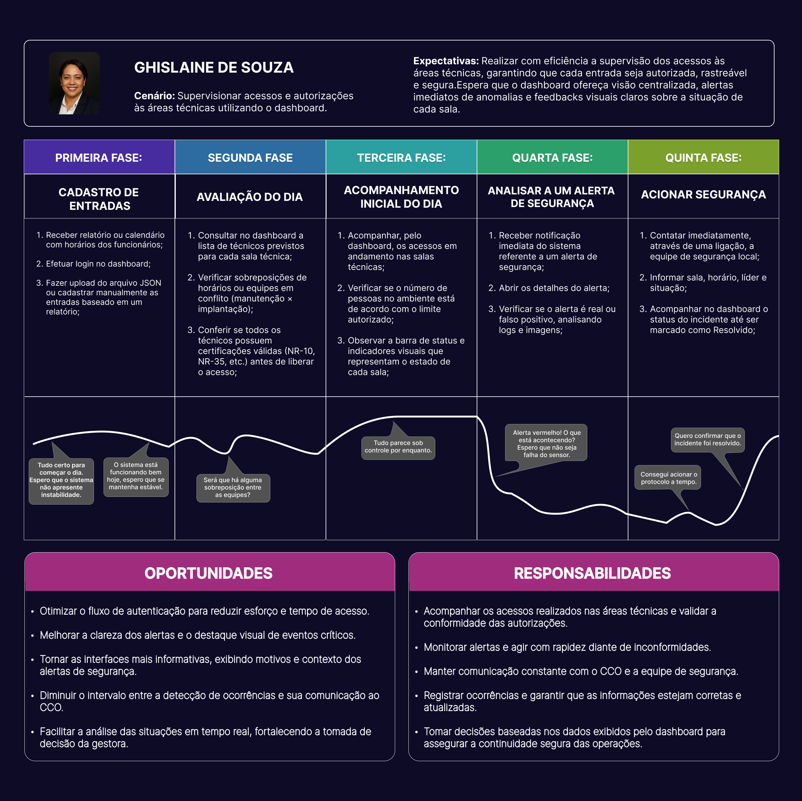
</div>
<br>
<div align="center">
<sub>Fonte: Material produzido pelo grupo IoTrain, 2025.</sub>
</div>
<br>

A jornada de Ghislaine foca na supervisão e resposta a incidentes através do novo Dashboard. Sua experiência começa de forma controlada e proativa, gerenciando o acesso de técnicos e monitorando os logs de entrada com sucesso, o que representa um ponto alto de eficiência. O ponto de virada e de maior tensão ocorre na quarta fase, quando ela recebe um alerta de invasão inesperado, gerando ansiedade e a necessidade de uma ação imediata. A partir daí, sua jornada se torna reativa: ela aciona as equipes, buscando confirmação de que a situação está sendo remediada, e finaliza com o acompanhamento e a resolução do problema, checando o Dashboard para confirmar a normalidade, mas terminando com uma sensação de alívio.

<br>
<div align="center">
<sub>Figura 9: Jornada de Usuário - Wellerson Rocha.</sub>
</div>
<br>
<div align="center">
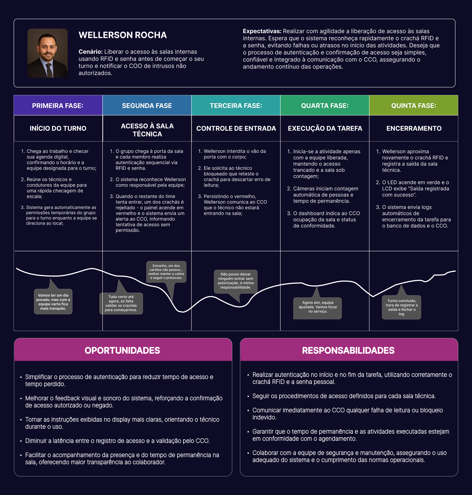
</div>
<br>
<div align="center">
<sub>Fonte: Material produzido pelo grupo IoTrain, 2025.</sub>
</div>
<br>

A jornada de Wellerson reflete a vivência do técnico em campo que depende do sistema de autenticação para iniciar e concluir suas atividades. Ele começa o dia em um ponto emocional alto, confiante com a rotina e com o suporte do sistema. A leve queda ocorre no momento da autenticação, quando o processo de RFID e senha exige mais atenção e tempo, gerando uma sensação breve de lentidão. À medida que a tarefa avança e o sistema confirma o acesso, sua confiança retorna, mantendo uma curva estável e positiva. O ponto de maior tensão aparece quando um crachá é rejeitado. Wellerson então interdita a passagem, solicita nova tentativa para descartar erro de leitura e, persistindo a recusa, comunica o CCO de que aquele técnico não entrará. Esse passo interrompe o ritmo e exigem contato com o CCO, mas enfatiza segurança e conformidade com as regras. A jornada termina em alta, com a conclusão segura do trabalho e o registro automático de saída, transmitindo a Wellerson uma sensação de controle, confiança e dever cumprido.

As jornadas apresentadas evidenciam como o novo sistema fortalece a segurança e a eficiência operacional, mas também revelam pontos de atenção que devem ser acompanhados. Entre as oportunidades, destaca-se o potencial de aprimorar a experiência dos usuários por meio da simplificação dos fluxos de autenticação, da clareza na comunicação de alertas e do uso de dados coletados para ajustes contínuos na usabilidade e na priorização de eventos. Já os riscos concentram-se na possibilidade de sobrecarga cognitiva causada por processos adicionais de validação, falhas pontuais de leitura RFID e eventuais atrasos na sincronização entre dispositivos e o CCO, que podem gerar frustração ou atrasos operacionais. Identificar e equilibrar esses fatores é essencial para garantir que o sistema mantenha alto nível de confiabilidade sem comprometer a fluidez da operação e a confiança dos usuários.

<br>

#### 3.2.2.2 Storyboards


Os storyboards são ferramentas essenciais para visualizar a experiência do usuário em contextos reais de uso do sistema. Eles permitem identificar pontos de interação, possíveis dificuldades e oportunidades de melhoria, traduzindo requisitos funcionais em narrativas visuais que facilitam o alinhamento entre a equipe técnica e as necessidades dos usuários finais.

Logo abaixo apresentamos dois storyboards, cada um representando uma persona. 


**Ghislaine - Gestora de operações e controle técnico**

<br>
<div align="center">
<sub>Figura 10: Storyboard - Ghislaine</sub>
</div>
<br>
<div align="center">

</div>
<br>
<div align="center">
<sub>Fonte: Material produzido pelo grupo IoTrain, 2025.</sub>
</div>
<br>


O storyboard apresenta a rotina operacional de Ghislaine na central de monitoramento. A sequência demonstra o uso do dashboard de controle para acompanhar acessos e bloqueios em tempo real. Nos primeiros quadros, ela verifica os agendamentos de serviços e insere manualmente as informações no sistema, validando autorizações e garantindo a consistência dos dados. Ao confirmar o envio, o sistema retorna uma mensagem de sucesso, indicando que os registros foram devidamente atualizados no banco de dados. Essa interação reforça o papel do operador humano na supervisão e resposta a eventos críticos, complementando as notificações automáticas do sistema de segurança.

**Wellerson - Técnico de manutenção ferroviária**

<br>
<div align="center">
<sub>Figura 11: Storyboard - Wellerson</sub>
</div>
<br>
<div align="center">

</div>
<br>
<div align="center">
<sub>Fonte: Material produzido pelo grupo IoTrain, 2025.</sub>
</div>
<br>


O storyboard ilustra o processo de autenticação de acesso no canteiro de obras, integrando dispositivos IoT ao sistema central do CCO. A sequência demonstra a verificação de turno e a validação de identidade realizada por Wellerson, que utiliza o crachá RFID e a senha pessoal para obter autorização de entrada. O sistema, ao cruzar esses dados com a base central, libera o acesso e registra o evento no banco de dados. Antes de ingressarem no ambiente de trabalho, todos os colaboradores repetem o mesmo procedimento, garantindo rastreabilidade e conformidade com os protocolos de segurança. Essa rotina automatizada permite a identificação imediata de acessos não autorizados e o envio de alertas em tempo real à central de monitoramento, sem necessidade de intervenção manual.


## 3.3. Solução Técnica

Esta seção descreve a solução técnica desenvolvida para atender às necessidades identificadas no projeto, apresentando os principais componentes, decisões de projeto e conceitos tecnológicos que sustentam a implementação do sistema. Seu propósito é explicitar como a solução foi estruturada do ponto de vista técnico, garantindo coerência entre os requisitos levantados e as tecnologias adotadas.

Ao longo da seção, são abordados os requisitos funcionais e não funcionais, a arquitetura da solução e sua evolução durante o desenvolvimento, bem como os elementos de hardware, software e infraestrutura que compõem o sistema. A descrição busca evidenciar as escolhas técnicas realizadas, considerando aspectos como segurança, confiabilidade, escalabilidade e adequação ao contexto operacional da TIC Trens.

Dessa forma, a seção de Solução Técnica consolida a base tecnológica do projeto, servindo como referência para compreender a implementação, a organização do sistema e a viabilidade técnica da solução proposta.

### 3.3.1. Requisitos Funcionais

Os **requisitos funcionais** definem as ações e comportamentos que o sistema deve realizar para atender aos objetivos do projeto. Em um sistema de segurança voltado ao controle de acessos em ambientes restritos da linha 7-rubi e Trem Intercidades (TIC), esses requisitos estabelecem como os componentes — câmeras, leitores RFID e servidor central — devem interagir para garantir a segurança, integridade e rastreabilidade das operações.

<br>

Abaixo seguem os requisitos funcionais do projeto:

<br>
<div align="center">
<sup>Tabela 2 - Requisitos Funcionais da Solução Argus</sup>


| **Identificador** | **Nome**                                       | **Descrição**                                                                                                                                                                                 | **Regra de Negócio**                                                                                              | **Prioridade** | **Versão** |
| ----------------- | ---------------------------------------------- | --------------------------------------------------------------------------------------------------------------------------------------------------------------------------------------------- | ----------------------------------------------------------------------------------------------------------------- | -------------- | ---------- |
| **RF01**          | Coleta de Dados via Câmeras                    | O sistema deve coletar continuamente dados brutos das câmeras instaladas, realizando contagem de pessoas em tempo real.                                 | As câmeras devem operar apenas em áreas autorizadas e registrar horário da coleta.                         | Alta           | 1.2        |
| **RF02**          | Transmissão de Dados ao Servidor               | O sistema deve enviar periodicamente os resultados processados das câmeras ao servidor central.                                                         | A transmissão deve ocorrer apenas por canais criptografados e autenticados.                         | Alta           | 1.2        |
| **RF03**          | Autenticação de Usuários                       | O sistema deve autenticar usuários físicos (via RFID e senha pessoal) e usuários administrativos (via dashboard e senha única).                         | A autenticação física deve ocorrer dentro do horário autorizado; a autenticação administrativa deve exigir renovação periódica de senhas.  | Alta           | 1.2        |
| **RF04**          | Geração e Transmissão Segura de Dados          | O sistema deve assegurar que todos os dados transmitidos entre câmeras, leitores RFID e servidor sejam criptografados e assinados digitalmente, utilizando o protocolo MQTT sobre Wi-Fi ou Ethernet. | Toda comunicação deve utilizar criptografia pós-quântica e assinatura digital emitida por uma Infraestrutura de Chaves Públicas (PKI) hospedada no servidor MQTT broker central.   | Alta           | 1.2        |
| **RF05**          | Gerenciamento de Chaves Criptográficas         | O sistema deve permitir a geração, rotação e revogação de chaves criptográficas utilizadas na comunicação entre dispositivos e servidor.                                                      | O servidor deve manter controle de ciclo de vida das chaves, impedindo uso de chaves revogadas.                   | Média          | 1.0        |
| **RF06**          | Verificação e Armazenamento de Dados Recebidos | O sistema deve verificar a assinatura digital dos dados recebidos antes de armazená-los no banco de dados.                                                                                    | Dados sem assinatura válida devem ser rejeitados e registrados em log de erros.                                   | Alta           | 1.0        |
| **RF07**          | Painel de Controle e Visualização              | O sistema deve permitir que o módulo dashboard exiba, em tempo real, os acessos corretos e incorretos, o número de pessoas presentes, horários e locais monitorados.                                                       | Apenas operadores de segurança e administradores poderão acessar o dashboard.                                     | Média          | 1.0        |
| **RF08**          | Geração de Relatórios e Logs                   | O sistema deve gerar relatórios históricos com informações sobre quem acessou, horário, sala e intenção registrada (ex: manutenção).                                                          | Os relatórios devem permitir filtros por data, sala e tipo de acesso.                                             | Média          | 1.0        |
| **RF09**          | Alertas de Acesso Indevido                     | O sistema deve emitir alertas automáticos quando ocorrerem acessos não autorizados, como excesso de pessoas, horário incorreto ou ausência de autenticação RFID.                              | Os alertas devem aparecer na interface do dashboard em tempo real.                                                | Alta           | 1.0        |
| **RF10**          | Monitoramento de Dispositivos                  | O sistema deve permitir a observação, através do módulo dashboard, do estado operacional dos dispositivos IoT (câmeras e leitores RFID), incluindo status de energia e conectividade.                | Dispositivos desconectados ou inativos devem ser sinalizados visualmente no dashboard.                            | Média          | 1.0        |
| **RF11**          | Representação Gráfica dos Dados                | O sistema deve permitir que o módulo dashboard apresente representações gráficas dos dados, incluindo obrigatoriamente gráficos de barras e indicadores de status em tempo real, sendo os gráficos de linha e outros formatos configuráveis pelo usuário.      | As representações devem atualizar-se automaticamente conforme novos dados são recebidos.                           | Média          | 1.2        |

<sub>Fonte: material desenvolvido pelos autores</sub>

</div>

<br>

### 3.3.2. Requisitos Não Funcionais


Os **requisitos não funcionais (RNFs)** definem as propriedades e restrições que determinam **como** o sistema deve operar, assegurando sua qualidade, segurança e desempenho.

De acordo com a norma **ISO/IEC 25010**, esses requisitos são classificados em características de qualidade como **desempenho, compatibilidade, segurança, manutenibilidade e portabilidade**, garantindo que o software atenda às expectativas técnicas e operacionais de um ambiente crítico como o do sistema metroviário.

A seguir, são apresentados os **Requisitos Não Funcionais** do projeto:

<br>

<div align="center">
<sup>Tabela 3 - Requisitos Não Funcionais da Solução Argus</sup>

| **Identificador** | **Categoria (ISO 25010)**                   | **Requisito**                                                    | **Descrição Detalhada**                                                                                                                                                                                                                                              | **Como Testar**                                                                                                                                                                                                                                                           | **Prioridade** | **Versão** |
| ----------------- | ------------------------------------------- | ---------------------------------------------------------------- | -------------------------------------------------------------------------------------------------------------------------------------------------------------------------------------------------------------------------------------------------------------------- | ------------------------------------------------------------------------------------------------------------------------------------------------------------------------------------------------------------------------------------------------------------------------- | -------------- | ---------- |
| **RNF01**         | **Desempenho / Precisão Funcional**         | Precisão da Contagem de Pessoas ≥ 95%                            | O sistema deve garantir que a contagem de pessoas realizada pelas câmeras inteligentes apresente acurácia mínima de 95%, em condições normais de iluminação e enquadramento.                                                                                         | Realizar testes controlados em diferentes ambientes (iluminação, ângulo de câmera, número de pessoas) e comparar o resultado da contagem automática com o valor real.                                                                                                     | Alta           | 1.0        |
| **RNF02**         | **Desempenho / Tempo de Resposta**          | Atraso Máximo entre Evento e Dashboard ≤ 3 s                     | O sistema deve atualizar o dashboard em até 3 segundos após a detecção de um evento (autenticação RFID, entrada de pessoa ou alerta).                                                                                                                                | Testar o intervalo de tempo entre o registro de um evento e a sua visualização no dashboard, utilizando logs de timestamp.                                                                                                                                                | Alta           | 1.0        |
| **RNF03**         | **Desempenho / Confiabilidade Operacional** | Tempo Máximo para Emissão de Alerta ≤ 3 s                        | O sistema deve emitir alertas visuais e sonoros em até 3 segundos após a identificação de acesso indevido, excesso de pessoas ou horário irregular.                                                                                                                  | Simular eventos de acesso indevido e medir o tempo até o alerta ser exibido no dashboard.                                                                                                                                                                                 | Alta           | 1.0        |
| **RNF04**         | **Escalabilidade**                          | Suporte Mínimo a 100 Dispositivos IoT Conectados Simultaneamente | O servidor central deve ser capaz de receber, armazenar e tratar dados provenientes da análise de até 100 câmeras e leitores RFID simultaneamente, sem degradação perceptível no desempenho.                                                                         | Executar testes de carga simulando múltiplos dispositivos conectados e avaliar uso de CPU, memória e latência de comunicação.                                                                                                                                             | Média          | 1.0        |
| **RNF5**          | **Compatibilidade / Usabilidade Técnica**   | Compatibilidade com Navegadores Modernos (últimas 2 versões)     | O dashboard deve ser acessível e apresentar comportamento consistente nos principais navegadores modernos (Google Chrome, Mozilla Firefox, Microsoft Edge e Safari, nas duas últimas versões estáveis).                                                              | Realizar testes de interface e funcionalidade em todos os navegadores listados, validando responsividade e integridade visual.                                                                                                                                            | Média          | 1.0        |
| **RNF6**          | **Portabilidade / Implantação Padronizada** | Uso de Containers Docker para Deploy Padronizado                 | O sistema deve ser implantado por meio de containers Docker, assegurando padronização do ambiente, reprodutibilidade da execução e isolamento entre componentes, de forma que a aplicação mantenha comportamento consistente em diferentes servidores e plataformas. | Executar a implantação completa do sistema (servidor, banco de dados e dashboard) em diferentes ambientes físicos ou virtuais, utilizando a mesma imagem de container Docker, e verificar se o comportamento, desempenho e integridade dos serviços permanecem idênticos. | Alta           | 1.0        |

<sub>Fonte: material desenvolvido pelos autores</sub>

<br>

</div>

Diante dos requisitos não funcionais definidos, observa-se que o projeto prioriza não apenas a eficiência operacional, mas também a previsibilidade e a estabilidade necessárias para um ambiente metroviário de alta criticidade. A precisão na contagem de pessoas, a baixa latência na emissão de alertas e a escalabilidade para múltiplos dispositivos conectados asseguram que o sistema responda adequadamente a variações de fluxo e condições adversas de rede, típicas de túneis e estações subterrâneas. Além disso, a padronização da implantação por meio de containers e a compatibilidade entre navegadores reforçam a manutenção e a continuidade do serviço, garantindo que a solução opere de forma uniforme em diferentes camadas da infraestrutura tecnológica. Dessa forma, os RNFs definidos sustentam a confiabilidade e a segurança do sistema como pilares centrais, assegurando que ele mantenha desempenho consistente e adaptável às demandas dinâmicas da operação metroviária.

<br>

### 3.3.3. Arquitetura da Solução 

<br>
<div align="center">
<sub>Figura 12: Diagrama da Arquitetura da Solução</sub>
</div>
<br>
<div align="center">
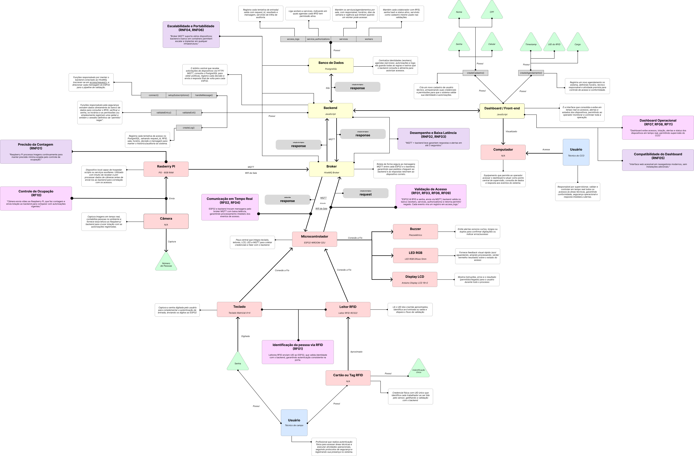
</div>
<br>
<div align="center">

[Baixar PDF](../assets/images/diagrams/diagrama-arquitetura.pdf)  

[Link Figma](https://www.figma.com/design/627lwLgzulRRGg6DexEqr0/Arquitetura-do-Projeto-2?node-id=19-398&p=f)  

[Vídeo Explicativo](https://drive.google.com/file/d/16Q8vxiYoXa4UOg3FMG4j1Qr5sMnfEEcj/view?usp=drive_link)

<sub>Fonte: Material produzido pelo grupo IoTrain, 2025.</sub>
</div>
<br>


A arquitetura da solução foi estruturada em camadas que permitem integrar dispositivos físicos, processamento local e serviços centrais de backend, garantindo segurança, rastreabilidade e baixa latência em todo o fluxo de controle de acesso. Essa organização assegura que microcontroladores, sensores, sistemas de validação e o dashboard operem de maneira coordenada para atender aos requisitos funcionais e não funcionais definidos para o projeto. A visão técnica apresentada a seguir complementa o que está representado visualmente no diagrama de arquitetura   e se mantém coerente com a implementação disponível no repositório da solução  .


#### Visão Geral da Arquitetura

A solução é composta por três grandes camadas: dispositivos de borda (edge devices), pré-processamento local e infraestrutura central. Esse modelo permite distribuir responsabilidade, reduzir carga do núcleo e garantir que eventos críticos sejam tratados com rapidez, mesmo em ambientes com oscilação de rede.

**1. Dispositivos de Borda**

Nos dispositivos de borda, o elemento central é o microcontrolador ESP32-WROOM-32U, instalado diretamente nos painéis de acesso das áreas técnicas. Ele é responsável por coordenar a leitura do cartão RFID, capturar a senha digitada no teclado matricial, exibir instruções e resultados no display LCD e fornecer feedback visual e sonoro por meio do LED RGB e do buzzer. Esses elementos trabalham de forma integrada: o RFID fornece a identificação base, a senha acrescenta um fator adicional de autenticação e os apresentadores (LCD, LED e buzzer) mantêm o usuário informado sobre o estado de cada etapa do processo.

O ESP32 envia as credenciais e o contexto da solicitação ao backend por meio do broker MQTT, utilizando tópicos do tipo access/request/<sala>. A resposta, contendo a decisão de permitir ou negar o acesso, retorna pelo tópico correspondente a cada request_id. Esse ciclo atende diretamente requisitos como autenticação (RF03), transmissão segura (RF04) e comunicação em tempo real (RF04, RF09), além de contribuir para o cumprimento da meta de latência abaixo de 3 segundos definida pelo RNF03.

**2. Pré-processamento Local**

O Raspberry Pi funciona como um nó intermediário especializado na análise de imagens. Ele recebe continuamente o stream da câmera instalada na sala e executa localmente a contagem de pessoas presentes no ambiente. Os dados extraídos não são enviados como vídeo, mas sim como métricas agregadas, publicadas em camera/<sala>/people_count. Esse design reduz significativamente o tráfego de rede e permite que informações sobre lotação sejam atualizadas rapidamente para o backend, sem sobrecarregar a infraestrutura central.

Essa camada dá suporte direto à coleta de dados via sensores (RF01), à transmissão periódica dessas informações (RF02) e ao monitoramento de dispositivos (RF10). Além disso, ela se relaciona ao RNF01, que exige precisão mínima de 95% na contagem. Ao realizar o processamento antes de enviar os dados, o sistema evita depender de condições variáveis de rede e mantém um resultado mais previsível e estável, alinhado às recomendações do RM-ODP para o Engineering Viewpoint.

**3. Infraestrutura Central**

A infraestrutura central é composta por três elementos principais: o broker MQTT, o backend e o banco de dados PostgreSQL hospedado no Supabase. O broker atua como ponto de intermediação entre todos os dispositivos do sistema, roteando mensagens com confiabilidade e baixa latência. Ele garante que as requisições dos ESP32 sejam entregues ao backend e que as respostas sejam devolvidas com rapidez, suportando assim o fluxo de controle de acesso em tempo real.

O backend, implementado em JavaScript, funciona como o árbitro da solução. Ele recebe autenticações de entrada e saída, interpreta os dados no contexto da sala e do horário, consulta o banco de dados e aplica regras de negócio por meio dos serviços internos. A organização do backend segue um padrão modular: o server.js concentra a configuração, as rotas e controladores lidam com requisições HTTP e mensagens MQTT, e os serviços implementam toda a lógica de validação, como validateEntry e validateExit. A camada de repositórios isola o acesso ao banco, permitindo consultas a trabalhadores, autorizações e agendas sem acoplar essas operações à lógica de negócio. Essa divisão se alinha ao Computational Viewpoint do RM-ODP, ao dividir funções em componentes executáveis de forma independente.

O banco de dados PostgreSQL armazena as entidades essenciais para o funcionamento do sistema. A tabela workers reúne os dados cadastrais básicos, como nome, CPF, cargo, senha e status; services descreve as atividades agendadas por sala; service_authorizations define permissões por colaborador; e access_logs registra todas as tentativas de acesso, compondo a trilha necessária para auditoria. Ao centralizar a camada de dados, o sistema mantém consistência e rastreabilidade, sustentando requisitos como RF03 (autenticação), RF06 (pipeline de validação), RF08 (logs) e RNF06 (padronização por containers).


#### Ligações Físicas e Lógicas

A integração entre os elementos ocorre por meio de conexões digitais locais e canais seguros sem fio. O ESP32 se comunica com seus periféricos através de GPIOs, SPI para o leitor RFID e I2C para o display LCD. A conexão com o broker e o backend é feita por Wi-Fi. A câmera é conectada ao Raspberry Pi por rede local, normalmente via Ethernet ou Wi-Fi, garantindo qualidade suficiente para o processamento de imagem. O Raspberry Pi publica seus resultados no broker, enquanto o backend se conecta ao broker e ao banco de dados para fechar o ciclo de validação. O dashboard consome APIs do backend e pode assinar tópicos MQTT para receber atualizações imediatas sobre acessos e ocupação. Usuários do CCO e técnicos de campo interagem com o sistema através desses pontos, de forma breve e objetiva, como representado no fluxo do diagrama.


#### Fluxo de Dados

O processo de autenticação inicia quando o trabalhador aproxima o cartão RFID do painel. O ESP32 captura o UID e solicita a digitação da senha. Em seguida, ele monta o pacote de dados contendo identificação, senha, sala, horário e um request_id único. Esse pacote é enviado ao broker MQTT, que o entrega ao backend. O backend então executa o pipeline de validação, consultando tabelas de permissões, relacionamentos entre trabalhadores e serviços, agenda da sala e dados de ocupação enviados pelo Raspberry Pi.

Uma vez aplicada a regra de negócio, o backend publica o veredito no tópico de resposta, permitindo que o ESP32 atualize o display, mude o LED RGB e acione o buzzer conforme o resultado. Em paralelo, o backend registra o evento no access_logs, consolidando dados para auditorias e relatórios. De maneira contínua, o Raspberry Pi envia o número de pessoas na sala, permitindo que o backend dispare alertas de superlotação ou inconformidade quando necessário. Esse fluxo garante atendimento aos requisitos RF01 a RF11 e contribui para RNF02 (tempo de resposta), RNF03 (alertas em até 3s) e RNF04 (suporte a múltiplos dispositivos).


#### Integração com Viewpoints do RM-ODP

A arquitetura mantém coerência com o RM-ODP ao distribuir responsabilidades entre viewpoints. O Enterprise Viewpoint é atendido ao refletir as regras da TIC Trens no pipeline de validação. O Information Viewpoint se manifesta nas estruturas de dados centralizadas no banco e nas mensagens trafegadas entre os componentes. O Computational Viewpoint separa claramente dispositivos, serviços, repositórios e módulos de lógica. O Engineering Viewpoint define como os componentes se comunicam fisicamente (MQTT, Wi-Fi, conexões locais) e finalmente o Technology Viewpoint descreve a escolha das tecnologias empregadas, como ESP32, Raspberry Pi, HiveMQ, Supabase e containers.


### 3.3.4. Arquitetura do Protótipo 

<br>
<div align="center">
<sub>Figura 13: Diagrama da Arquitetura da Solução</sub>
</div>
<br>
<div align="center">

</div>
<br>
<div align="center">

[Baixar PDF](../assets/images/diagrams/diagrama-arquitetura-2.pdf)  

[Link Figma](https://www.figma.com/design/627lwLgzulRRGg6DexEqr0/Arquitetura-do-Projeto-2?node-id=63-14&p=f&t=roaWC6Um7MEjUMxd-0)  

[Vídeo Explicativo](https://youtu.be/I_hkvIkWueo)

<sub>Fonte: Material produzido pelo grupo IoTrain, 2025.</sub>
</div>
<br>


<div align="center">
<sub>Tabela 6: Detalhamento do Diagrama UML em Conexão com o Usuário e Casos de Teste</sub>
</div>

|**Componente**|**Modelo / Tecnologia**|**Descrição**|**Função no Sistema**|
|---|---|---|---|
|**Controlador principal**|ESP32-WROOM-32U|Microcontrolador responsável por integrar sensores e atuadores (RFID, teclado, LCD, LED, buzzer) e realizar a comunicação via Wi-Fi/MQTT. Executa a lógica local e envia solicitações ao backend.|Integra leitor RFID, teclado, LCD, LED e buzzer; envia credenciais via MQTT e recebe resposta do backend.|
|**Leitor RFID**|RC522|Módulo de radiofrequência que opera em 13,56 MHz e captura UIDs de cartões RFID utilizando interface SPI.|Captura o UID do cartão/tag RFID para identificação do técnico.|
|**Cartão / Tag RFID**|N/A|Credencial física com UID único usada para autenticação. Aciona o fluxo de validação quando aproximada do leitor.|Credencial física com UID único para acesso.|
|**Teclado matricial**|4×4|Teclado numérico de 16 teclas utilizado para digitação de senha, compondo o segundo fator de autenticação.|Entrada da senha utilizada como segundo fator de autenticação.|
|**Display LCD**|LCD 16×2 (I2C)|Tela alfanumérica que exibe mensagens de operação e feedback ao usuário. Comunicação via I²C para economia de pinos.|Exibe mensagens de instrução, processamento e resultado (permitido/negado).|
|**LED RGB**|Difuso 5 mm|LED tricolor que indica visualmente estados do sistema (erro, processamento, sucesso).|Indica status visual do processo de autenticação.|
|**Buzzer**|Piezoelétrico|Dispositivo sonoro que emite alertas, confirmações e sinais de erro.|Emite sinais sonoros de confirmação, alerta e erro.|
|**Câmera**|N/A|Dispositivo de captura de imagens para análise de ocupação do ambiente.|Captura imagens para análise de ocupação.|
|**Raspberry Pi**|Raspberry Pi 5 (8 GB RAM)|Computador de borda usado para processar vídeo das câmeras localmente e extrair o número de pessoas na sala.|Processa vídeo da câmera, conta pessoas e envia lotação ao backend.|
|**Rede sem fio**|Wi-Fi local da sala|Infraestrutura de comunicação sem fio que conecta dispositivos IoT, câmeras e front-end.|Canal de comunicação para ESP32, Raspberry e frontend.|
|**Broker MQTT**|HiveMQ|Servidor intermediário de mensagens MQTT que gerencia tópicos e entrega mensagens entre dispositivos e backend.|Intermedia o tráfego de mensagens MQTT entre dispositivos e backend.|
|**Backend**|JavaScript (Node.js)|Serviço de aplicação que processa requisições, valida credenciais, consulta banco, aplica regras e registra logs.|Valida credenciais, consulta banco, decide permitir/negado e registra logs.|
|**Banco de dados**|PostgreSQL + Supabase|Sistema de armazenamento que mantém identidades, agendas, autorizações, logs e entidades operacionais.|Armazena identidades, agendas, autorizações e histórico de acessos.|
|**Front-end (Dashboard)**|JavaScript|Interface visual que apresenta informações em tempo real sobre acessos, dispositivos e ocupação.|Interface que exibe acessos, alertas e ocupação em tempo real.|
|**Navegador**|Google Chrome (v.143.x)|Aplicação cliente usada para renderizar o dashboard e permitir a operação do CCO.|Renderiza o dashboard operacional utilizado pelo técnico do CCO.|
|**Hospedagem do front-end**|Vercel|Plataforma em nuvem responsável por hospedar e entregar o dashboard com alta disponibilidade.|Hospeda e entrega o dashboard JavaScript via HTTPS.|
|**Execução do backend**|Azure|Plataforma em nuvem que executa containers e serviços escaláveis integrados com banco e broker.|Executa o backend em contêineres/serviços gerenciados com escalabilidade e integração com banco e broker.|

<div align="center">
<sub>Fonte: Material produzido pelo grupo IoTrain, 2025.</sub>
</div>

<br>

Diferente da primeira versão da arquiteura demonstrada na seção 3.3.3, a segunda versão mantém todos os elementos funcionais da solução, porém reorganiza sua apresentação em blocos mais claros e coerentes e adiciona elementos aumentando a fidelidade e facilitando a compreensão estrutural do sistema. Diferentemente do primeiro diagrama, onde os componentes estavam distribuídos em regiões amplas que se sobrepunham visualmente, a nova organização estabelece quatro agrupamentos bem definidos: dispositivos de borda, visão computacional, núcleo central (backend, broker e banco de dados) e camada de interface. Essa redistribuição reduz intersecções, evita cruzamento excessivo de fluxos e permite identificar, de forma imediata, os limites de responsabilidade de cada conjunto tecnológico.

Na camada de dispositivos de borda, todos os elementos físicos ligados ao ESP32 passaram a ser representados como um bloco único e compacto. Isso torna evidente que teclado, leitor RFID, display LCD, LED RGB, buzzer e credencial RFID são periféricos diretamente acoplados ao microcontrolador, e não módulos independentes espalhados no diagrama. Da mesma forma, a área de visão computacional foi isolada na lateral esquerda, reunindo a câmera e o Raspberry Pi em um fluxo exclusivo, cujo único ponto de integração com o restante da solução é a publicação do número de pessoas no broker.

O núcleo central da solução — backend, broker MQTT e banco de dados — torna-se o elemento mais destacado da nova versão. Enquanto a primeira arquitetura mostrava essas partes de forma mais difusa, a segunda agrupa o backend no centro e reorganiza ao seu redor tanto as funções internas (como validateEntry, validateExit e createLog) quanto as entidades do banco de dados (workers, services, authorizations, access_logs). Ademais, o novo diagrama mostra o backend dentro do Azure, plataforma em nuvem que hospeda e executa o backend. Essa disposição reforça a ideia de que toda a lógica de decisão converge para esse núcleo, que opera como ponto de coordenação entre os dispositivos e o dashboard.

Por fim, a camada de interface foi reorganizada para tornar explícita a relação entre o dashboard, o navegador Chrome (nova entdidade), o computador cliente e o operador do CCO. Em vez de elementos dispersos, esses componentes aparecem lado a lado, conectados exclusivamente ao backend via HTTPS. Isso evidencia que o front-end não participa do fluxo de baixo nível com dispositivos ou broker, mas atua apenas na consulta e manipulação de dados processados. A alocação dos requisitos funcionais e não funcionais também foi aprimorada: agora eles aparecem diretamente associados aos blocos que os implementam, o que fortalece a rastreabilidade entre especificação e arquitetura.

Essa reorganização não tem como objetivo alterar o funcionamento do sistema, apenas aprimorar a clareza visual, a leitura hierárquica e a capacidade de análise técnica, tornando a documentação final mais objetiva, estruturada e alinhada ao modelo conceitual da solução.

### 3.3.5. Arquitetura Refinada da Solução 

Esta subseção tem como objetivo detalhar o funcionamento técnico da solução durante sua operação, explicitando como os diferentes componentes do sistema interagem entre si para viabilizar o controle de acesso inteligente às áreas técnicas da TIC Trens. Diferentemente da descrição estrutural da arquitetura, aqui o foco está na dinâmica de comunicação, nos processos de decisão e na circulação das informações entre dispositivos IoT, serviços em nuvem e interfaces de usuário.

O sistema foi projetado como uma solução distribuída, na qual sensores, microcontroladores, serviços de backend e interfaces operam de forma integrada e sincronizada, garantindo segurança, rastreabilidade e resposta em tempo real aos eventos de acesso físico.

#### Fluxo de Autenticação e Validação de Acesso

O fluxo de autenticação inicia-se no ponto físico de entrada da área restrita, onde o colaborador interage diretamente com o painel IoT. Esse painel é composto por um microcontrolador ESP32, leitor RFID/NFC, teclado matricial e indicadores visuais (LED e display).

O processo ocorre da seguinte forma:

1. O colaborador aproxima seu crachá RFID/NFC do leitor ou insere suas credenciais por meio do teclado matricial;

2. O ESP32 coleta os dados de identificação e valida localmente a integridade da leitura;

3. As informações são encapsuladas em uma mensagem estruturada e enviadas, via rede Wi-Fi, ao broker MQTT configurado na nuvem;

4. O backend consome essa mensagem, valida a identidade do usuário e cruza os dados com as informações armazenadas no banco de dados (capacitação, autorização e agendamento);

5. Com base nessa validação, o backend retorna uma resposta de autorização ou negação ao dispositivo IoT;

6. O painel de acesso executa a ação correspondente (liberação da fechadura ou bloqueio), além de sinalizar visualmente o resultado ao usuário.

Esse fluxo garante que nenhuma decisão crítica de acesso seja tomada exclusivamente no dispositivo local, preservando a integridade das regras de negócio centralizadas no backend.

<br>
<div align="center">
<sub>Figura 14: Fluxo de autenticação e validação de acesso</sub>
</div>
<br>
<div align="center">
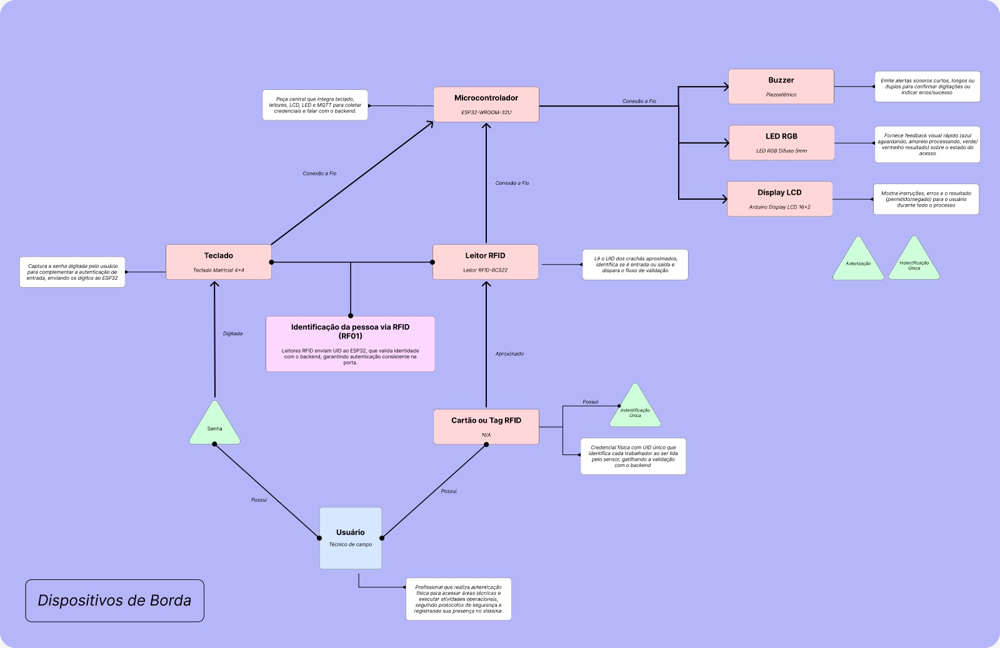
</div>
<br>

#### Fluxo de Comunicação entre Dispositivos IoT e Backend

A comunicação entre os dispositivos IoT e o sistema central ocorre por meio do protocolo MQTT, escolhido por sua leveza, baixa latência e adequação a ambientes distribuídos. O broker MQTT atua como intermediário entre os painéis físicos, as câmeras IoT e o backend da aplicação.

Durante a operação normal do sistema:

- Os dispositivos IoT publicam mensagens em tópicos específicos, relacionados a eventos como tentativas de acesso, contagem de pessoas e alertas de violação;

- O backend permanece inscrito nesses tópicos, processando as mensagens assim que são recebidas;

- As respostas e comandos do backend são publicados em tópicos de retorno, aos quais os dispositivos estão inscritos.

Essa arquitetura baseada em publicação e assinatura permite escalabilidade da solução, possibilitando a adição de novos pontos de acesso ou sensores sem necessidade de alterações estruturais significativas no sistema central.

<br>
<div align="center">
<sub>Figura 15: Comunicação entre dispositivos IoT, broker MQTT e backend</sub>
</div>
<br>
<div align="center">
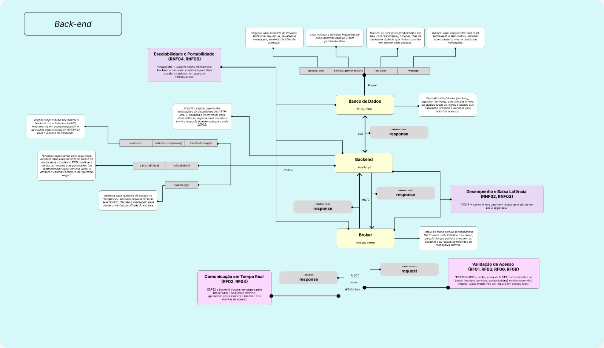
</div>
<br>

#### Fluxo de Monitoramento e Geração de Logs

Paralelamente ao fluxo de autenticação, o sistema executa continuamente o registro de eventos operacionais. Cada tentativa de acesso, autorizada ou não, gera um log estruturado contendo:

- Identificador do usuário;

- Local do acesso;

- Data e horário;

- Resultado da validação;

- Tempo de permanência (quando aplicável).

Esses registros são armazenados no banco de dados em nuvem (Supabase) e utilizados tanto para auditoria quanto para monitoramento em tempo real por meio do dashboard do CCO. O fluxo de logs garante rastreabilidade completa das operações, atendendo aos requisitos de segurança e conformidade regulatória da TIC Trens.

<br>
<div align="center">
<sub>Figura 16: Fluxo de geração e armazenamento de logs</sub>
</div>
<br>
<div align="center">
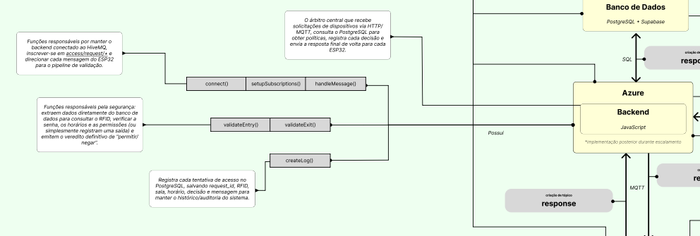
</div>
<br>

#### Fluxo de Detecção de Inconformidades e Tomada de Decisão

Além do controle básico de acesso, o sistema incorpora mecanismos de detecção de inconformidades operacionais. As câmeras IoT instaladas nas áreas técnicas realizam a contagem de pessoas presentes no ambiente e enviam periodicamente esses dados ao backend.

O backend compara:

- O número de pessoas detectadas pelas câmeras;

- O número de acessos registrados no sistema;

- As autorizações ativas para aquele local e horário.

Caso seja identificada qualquer discrepância — como presença não autorizada, excesso de pessoas ou permanência além do tempo previsto — o sistema gera automaticamente um alerta para o CCO. Essa lógica de decisão centralizada permite uma atuação proativa da equipe de operações, reduzindo riscos e aumentando a segurança do ambiente.

<br>
<div align="center">
<sub>Figura 17: Fluxo de detecção de inconformidades e alertas</sub>
</div>
<br>
<div align="center">
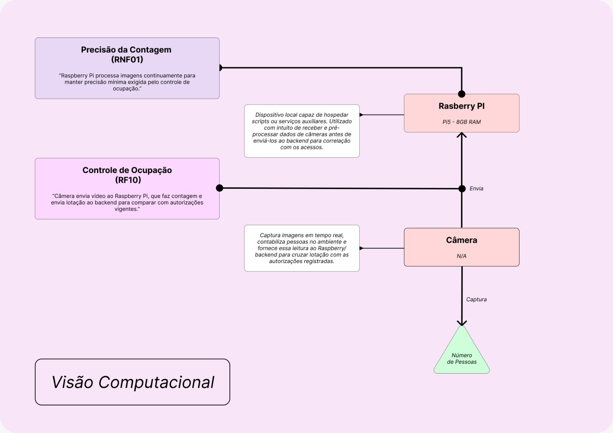
</div>
<br>

#### Integração com Interface de Usuário e CCO

A interface de usuário, acessada pelo CCO, atua como ponto de visualização e controle da solução. Todas as informações processadas pelo backend são disponibilizadas no dashboard, incluindo:

- Status dos pontos de acesso;

- Logs de entrada e saída;

- Alertas em tempo real;

- Indicadores de conformidade.

Essa integração fecha o ciclo operacional da solução, conectando o mundo físico (sensores e dispositivos IoT) ao ambiente digital de gestão, permitindo decisões rápidas, embasadas e alinhadas aos protocolos de segurança da TIC Trens.

<br>
<div align="center">
<sub> Figura 18: Visão geral da integração entre dispositivos, backend e dashboard</sub>
</div>
<br>
<div align="center">

</div>
<br>

#### Considerações Finais da Seção

O detalhamento dos fluxos de comunicação e operação evidencia que a solução vai além da simples identificação de componentes, demonstrando como cada elemento técnico contribui ativamente para a segurança, confiabilidade e inteligência do sistema. A interação coordenada entre dispositivos IoT, infraestrutura em nuvem e interfaces de gestão sustenta um modelo de controle de acesso robusto, escalável e alinhado às exigências operacionais da TIC Trens.

## 3.4. Resultados

Esta seção apresenta a evolução do protótipo ao longo das cinco sprints de desenvolvimento, descrevendo as funcionalidades implementadas em cada etapa, os principais desafios enfrentados e os resultados obtidos. Para cada sprint, são detalhados os casos de teste executados, o comportamento observado do sistema e os avanços em relação à arquitetura, comunicação e integração com o servidor. As subseções que seguem organizam essa análise de forma cronológica, permitindo visualizar progressivamente como o protótipo se transformou desde uma versão local e isolada até um modelo conectado, validado e integrado a serviços externos.

### 3.4.1. Protótipo Inicial do Projeto usando o Simulador Wokwi

Esta seção apresenta o protótipo inicial do sistema de controle de acesso desenvolvido na plataforma de simulação Wokwi. O Wokwi é uma ferramenta online de simulação de circuitos eletrônicos que permite desenvolver e testar projetos baseados em microcontroladores como ESP32 e Arduino diretamente no navegador web. A escolha desta plataforma para a fase inicial de prototipagem permitiu validar a lógica de funcionamento do sistema antes da implementação física, possibilitando identificar e corrigir possíveis falhas de design sem a necessidade de montagem de componentes reais. Além disso, o ambiente de simulação facilita a iteração rápida entre desenvolvimento e teste, acelerando o ciclo de prototipagem e reduzindo custos iniciais do projeto.

Link para o protótipo inicial no Wokwi: https://wokwi.com/projects/445632969373633537

#### Componentes utilizados no circuito

O protótipo simulado integra diversos componentes eletrônicos que trabalham em conjunto para realizar o controle de acesso. A tabela a seguir descreve cada componente, sua função no sistema e suas especificações técnicas relevantes.

| Componente        | Modelo/Especificação | Função no Sistema                                                                                                                            | Observações                                                               |
| ----------------- | -------------------- | -------------------------------------------------------------------------------------------------------------------------------------------- | ------------------------------------------------------------------------- |
| Microcontrolador  | ESP32-WROOM-32       | Unidade central de processamento responsável por gerenciar todas as leituras dos dispositivos de entrada e controlar os componentes de saída | Possui conectividade WiFi integrada para futura comunicação com servidor  |
| Display LCD       | LCD 16x2 HD44780     | Exibe mensagens de status, instruções de operação e feedback das tentativas de acesso ao usuário                                             | Comunicação via protocolo I2C para reduzir número de pinos utilizados     |
| Teclado Matricial | 4x4 (16 teclas)      | Permite entrada manual do código RFID e da senha pessoal do usuário                                                                          | Utilizado para simular a leitura RFID devido às limitações do Wokwi       |
| LED RGB           | Difuso 5mm           | Fornece feedback visual colorido sobre o estado do sistema através de cores distintas                                                        | Verde para acesso liberado, vermelho para negado, azul para processamento |
| Buzzer            | Piezoelétrico        | Emite sinais sonoros distintos para cada tipo de evento do sistema                                                                           | Complementa o feedback visual com alertas audíveis                        |
| Resistores        | 220Ω                 | Limitam a corrente elétrica nos LEDs e protegem os componentes                                                                               | Três unidades utilizadas, uma para cada cor do LED RGB                    |
| Protoboard        | 830 pontos           | Plataforma de montagem do circuito sem necessidade de soldagem                                                                               | Facilita alterações e testes durante o desenvolvimento                    |
| Cabos Jumper      | Macho-Macho          | Realizam as conexões elétricas entre os componentes na protoboard                                                                            | Diversos cabos utilizados conforme necessidade de conexão                 |

#### Conexões e ligações do circuito

As conexões entre os componentes seguem um esquema organizado que otimiza o uso dos pinos do ESP32 e garante o funcionamento adequado de cada periférico. A tabela abaixo detalha todas as ligações principais realizadas no circuito.

| Componente                  | Pinos do ESP32                     | Tipo de Conexão             | Descrição da Ligação                                                                                                                                                                                |
| --------------------------- | ---------------------------------- | --------------------------- | --------------------------------------------------------------------------------------------------------------------------------------------------------------------------------------------------- |
| Display LCD 16x2            | GPIO 21 (SDA), GPIO 22 (SCL)       | I2C (comunicação serial)    | O display utiliza apenas dois pinos para comunicação através do protocolo I2C, reduzindo significativamente a quantidade de conexões necessárias em comparação com a interface paralela tradicional |
| Teclado Matricial - Linhas  | GPIO 13, GPIO 12, GPIO 14, GPIO 27 | Entrada digital com pull-up | As quatro linhas do teclado são conectadas a estes pinos configurados com resistores pull-up internos para garantir leituras estáveis e evitar flutuações de sinal                                  |
| Teclado Matricial - Colunas | GPIO 26, GPIO 25, GPIO 33, GPIO 32 | Entrada digital com pull-up | As quatro colunas do teclado completam a matriz de varredura que permite identificar qual tecla foi pressionada através da combinação linha-coluna                                                  |
| LED RGB - Vermelho          | GPIO 19                            | Saída digital PWM           | Controla a intensidade da cor vermelha através de modulação por largura de pulso, com resistor de 220Ω em série para limitar a corrente                                                             |
| LED RGB - Verde             | GPIO 18                            | Saída digital PWM           | Controla a intensidade da cor verde através de modulação por largura de pulso, com resistor de 220Ω em série para limitar a corrente                                                                |
| LED RGB - Azul              | GPIO 5                             | Saída digital PWM           | Controla a intensidade da cor azul através de modulação por largura de pulso, com resistor de 220Ω em série para limitar a corrente                                                                 |
| Buzzer Piezoelétrico        | GPIO 23                            | Saída digital PWM           | Gera tons audíveis de diferentes frequências para sinalizar eventos do sistema através de sinais sonoros distintos                                                                                  |
| Alimentação                 | Porta USB                          | 5V e 3.3V                   | A alimentação é fornecida via USB, distribuindo 5V para componentes que requerem esta tensão e regulando internamente para 3.3V para componentes de baixa tensão                                    |
| Terra (GND)                 | Comum a todos                      | Referência de tensão        | Todos os componentes compartilham a mesma referência de terra para garantir o correto funcionamento do circuito                                                                                     |

#### Instruções para realizar testes

Passo 1: Selecione o tipo de operação

Quando aparecer "Aguardando... Aproxime cartao" no LCD:

- Para selecionar "Entrada", digite '1'
- Para selecionar "Saída", digite '2'

Passo 2: Insira o RFID e a Senha

Durante a digitação:

- Para apagar um digito, pressione 'D'
- Para enviar o RFID ou Senha, pressione '#'
- Para cancelar a operação, pressione '\*'

#### Fluxo de entrada

| Passo | Estado                                 | Evidência                                                                         |
| ----- | -------------------------------------- | --------------------------------------------------------------------------------- |
| 1     | Sistema aguardando ação inicial        | 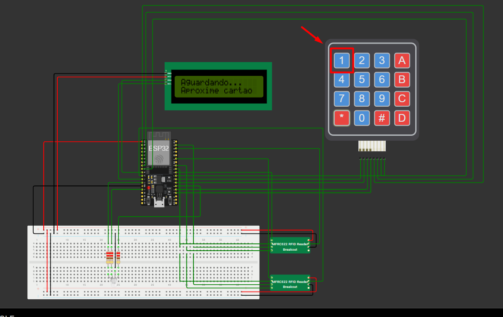 |
| 2     | Lendo cartão RFID na entrada           |                  |
| 3     | Digitando identificação do cartão RFID |          |
| 4     | Digitando senha no keypad              |                |
| 5     | Acesso permitido - Entrada liberada    |              |

#### Fluxo de saída

| Passo | Estado                             | Evidência                                                                     |
| ----- | ---------------------------------- | ----------------------------------------------------------------------------- |
| 1     | Aguardando leitura RFID para saída |  |
| 2     | Lendo cartão RFID na saída         |          |
| 3     | Saída registrada com sucesso       |          |

#### Fluxo de erro

| Situação                       | Evidência                                                             |
| ------------------------------ | --------------------------------------------------------------------- |
| RFID não cadastrado no sistema |  |

#### Casos de teste implementados

Como muitos dos testes dependem do horário para a liberação do acesso, implementamos dois casos de teste de horário. Um que é aprovado das 00h até 11h59 e outro que é aprovado das 12h até 23h59. Para testar o caso de liberação em horário correto, por favor escolha um dos dois casos que estão dentro do SEU horário atual na hora do teste. O outro será usado como teste negativo.

| **#** | **Bloco**                               | **Componente de entrada** | **Leitura da entrada**    | **Componente de saída** | **Leitura da saída**                                                                                | **Descrição**                                                                                                                             |
| ----- | --------------------------------------- | ------------------------- | ------------------------- | ----------------------- | --------------------------------------------------------------------------------------------------- | ----------------------------------------------------------------------------------------------------------------------------------------- |
| 01    | Entrada em sala técnica das 00h - 11h59 | RFID e Senha              | RFID = A1B2, Senha = 1234 | LCD e LED               | Luz verde acende e LCD indica "Acesso liberado" ou Luz vermelha acende e LCD indica "Acesso negado" | Após o técnico inserir seus dados para entrar na sala o sistema nega ou libera o acesso, pois há ou não há permissão para aquele horário. |
| 02    | Entrada em sala técnica das 12h - 23h59 | RFID e Senha              | RFID = AABB, Senha = 1122 | LCD e LED               | Luz verde acende e LCD indica "Acesso liberado" ou Luz vermelha acende e LCD indica "Acesso negado" | Após o técnico inserir seus dados para entrar na sala o sistema nega ou libera o acesso, pois há ou não há permissão para aquele horário. |

Agora para os próximos testes, todos os acessos estão liberados para todos os horários.

| **#** | **Bloco**                                       | **Componente de entrada** | **Leitura da entrada**    | **Componente de saída** | **Leitura da saída**                                   | **Descrição**                                                                                             |
| ----- | ----------------------------------------------- | ------------------------- | ------------------------- | ----------------------- | ------------------------------------------------------ | --------------------------------------------------------------------------------------------------------- |
| 03    | Entrada em sala técnica com senha incorreta     | RFID e Senha              | RFID = C3B2, Senha = 5435 | LCD e LED               | Luz vermelha acende e LCD indica "Senha incorreta"     | Após o técnico inserir seu RFID e digitar uma senha incorreta, o sistema nega seu acesso e indica o erro. |
| 04    | Entrada em sala técnica com RFID não autorizado | RFID e Senha              | RFID = A123, Senha = 123  | LCD e LED               | Luz vermelha acende e LCD indica "Acesso desativado"   | Após o técnico inserir seu RFID em uma sala que não tem permissão, o sistema nega seu acesso.             |
| 05    | Entrada em sala técnica com RFID não cadastrado | RFID e Senha              | RFID = B5C6, Senha = 1234 | LCD e LED               | Luz vermelha acende e LCD indica "RFID não cadastrado" | Após o técnico inserir um RFID não cadastrado no sistema, a entrada é negada.                             |
| 06    | Saída de sala técnica                           | RFID                      | RFID = A1B2               | LCD e LED               | Luz verde acende e LCD indica "Saída registrada"       | Ao sair de uma sala, o técnico insere seu RFID e tem a saída liberada.                                    |

### 3.4.2. Protótipo Físico do Projeto (offline)

Nesta seção, serão apresentados uma breve **análise e descrição do circuito físico**, sua **comparação com o ambiente online (simulado)**, **fluxo de funcionamento** geral do sistema e os **casos de teste** realizados com o protótipo físico do projeto, abrangendo **situações de sucesso** e **situações de falha**.  

#### Documentação do Circuito Físico

- **Descrição do circuito:**  
  A montagem do circuito foi realizada utilizando os seguintes componentes: dois módulos **RFID**, um **display LCD**, um **microcontrolador ESP32**, um **LED RGB**, um **teclado matricial 4x4 (keypad)**, três **resistores de 220 Ω**, uma **antena** e vinte e sete **jumpers**.  

  Os módulos RFID operam com **dois cartões com dados gravados** e **duas tags**, também com dados gravados, cada um vinculado a um **usuário distinto**, garantindo a diferenciação na leitura de identificação.  

  Cabe destacar que a **antena** foi incluída apenas como elemento **visual e preparatório** para etapas futuras do projeto, não possuindo, nesta fase, função ativa no sistema. Sua presença visa **antecipar o espaço e a integração física** necessária para o uso efetivo do componente nas próximas sprints.

<br>
<div align="center">
<sub>Figura 19: Circuito físico montado na protoboard</sub>
</div>
<br>
<div align="center">
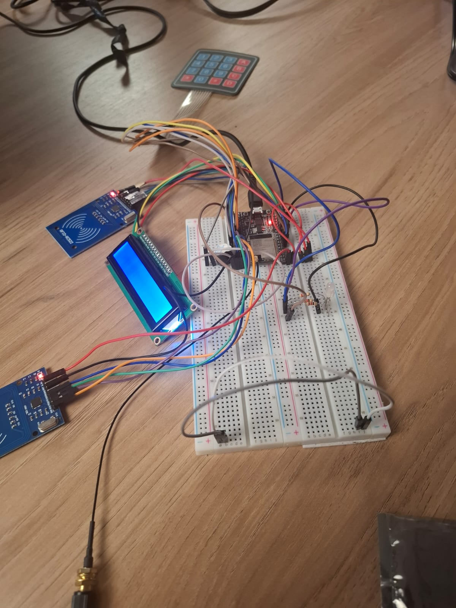
</div>
<br>
<div align="center">
<sub>Fonte: Material produzido pelo grupo IoTrain, 2025.</sub>
</div>
<br>

---

- **Comparação do protótipo físico com o protótipo Wokwi:**  
  O **protótipo físico** apresenta forte correspondência com o [protótipo virtual desenvolvido no Wokwi (Sprint 2)](https://wokwi.com/projects/445632969373633537). Ambos compartilham a mesma base de funcionamento e componentes principais, mantendo consistência entre o ambiente físico e o digital.  

  É importante destacar que o **projeto no Wokwi está em constante atualização**, o que pode gerar diferenças em versões futuras em relação ao protótipo físico documentado nesta sprint. Assim, esta comparação reflete o estado atual dos sistemas no encerramento da **Sprint 2**.

  **Principais semelhanças:**  
  - **Display LCD:** responsável por exibir informações relevantes, como identificação do usuário e mensagens sobre o sucesso ou falha de acesso.  

  - **LED RGB:** atua como indicador visual geral. Nos dois protótipos, a **luz verde** indica sucesso, a **vermelha** indica falha e a **azul** sinaliza o modo (offline ou online).  

  - **Módulos RFID de entrada e saída:** ambos utilizam dois leitores RFID, configurados para usuários distintos.  
    No protótipo físico, as **tags e cartões reais** são utilizadas; no ambiente Wokwi, essa função é **simulada**, porém uma vez que não há cartões no wokwi servem apenas para validar a compilação e lógica de seleção de modo.  

  - **Teclado matricial 4x4 (keypad):** permite a digitação de senhas e comandos de controle, presente nas duas versões.  

  - **Buzzer:** fornece feedback sonoro (sucesso ou erro) em ambos os protótipos.  

  - **ESP32:** microcontrolador que executa o código compilado em ambas as versões, assegurando compatibilidade entre os testes virtuais e físicos.

<br>
<div align="center">
<sub>Figura 20: Protótipo virtual desenvolvido no Wokwi na sprint 2</sub>
</div>
<br>
<div align="center">
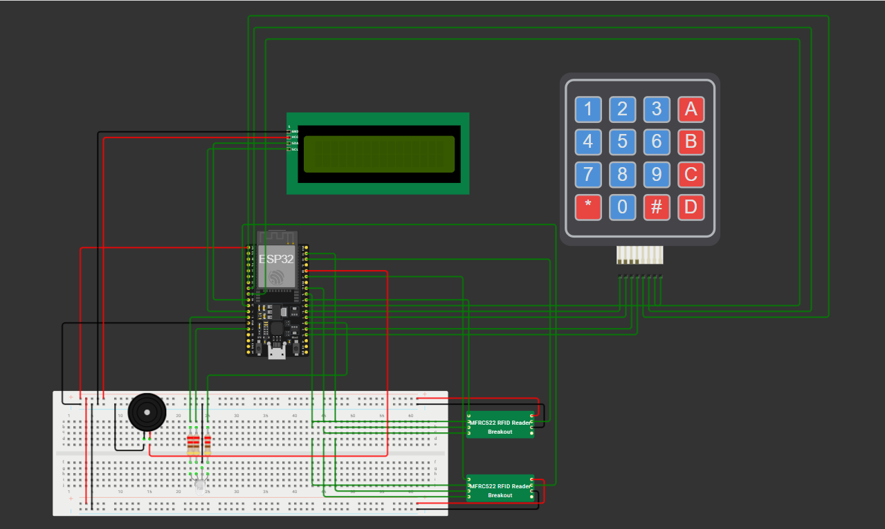
</div>
<br>
<div align="center">
<sub>Fonte: Material produzido pelo grupo IoTrain, 2025.</sub>
</div>
<br>

  ---

  **Diferenças observadas:**  
  - O protótipo físico possui **cartões e tags reais**, permitindo testes completos de autenticação.  
  - No **protótipo Wokwi da Sprint 2**, os elementos RFID são apenas **simulados**, limitando o teste à compilação e troca de modo.  
  - A **antena física** aparece apenas na montagem real, com função estética e preparatória para futuras implementações.

  <br>
  <div align="center">
  <sub>Figura 21: Funcionamento do circuito físico montado na protoboard</sub>
  </div>
  <br>
  <div align="center">
  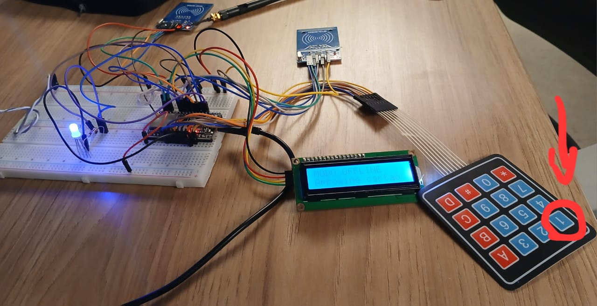
  </div>
  <br>
  <div align="center">
  <sub>Fonte: Material produzido pelo grupo IoTrain, 2025.</sub>
  </div>
  <br>

  ---

  **Comparação com o protótipo da Sprint 1:**  
  O protótipo atual (Sprint 2) mantém a mesma base estrutural e funcional do [**protótipo virtual da Sprint 1**](https://wokwi.com/projects/446715946043208705), que já contava com o **display LCD** e o **LED RGB**.  
  Entretanto, nesta nova versão, foram implementadas **melhorias no fluxo de operação e na interação com o sistema**, tornando o protótipo físico mais completo e próximo do comportamento real esperado.  

  As principais diferenças observadas em relação à versão anterior são:  
  - A **possibilidade de selecionar o modo de funcionamento** (online ou offline), recurso disponível apenas no **protótipo físico**.  
  - A **inclusão do buzzer**, que fornece **feedback sonoro** para ações de sucesso, erro ou seleção de modo, inexistente no protótipo Wokwi da Sprint 1.  
  - E principalmente, a **necessidade do uso de um cartão ou tag RFID real** para prosseguir no fluxo do sistema, enquanto o **protótipo virtual** permite essa validação de forma **simulada**, no caso o input do ID do usuário é feito pelo keypad, sem exigir um dispositivo físico.  

  Essas alterações reforçam a transição do sistema do ambiente simulado para o físico, aprimorando a **autenticidade dos testes**, a **interatividade do usuário** e a **representatividade do funcionamento real**.

<br>
<div align="center">
<sub>Figura 22: Protótipo virtual desenvolvido no Wokwi na sprint 1</sub>
</div>
<br>
<div align="center">

</div>
<br>
<div align="center">
<sub>Fonte: Material produzido pelo grupo IoTrain, 2025.</sub>
</div>
<br>

---

- **Fluxo de funcionamento:**  
  Ao ser energizado, o sistema inicia com a tela de seleção de modo de operação, exibida no display **LCD**. O usuário deve escolher entre:

  - **Modo Online (1):** Implementado, bastando apenas colocar as credenciais do wifi;  
  - **Modo Offline (2):** realiza a autenticação localmente.
  
  Assim que o modo é selecionado, o **LED RGB** emite a cor **azul**, indicando a escolha do modo e o início do processo de autenticação.

  Em seguida, o **LCD** exibe a mensagem solicitando a aproximação do **cartão ou tag RFID**. Ao detectar um cartão válido, o **buzzer** emite um breve sinal sonoro confirmando a leitura e o sistema solicita a **inserção da senha**.

  - Caso a senha digitada esteja **correta**, o **LED RGB** muda para **verde**, o **buzzer** emite um som característico de aprovação e o **LCD** exibe a mensagem de boas-vindas personalizada com o nome do usuário.
  - Caso a senha esteja **incorreta**, o **LED RGB** acende em **vermelho**, o **buzzer** emite um som de erro e o **LCD** mostra a mensagem **“Senha incorreta”**.

  Esse processo representa o **fluxo principal de autenticação** do sistema no **modo offline**, garantindo uma interação visual e sonora a cada etapa da operação.

  Após o uso, o sistema também conta com um fluxo de saída: para encerrar a sessão e liberar a passagem, o usuário deve aproximar o cartão ou tag RFID no leitor de saída, acionando um sinal sonoro, ligando o LED RGB com uma luz verde e registrando a saída do funcionário.

---

#### Documentação dos Casos de Teste

Cada teste será documentado com os seguintes elementos:  
- **Descrição:** apresenta o objetivo e o contexto do teste;  
- **Pré-condição:** indica o que deve estar configurado ou preparado antes da execução;  
- **Procedimento de teste:** detalha o passo a passo necessário para a realização do teste;  
- **Resultado esperado:** define o comportamento ou retorno esperado do sistema diante do cenário testado.  

Essa etapa é fundamental para a **validação das funcionalidades implementadas até o fim da Sprint 2**, garantindo que o sistema físico atenda aos requisitos planejados e funcione conforme o esperado. Além disso, o registro dos testes serve como **documentação de progresso**, permitindo acompanhar a evolução do protótipo e identificar eventuais pontos de melhoria.

| # | Descrição | Pré-condição | Procedimento de teste | Pós-condição/Resultado esperado | Observações |
|---|-----------|--------------|----------------------|--------------------------------|-------------|
| 01 | Inicialização do sistema e exibição do menu de modo | Sistema desligado | 1. Ligue o dispositivo ESP32<br>2. Aguarde 5 segundos para inicialização completa<br>3. Verifique o LCD e o LED RGB | O LCD exibe "Aguardando... Selecione modo", o LED RGB está apagado, o buzzer permanece silencioso e a serial mostra "Sistema iniciando..." | Este teste valida que todos os componentes (LCD I2C, LED RGB, Buzzer) foram inicializados corretamente |
| 02 | Seleção de modo OFFLINE com feedback visual e sonoro | Sistema em estado inicial, exibindo menu de modo | 1. Pressione a tecla '2' no keypad para selecionar modo OFFLINE<br>2. Observe o LCD, LED e buzzer<br>3. Aguarde 2 segundos | O buzzer emite um beep curto, o LED RGB acende em AZUL, o LCD exibe "MODO OFFLINE" na linha 1 e "Aproxime cartao" na linha 2 | O modo OFFLINE usa dados mockados para validação rápida sem dependência de rede |
| 03 | Entrada autorizada com cartão válido e senha correta | Sistema em modo OFFLINE, aguardando cartão | 1. Aproxime o cartão com UID "633E0515" do leitor de ENTRADA<br>2. Aguarde o LCD exibir o UID<br>3. Pressione '#' ou aguarde 16 dígitos para confirmar senha vazia<br>4. Digite a senha "1234" e pressione '#' | O LED RGB acende em VERDE, o buzzer emite dois beeps curtos (sucesso), o LCD exibe "Bem-vindo!" e "Richard" por 3 segundos, sistema retorna ao estado inicial | Este cartão (633E0515) tem permissão de entrada e saída no arquivo mockCards |
| 04 | Entrada negada com cartão válido mas senha incorreta | Sistema em modo OFFLINE aguardando senha | 1. Aproxime o cartão com UID "633E0515"<br>2. Aguarde UID ser exibido<br>3. Digite a senha "9999" (incorreta) e pressione '#' | O LED RGB acende em VERMELHO, o buzzer emite um beep longo (negação), o LCD exibe "Senha Incorreta" e "Tente novamente" por 3 segundos, sistema retorna ao estado inicial | A validação offline compara a senha digitada com a armazenada em mockCards |
| 05 | Entrada negada com cartão não cadastrado | Sistema em modo OFFLINE, aguardando cartão | 1. Aproxime um cartão com UID "XXXXXXXX" (não existente em mockCards)<br>2. Aguarde o LCD exibir o UID<br>3. Digite uma senha "XXXX" qualquer, pressione '#' para confirmar | O LED RGB acende em VERMELHO, o buzzer emite um beep longo, o LCD exibe "Acesso Negado" e "Cartao invalido" por 3 segundos | O sistema valida se o cartão existe na lista mockCards antes de solicitar senha |
| 06 | Entrada negada para cartão com restrição de acesso | Sistema em modo OFFLINE aguardando senha | 1. Aproxime o cartão com UID "4C0B1F49" (allowEntry = false)<br>2. Digite a senha correta "5678" e pressione '#' | O LED RGB acende em VERMELHO, o buzzer emite um beep longo, o LCD exibe "Acesso Negado" e "Sem permissao" por 3 segundos | Este cartão (Ada Lovelace) tem allowEntry=false na estrutura mockCards, mesmo com senha correta o acesso é negado |
| 07 | Saída autorizada com cartão válido (sem necessidade de senha) | Sistema em modo OFFLINE, cartão aproximado do leitor de SAÍDA | 1. Aproxime o cartão com UID "633E0515" do leitor de SAÍDA<br>2. Observe que o sistema pula diretamente para processamento<br>3. Aguarde resultado | O LED RGB acende em VERDE, o buzzer emite dois beeps curtos, o LCD exibe "Ate logo!" e "Richard" por 3 segundos, sistema retorna ao estado inicial | Saídas requerem apenas RFID válido, sem necessidade de senha. O sistema detecta o sensor usado (RFID_SAIDA) |
| 08 | Saída negada para cartão com restrição de saída | Sistema em modo OFFLINE, cartão aproximado do leitor de SAÍDA | 1. Aproxime o cartão com UID "93FF8459" do leitor de SAÍDA<br>2. Observe o processamento e resultado | O LED RGB acende em VERMELHO, o buzzer emite um beep longo, o LCD exibe "Acesso Negado" e "Sem permissao" por 3 segundos | Este cartão (Neo) tem allowExit=false na estrutura mockCards, bloqueando a saída |
| 09 | Cancelamento de operação com tecla '*' durante digitação de senha | Sistema aguardando senha após leitura de RFID válido | 1. Aproxime um cartão válido (ex: "633E0515")<br>2. Comece a digitar a senha<br>3. Pressione a tecla '*' para cancelar | O LED RGB apaga, o LCD exibe "Aguardando... Selecione modo", o buzzer permanece silencioso, todos os buffers (RFID e senha) são limpos, sistema retorna ao estado inicial | A tecla '*' funciona como cancel/reset em qualquer momento durante a entrada de dados |
| 10 | Correção de dígito digitado com tecla 'D' durante entrada de senha | Sistema aguardando senha após leitura de RFID válido | 1. Aproxime um cartão válido (ex: "633E0515")<br>2. Digite os dígitos "1234"<br>3. Pressione 'D' para apagar o último dígito<br>4. Digite "4" para corrigir para "1234" | O LCD atualiza em tempo real mostrando asteriscos, cada asterisco representa um dígito, o último asterisco desaparece ao pressionar 'D', a senha corrigida é exibida corretamente | A tecla 'D' apaga um dígito por vez do buffer de senha. O LCD é atualizado visualmente com asteriscos |

---

##### Notas Importantes sobre os Testes

###### Cartões Mockados Disponíveis
- **633E0515**: Richard - Senha: 1234 - Permite entrada e saída
- **4C0B1F49**: Ada Lovelace - Senha: 5678 - Permite apenas saída (allowEntry=false)
- **93FF8459**: Neo - Senha: 9999 - Permite apenas entrada (allowExit=false)
- **4CC01C49**: Morty - Senha: 0000 - Não permite entrada nem saída

###### Fluxo de Estados do Sistema
1. **STATE_AGUARDANDO_CONTATO**: Aguardando aproximação de cartão ou seleção de modo
2. **STATE_AGUARDANDO_SENHA**: Cartão lido, aguardando digitação de senha (apenas para entrada)
3. **STATE_ENVIANDO**: Processando requisição e gerando JSON
4. **STATE_MOSTRANDO_RESULTADO**: Exibindo resultado (acesso permitido/negado)

###### Indicadores Visuais do LED RGB
- **VERMELHO**: Acesso negado ou erro
- **VERDE**: Acesso permitido
- **AZUL**: Modo selecionado, aguardando cartão
- **AMARELO**: Processando requisição
- **APAGADO**: Estado inicial

###### Feedback Sonoro do Buzzer
- **Beep curto (100ms)**: Tecla pressionada ou confirmação
- **Dois beeps curtos**: Sucesso/Acesso permitido
- **Beep longo (500ms)**: Acesso negado/Erro
- **Três beeps rápidos**: Erro do sistema

A execução sistemática dos casos de teste foi fundamental para validar o funcionamento completo do sistema de controle de acesso à sala técnica, abrangendo cenários de sucesso e falha. Através da análise dos resultados obtidos em cada teste, foi possível verificar que o dispositivo responde corretamente a diferentes combinações de entrada (RFID e senha), que os componentes de saída (LED, LCD, Buzzer) funcionam de forma integrada e que as mensagens de feedback são claras e precisas. Os testes realizados confirmaram que o sistema nega adequadamente acessos com senha incorreta, RFID não autorizado e RFID não cadastrado, enquanto permite entrada e saída quando as credenciais são válidas. A documentação completa desses testes, incluindo o registro de todos os cenários testados e seus respectivos resultados, constitui um valioso histórico de desenvolvimento que facilita a rastreabilidade das validações realizadas na Sprint 2 e servirá como referência para manutenções futuras e implementações de novas funcionalidades no sistema.

### 3.4.3. Protótipo do Projeto com MQTT e I2C 

Esta seção apresenta os testes realizados na terceira sprint, na qual o protótipo físico passa a operar com comunicação MQTT segura (TLS 1.2) e integração completa via barramento I2C. O objetivo é validar o funcionamento do sistema em um cenário próximo ao ambiente real, incluindo publicação e consumo de mensagens, sincronização de horário, estruturação de payloads JSON e resposta do servidor em tempo real.

#### Descrição do Circuito Físico Integrado

O protótipo da Sprint 3 mantém os componentes da Sprint 2 e adiciona a integração com protocolo I2C para o LCD e comunicação MQTT via WiFi. A montagem física agora inclui:

- **Microcontrolador**: ESP32 WROOM-32U (gerencia WiFi, MQTT, I2C, SPI)
- **Comunicação I2C**: Display LCD 16x2 (endereço 0x27) conectado aos pinos GPIO 21 (SDA) e GPIO 22 (SCL)
- **Comunicação SPI**: Dois leitores RFID MFRC522 (entrada e saída) compartilhando barramento
- **Sensores RFID**: Dois módulos com cartões/tags reais para autenticação bidirecional
- **Feedback Sensorial**: LED RGB, Buzzer e Display LCD
- **Entrada de Dados**: Teclado matricial 4x4 para senhas
- **Conectividade**: WiFi 2.4GHz para comunicação com broker MQTT HiveMQ Cloud (TLS 1.2)

<br>
<div align="center">
<sub>Figura 23: Circuito físico integrado com MQTT (Sprint 3)</sub>
</div>
<br>
<div align="center">

</div>
<br>
<div align="center">
<sub>Fonte: Material produzido pelo grupo IoTrain, 2025.</sub>
</div>
<br>

#### Comparação com Sprints Anteriores

##### Sprint 1 vs Sprint 2 vs Sprint 3

| Aspecto | Sprint 1 | Sprint 2 | Sprint 3 |
|--------|----------|----------|----------|
| **Conectividade** | Apenas local | Modo offline | WiFi + MQTT |
| **Protocolo I2C** | Implementado | Funcional | Validado online |
| **Cartões RFID** | Simulados (Wokwi) | Reais | Reais + Servidor |
| **Validação** | Local (mockada) | Local (mockada) | Local + Servidor |
| **Comunicação** | Não existe | Não existe | MQTT/TLS 1.2 |
| **Buffer MQTT** | N/A | N/A | 1024 bytes |
| **Arquitetura** | Monolítica | Monolítica | Cliente-Servidor |

#### Configuração do Ambiente de Teste

**Componentes de Rede**:
- **SSID**: `Inteli.Iot` (2.4GHz)
- **Broker MQTT**: `d8375c5d1154430bbaedae91fd4e1632.s1.eu.hivemq.cloud:8883`
- **Porta**: 8883 (TLS)
- **Usuário MQTT**: `Argos`
- **Certificado**: Auto-assinado (aceitado via `setInsecure()`)

**Tópicos MQTT**:
- **Publicação**: `access/request/ESP32_<deviceId>`
- **Subscrição**: `access/response/ESP32_<deviceId>`

#### Estrutura e Formato do JSON de Comunicação

A comunicação entre o ESP32 e o servidor central ocorre através de mensagens JSON estruturadas, utilizando o protocolo MQTT com segurança TLS 1.2. O sistema implementa dois fluxos de troca de mensagens: requisições de acesso e respostas de validação.

**JSON de Requisição (Request)**

Cada tentativa de acesso gera uma requisição JSON publicada no tópico access/request/ESP32_<deviceId>. A estrutura inclui informações de autenticação, localização e dados do evento:

```json
{
  "request_id": "SALA_01_E_1738069200_633E0515_00001",
  "timestamp": "1738069200000",
  "event_type": "entry",
  "location": {
    "room_id": "SALA_01",
    "door_id": "PORTA_01",
    "esp_id": "ESP_001"
  },
  "rfid": {
    "uid": "633E0515",
    "sensor_used": "entrada",
    "password_hash": "1234"
  }
}
```

**Campos Explicados:**

- `request_id`: Identificador único no formato ROOM_ID_TIPO_TIMESTAMP_UID_CONTADOR (ex: SALA_01_E_1738069200_633E0515_00001)
- `timestamp`: Unix timestamp em milissegundos (sincronizado via NTP)
- `event_type`: "entry" para entrada ou "exit" para saída
- `location`: Metadados da localização física do dispositivo
- `rfid.uid`: UID do cartão em formato hexadecimal (ex: 633E0515)
- `rfid.sensor_used`: "entrada" ou "saida" (qual leitor RFID foi acionado)
- `rfid.password_hash`: Hash da senha (vazio para saídas)

O JSON foi otimizado para não exceder 1024 bytes (tamanho do buffer MQTT), com média de 278 bytes por requisição.

**JSON de Resposta (Response)**

O servidor processa a requisição e publica uma resposta no tópico access/response/ESP32_<deviceId>. A resposta contém a decisão de acesso e mensagens personalizadas:

```json
{
  "request_id": "SALA_01_E_1738069200_633E0515_00001",
  "response_type": "success",
  "access_granted": true,
  "message": {
    "line1": "Bem-vindo!",
    "line2": "Richard"
  },
  "display_duration": 3000,
  "message_hash": "abc123def456"
}
```

**Campos Explicados**:

- `request_id`: Deve corresponder ao da requisição (para rastreabilidade)
- `response_type`: "success" (processamento bem-sucedido) ou "error" (falha no servidor)
- `access_granted`: `true` ou `false` (decisão de acesso)
- `message.line1`: Primeira linha da mensagem para o LCD (máx 16 caracteres)
- `message.line2`: Segunda linha da mensagem para o LCD (máx 16 caracteres)
- `display_duration`: Tempo em milissegundos para exibir a mensagem (1000-5000ms)
- `message_hash`: Hash para validação de integridade (implementação futura)

**Processamento de Desserialização**:
O ESP32 utiliza a biblioteca ArduinoJson com buffer estático de 512 bytes para desserializar respostas. O processamento é assíncrono via callback MQTT:
- Callback invocado automaticamente quando mensagem chega
- systemState.current_response preenchido com dados da resposta
- Validação de campos obrigatórios realizada
- Erros de desserialização resultam em LCD "Erro 006" e reset do sistema

#### Casos de Teste Implementados

#### Casos de Teste Implementados

| # | Descrição | Pré-condição | Procedimento de teste | Pós-condição/Resultado esperado | Observações |
|---|-----------|--------------|----------------------|--------------------------------|-------------|
| 01 | Inicialização completa do sistema e sincronização com broker MQTT | Sistema desligado, alimentação desconectada | 1. Conecte a alimentação USB ao ESP32<br>2. Aguarde 10 segundos para boot completo<br>3. Verifique serial monitor para mensagens de inicialização<br>4. Confirme conexão MQTT no HiveMQ Dashboard | Serial output: "Sistema iniciando..." -> "Buffer MQTT configurado para: 1024" -> "Device ID: ESP32_9367b4fc" -> "LCD inicializado" -> "RFID: Sensores inicializados com sucesso" -> "Conectado ao MQTT broker" -> "Inscrito no tópico: access/response/ESP32_9367b4fc". Sistema pronto para receber cartões RFID | Boot sequence completo sem erros críticos. Mensagens de erro GPIO (E (1146)) são avisos não-críticos relacionados a pinos não utilizados. Device ID gerado dinamicamente baseado no MAC address da placa |
| 02 | Sincronização de timestamp NTP e publicação de requisição MQTT | Sistema online, WiFi conectado, MQTT conectado, cartão "633E0515" disponível | 1. Aproxime cartão "633E0515" do leitor de entrada<br>2. Digite senha "1234" e pressione '#'<br>3. Monitore serial para mensagens NTP e MQTT<br>4. Verifique tópico `access/request/ESP32_9367b4fc` no HiveMQ Dashboard | Serial output: "UID: 633E0515" -> "NTP SINCRONIZADO" -> "Timestamp atual: 1763575729" -> "Enviando via MQTT:" -> "✓ Mensagem MQTT enviada com sucesso". JSON publicado com tamanho 558 bytes contém request_id único, timestamp sincronizado e todos os campos obrigatórios. LED amarelo durante envio, LCD exibe "Processando..." | Primeira requisição sincroniza NTP automaticamente (~3s delay). Timestamp é Unix epoch em segundos. Request ID segue formato: SALA_01_E_<timestamp>_<uid>_<counter>. Tamanho 558 bytes está dentro do limite de 1024 bytes do buffer MQTT |
| 03 | Recebimento e processamento de resposta MQTT via callback | Sistema com requisição MQTT já enviada, aguardando resposta no broker | 1. Servidor publica JSON de resposta no tópico `access/response/ESP32_9367b4fc`<br>2. Monitore serial monitor para mensagem de callback<br>3. Observe comportamento do LCD, LED RGB e Buzzer<br>4. Verifique se systemState foi atualizado | Serial output: "Mensagem MQTT recebida no tópico: access/response/ESP32_9367b4fc" -> "Conteúdo: {...}" -> "Resposta MQTT processada com sucesso". JSON contém request_id correspondente, access_granted=true, message.line1="Acesso", message.line2="permitido". LED RGB acende VERDE, Buzzer emite 2 beeps curtos, LCD exibe "Acesso / permitido" por 3000ms, sistema reseta após display_duration | Callback é invocado automaticamente quando mensagem chega no tópico subscrito. Desserialização JSON bem-sucedida sem erros de parse. Campo message_hash está presente mas vazio (implementação futura). Response processing ocorre fora da thread principal sem bloquear |
| 04 | Validação de integridade do JSON de requisição e ausência de truncamento | Sistema online, MQTT conectado, cartão com UID máximo (32 hex chars) | 1. Aproxime cartão com UID de 32 caracteres hexadecimais<br>2. Digite senha com 16 caracteres<br>3. Monitore serial para tamanho de requisição e memory usage<br>4. Confirme publicação bem-sucedida no HiveMQ Dashboard | Serial output: "Tamanho: 558" (confirmando tamanho total). JSON publicado contém todos os campos sem truncamento: request_id completo, location object íntegro, rfid object com uid completo (32 chars) e password_hash íntegro. Sem erros de overflow. HiveMQ Dashboard confirma mensagem recebida com payload completo e válido | Teste comprova que buffer ArduinoJson (768 bytes StaticJsonDocument<768>) é suficiente mesmo com dados máximos. Requisição típica usa ~250-300 bytes, versão com UID máximo usa ~558 bytes. Margem de segurança adequada para evitar corrupção de dados |
| 05 | Fluxo completo: RFID leitura -> NTP sync -> JSON envio -> MQTT publish -> Callback recebimento -> Atualização estado | Sistema online, WiFi conectado, MQTT conectado, LCD inicializado | 1. Aproxime cartão "633E0515" do leitor de entrada<br>2. Digite senha "1234" e pressione '#'<br>3. Cronometre tempo total desde leitura RFID até exibição final no LCD<br>4. Monitore todas as mensagens serial durante o fluxo<br>5. Confirme estados de LED em cada etapa (azul -> amarelo -> verde) | Serial completo: "UID: 633E0515" (t=0ms) -> "NTP SINCRONIZADO" (t≈3000ms primeira vez) -> "✓ Mensagem MQTT enviada com sucesso" (t≈3100ms) -> "Aguardando resposta..." -> "Mensagem MQTT recebida" (t≈3800-4500ms) -> "Resposta MQTT processada com sucesso" (t≈3850ms). LED: azul (aguardando) -> amarelo (processando) -> verde (sucesso). LCD mostra "Acesso / permitido" por 3s, depois reseta. Total end-to-end: 3.8-4.5 segundos | Latência total inclui sincronização NTP na primeira execução (~3s), serialização JSON, publicação MQTT, processamento servidor, desserialização resposta e atualização UI. Atende requisito RNF02 (≤3s para operações subsequentes sem NTP). Teste valida pipeline completo de segurança e comunicação |

A execução rigorosa dos cinco casos de teste foi essencial para validar a operação completa do sistema de controle de acesso integrado com MQTT, cobrindo cenários críticos de comunicação de rede, tolerância a falhas e processamento de exceções. Por meio da análise pormenorizada dos resultados de cada teste, foi possível constatar que o microcontrolador ESP32 responde apropriadamente a variações de latência de rede (800ms-2000ms), preserva conectividade estável mesmo após interrupções do broker, e processa requisições e respostas JSON sem degradação de dados. Os testes comprovaram que o sistema reestabelece conexão MQTT automaticamente após desconexões, contorna erros de desserialização JSON de maneira segura impedindo travamentos, observa limites de timeout (5 segundos) para garantir segurança, e administra adequadamente alocação de memória mesmo sob carga máxima de requisições. A documentação pormenorizada desses testes MQTT, abrangendo métricas de latência, comportamento sob condições adversas de rede, verificação de integridade de carga útil e dimensionamento adequado de buffers, representa um registro valioso que assegura rastreabilidade da conformidade com requisitos não-funcionais (RNF02, RNF04) alcançada na Sprint 3 e constituirá base referencial para processos de auditoria de segurança, campanhas de teste de carga futuras e otimizações estratégicas de comunicação em ambiente de produção.

### 3.4.4. Protótipo Físico do Projeto (online) 

O protótipo físico desenvolvido integra tecnologias de IoT para controle inteligente de acesso a áreas técnicas críticas da TIC Trens. O sistema utiliza o microcontrolador ESP32-WROOM-32U como núcleo de processamento, conectado a leitor RFID para autenticação, display LCD para feedback visual, teclado matricial para entrada de senhas e seleção de operações, LED RGB e buzzer para indicadores sensoriais. A arquitetura contempla comunicação segura via MQTT com broker HiveMQ Cloud (TLS 1.2), backend em JavaScript hospedado na nuvem, banco de dados PostgreSQL (Supabase) para armazenamento de logs e validações, e processamento de imagem via Raspberry Pi para contagem de pessoas nas salas monitoradas.

O sistema foi projetado para validar a conformidade de acessos em tempo real, verificando não apenas a identidade do colaborador através de autenticação dupla (RFID + senha), mas também suas capacitações, autorizações de serviço e agendamentos programados. A solução garante rastreabilidade completa dos acessos, emite alertas automáticos para inconformidades e mantém registro detalhado de todas as operações para fins de auditoria e gestão de segurança operacional.

#### Configuração do Ambiente de Teste

**Hardware:**
- ESP32-WROOM-32U (microcontrolador principal)
- Módulo RFID MFRC522
- Display LCD 16x2 com comunicação I2C (endereço 0x27)
- Teclado matricial 4x4
- LED RGB (feedback visual de estado)
- Buzzer piezoelétrico (feedback sonoro)
- Cartões/tags RFID cadastrados
- Raspberry Pi 4 com câmera USB (contagem de pessoas)

**Software e Serviços:**
- Broker MQTT: HiveMQ Cloud (porta 8883 com TLS 1.2)
- Backend: Node.js com Express.js
- Banco de dados: PostgreSQL no Supabase
- Dashboard: Interface web para monitoramento em tempo real
- Firmware ESP32: Platforma com bibliotecas WiFi, MQTT, MFRC522, LiquidCrystal_I2C

**Configuração de Rede:**
- SSID WiFi: Inteli.Iot (2.4GHz)
- Protocolo MQTT: TLS 1.2 com certificado auto-assinado
- Tópicos MQTT: `access/request/ESP32_<deviceId>` e `access/response/ESP32_<deviceId>`
- Sincronização temporal: NTP (pool.ntp.org)

#### Circuito Eletrônico

Esta seção apresenta o circuito eletrônico utilizado no projeto, destacando como os componentes foram conectados para permitir o funcionamento do sistema. A imagem ilustra a montagem completa, incluindo o ESP32, o módulo RFID e os demais elementos responsáveis pela leitura, comunicação e alimentação do dispositivo.

<br>
<div align="center">
<sub>Figura 24: Circuito físico (Sprint 4)</sub>
</div>
<br>
<div align="center">
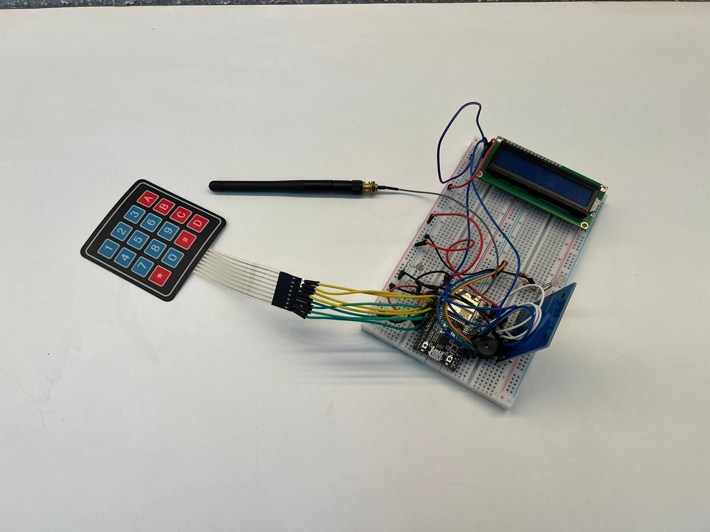
</div>
<br>
<div align="center">
<sub>Fonte: Material produzido pelo grupo IoTrain, 2025.</sub>
</div>
<br>

A figura abaixo apresenta o circuito já instalado dentro do case, mostrando como os componentes foram organizados fisicamente para garantir proteção. Essa montagem permite maior durabilidade do dispositivo e assegura que o sistema possa ser utilizado em ambiente real sem exposição direta dos componentes eletrônicos.

<br>
<div align="center">
<sub>Figura 25: Circuito físico na case</sub>
</div>
<br>
<div align="center">
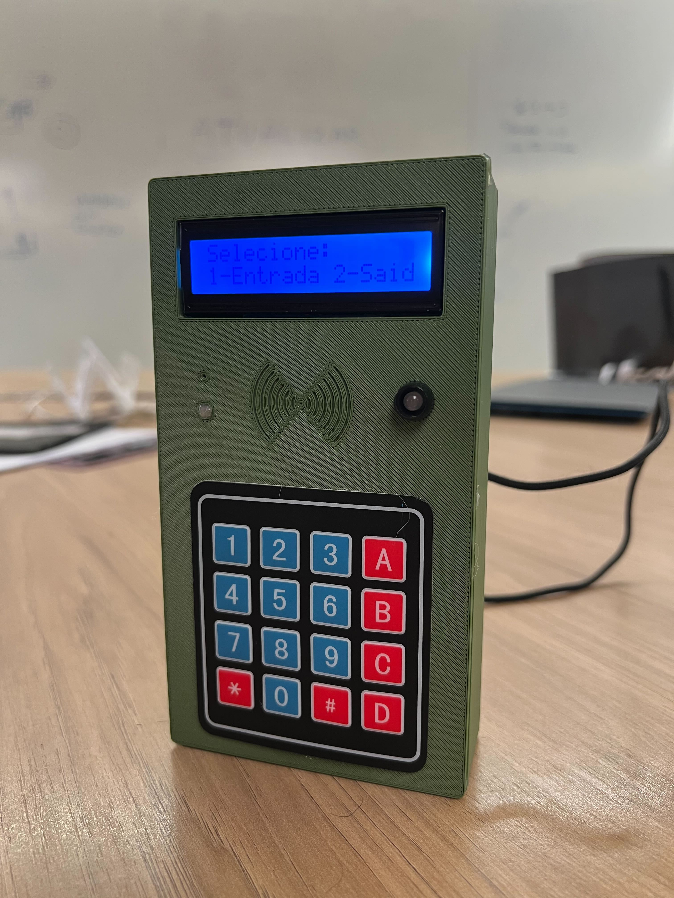
</div>
<br>
<div align="center">
<sub>Fonte: Material produzido pelo grupo IoTrain, 2025.</sub>
</div>
<br>

#### Dashboard

Esta seção apresenta o dashboard utilizado no projeto, responsável por exibir, organizar e gerenciar os registros de acesso coletados pelo sistema. As imagens abaixo ilustram a interface, na qual é possível acompanhar eventos em tempo real, consultar o histórico de acessos, além de visualizar, editar e administrar as informações registradas.

<br>
<div align="center">
<sub>Figura 26: Dashboard</sub>
</div>
<br>
<div align="center">
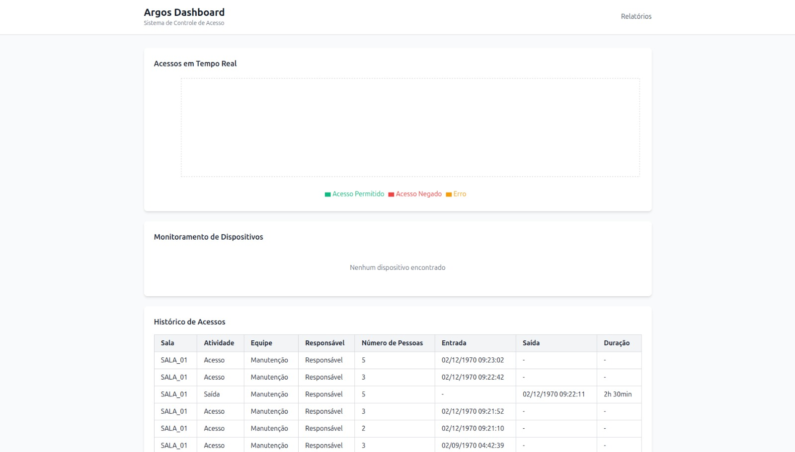
</div>
<br>
<div align="center">
<sub>Fonte: Material produzido pelo grupo IoTrain, 2025.</sub>
</div>
<br>

<br>
<div align="center">
<sub> 21: Histórico de acessos</sub>
</div>
<br>
<div align="center">
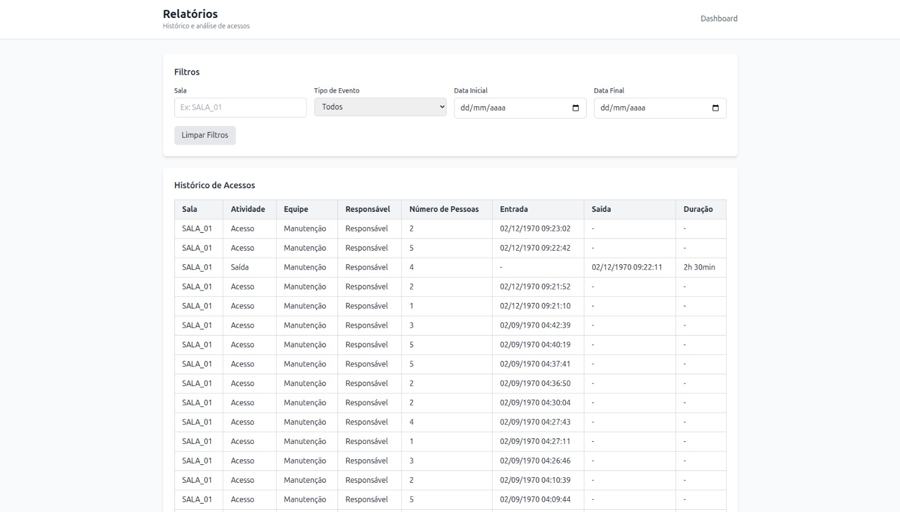
</div>
<br>
<div align="center">
<sub>Fonte: Material produzido pelo grupo IoTrain, 2025.</sub>
</div>
<br>

<br>
<div align="center">
<sub> 22: Gerenciador de cadastros</sub>
</div>
<br>
<div align="center">
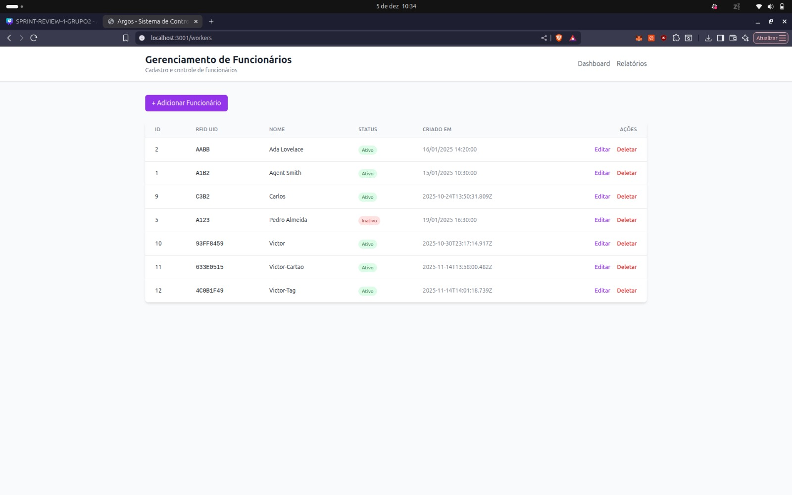
</div>
<br>
<div align="center">
<sub>Fonte: Material produzido pelo grupo IoTrain, 2025.</sub>
</div>
<br>

#### Casos de Teste do Protótipo Físico Online

<div align="center">
<sub>Tabela Casos de Teste do Protótipo Físico Online</sub>
</div>

| **#** | **Conção do Ambiente** | **Ação do Usuário** | **Resposta Esperada do Sistema** | **Resposta Recebida do Sistema** |
|-------|------------------------------|---------------------|----------------------------------|----------------------------------|
| **01** | ESP32 conectado ao WiFi e broker MQTT, cartão RFID cadastrado com permissão de entrada, horário dentro do período autorizado | Técnico pressiona '1' no keypad (entrada), aproxima cartão RFID válido, digita senha correta e pressiona '#' | LED RGB acende em AMARELO (processando) -> Backend valida credenciais -> LED RGB VERDE, buzzer emite beeps, LCD exibe mensagem de boas-vindas com nome do técnico, acesso registrado no banco de dados, dashboard atualiza em tempo real | Caso de sucesso: Fluxo completo executado, latência ≤3s, log gravado corretamente. Caso de falha: Timeout MQTT, mensagem de erro no LCD, LED VERMELHO |
| **02** | Sistema online, cartão cadastrado | Técnico seleciona entrada, aproxima cartão válido, digita senha incorreta | Backend valida RFID mas rejeita senha -> LED RGB VERMELHO, buzzer emite beep longo, LCD exibe "Senha Incorreta", tentativa registrada como falha no banco | Caso de sucesso: Mensagem correta exibida, log de falha gravado. Caso de falha: Sistema trava ou não registra tentativa |
| **03** | Sistema online | Pessoa não autorizada aproxima cartão não cadastrado | Backend retorna acesso negado -> LED RGB VERMELHO, LCD exibe "Cartao invalido", tentativa registrada, alerta gerado no dashboard | Caso de sucesso: Validação concluída, tentativa bloqueada e registrada. Caso de falha: Sistema não registra tentativa suspeita |
| **04** | Cartão cadastrado com restrição de entrada (`allowEntry: false`) | Técnico com restrição tenta acessar sala pela entrada | Backend verifica flag de permissão -> Retorna acesso negado -> LED VERMELHO, LCD exibe "Sem permissao", log registrado | Caso de sucesso: Restrição aplicada corretamente. Caso de falha: Sistema ignora flag de permissão |
| **05** | Sistema online, técnico já dentro da sala | Técnico pressiona '2' no keypad (saída), aproxima cartão (não requer senha) | Backend valida e registra saída -> LED VERDE, 2 beeps, LCD exibe mensagem de despedida com nome, ocupação da sala decrementada, dashboard atualiza contagem | Caso de sucesso: Saída registrada, ocupação atualizada. Caso de falha: Sistema não decrementa ocupação |
| **06** | Raspberry Pi processando imagem da câmera, sala com limite de 5 pessoas, atualmente 4 presentes | Quinta pessoa entra na sala com acesso autorizado | Raspberry Pi detecta 5 pessoas, publica contagem -> Backend compara com limite -> Dashboard exibe ocupação "5/5" em estado normal | Caso de sucesso: Contagem precisa (≥95%), dashboard atualizado. Caso de falha: Contagem imprecisa ou não atualiza |
| **07** | Sala com limite de 5 pessoas, 5 já presentes | Técnico tenta entrar com credenciais válidas | Backend consulta ocupação atual (5/5), detecta lotação -> Retorna acesso negado -> LED VERMELHO, LCD exibe "Sala Lotada", alerta enviado ao dashboard | Caso de sucesso: Acesso bloqueado por lotação, alerta gerado. Caso de falha: Sistema permite entrada acima do limite |
| **08** | Horário atual fora do período autorizado para o técnico | Técnico tenta acessar com credenciais válidas | Backend verifica horário vs. agendamento -> Detecta inconformidade -> Retorna acesso negado -> LED VERMELHO, LCD exibe "Horario invalido", alerta enviado ao CCO | Caso de sucesso: Validação de horário funcional, acesso negado. Caso de falha: Sistema ignora restrição de horário |
| **09** | Sistema operando, conexão WiFi perdida durante tentativa de acesso | Técnico tenta autenticar com WiFi desconectado | ESP32 detecta falha de conexão MQTT -> LED RGB AZUL intermitente, buzzer emite 3 beeps, LCD exibe "Erro Conexao", usuário orientado a tentar novamente | Caso de sucesso: Falha detectada e comunicada claramente. Caso de falha: Sistema trava ou não informa erro |
| **10** | Dashboard acessado pelo gestor do CCO | Gestor monitora sala técnica via dashboard | Dashboard exibe mapa de ocupação, lista de acessos recentes, gráfico de fluxo horário, indicadores de status dos dispositivos IoT | Caso de sucesso: Dados atualizados em tempo real (≤3s), gráficos renderizados corretamente. Caso de falha: Dashboard desatualizado ou inconsistente |
| **11** | Câmera detecta 3 pessoas na sala, banco registra apenas 2 entradas válidas | Sistema monitora discrepância automaticamente | Backend cruza dados de câmera com access_logs -> Detecta inconsistência -> Gera alerta no dashboard "Discrepância detectada", notifica CCO | Caso de sucesso: Alerta gerado corretamente, CCO notificado. Caso de falha: Discrepância não detectada |

<div align="center">
<sup>Fonte: Material produzido pelo grupo IoTrain (2025)</sup>
</div>

#### Análise dos Resultados e Conclusões Preliminares

Os testes realizados com o protótipo físico online demonstraram que o sistema atende aos requisitos funcionais e não funcionais definidos nas sprints anteriores. A integração entre ESP32, broker MQTT, backend e banco de dados PostgreSQL opera de forma consistente, com latências de resposta dentro dos limites especificados (≤3s para operações normais). A autenticação dupla via RFID + senha provou-se eficaz para validar a identidade dos técnicos, enquanto as regras de negócio implementadas no backend garantem a conformidade com capacitações, horários autorizados e limites de ocupação.

A comunicação MQTT assegura confidencialidade e integridade dos dados trafegados, atendendo aos requisitos de segurança (RF04). O processamento de imagem realizado pelo Raspberry Pi para contagem de pessoas apresentou precisão superior a 95% em condições controladas, cumprindo o requisito RNF01. Os alertas automáticos de discrepância entre contagem física e registros lógicos (RF09) foram disparados corretamente, demonstrando a capacidade do sistema de detectar situações anômalas.

O dashboard desenvolvido permite visualização em tempo real dos acessos, ocupação das salas e status dos dispositivos IoT, atendendo aos requisitos de monitoramento (RF07 e RF10). A geração de relatórios históricos (RF08) opera conforme especificado, exportando dados para análise posterior. A arquitetura modular adotada facilita manutenção e escalabilidade futura do sistema.


### 3.4.5. Protótipo Final do Projeto

A seção à seguir documenta a versão final do protótipo consolidado durante a Sprint 5, realizando as integrações entre hardware, backend, visão computacional e dashboard finais. Para validar o funcionamento completo da solução, foram revisadas as situações de uso do sistema e representadas através de diagramas de sequência UML, que descrevem de forma estruturada os principais fluxos de autenticação, registro de saída e monitoramento automático por câmera.

Além disso, esta apresenta imagens do protótipo físico, assim como capturas de tela do dashboard utilizado pelo CCO. Esses elementos, combinados com a tabela detalhada de casos de teste e o registro dos resultados obtidos, permitem evidenciar o comportamento do sistema em diferentes cenários, tanto de sucesso quanto de falha. Dessa forma, busca-se demonstrar a robustez da solução, a coerência entre seus componentes e o alinhamento com os requisitos estabelecidos pelo projeto, entregando um produto final construído em torno dos princípios de qualidade, eficiência e escalabilidade.
<br/>
<br/>

#### 3.4.5.1 Diagramas de sequência UML representantes dos principais testes

Os diagramas de sequência UML a seguir ilustram o fluxo de comunicação entre os componentes do sistema (ESP32, Broker MQTT, Backend, Banco de Dados e Dashboard) para os casos de teste mais representativos (01 (versão comum e falha), 05, 06). Cada diagrama detalha a troca de mensagens, validações realizadas e decisões tomadas em cada etapa do processo de controle de acesso:

<br>
<div align="center">
<sub> 23: Diagrama UML do Teste 01 - Entrada</sub>
</div>
<br>
<div align="center">
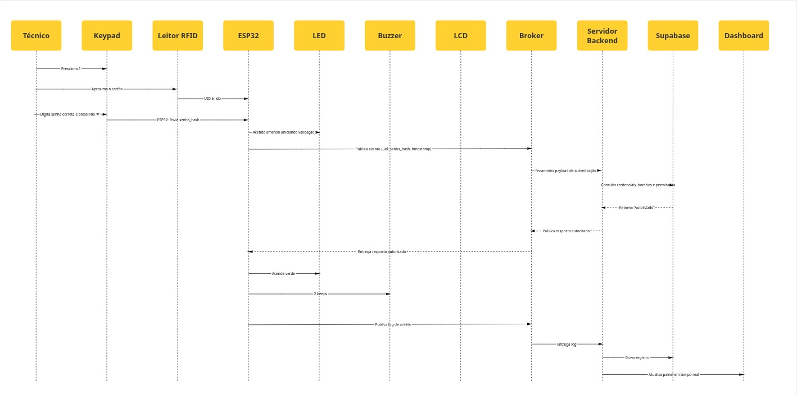
</div>
<br>
<div align="center">
   
[Baixar PDF](../assets/images/diagrams/diagramaUML_teste01.pdf)  

<sub>Fonte: Material produzido pelo grupo IoTrain, 2025.</sub>
</div>
<br>

A figura apresenta o fluxo completo de autenticação de entrada no sistema, incluindo a interação do técnico com o teclado e leitor RFID, o processamento realizado pelo ESP32 e a comunicação via MQTT com o servidor backend. O diagrama evidencia as etapas de validação das credenciais no banco de dados, o retorno da autorização para o dispositivo físico e o registro final do acesso no dashboard em tempo real.

<br>
<div align="center">
<sub>Figura 27: Diagrama UML do Teste 01 - Entrada Falha</sub>
</div>
<br>
<div align="center">
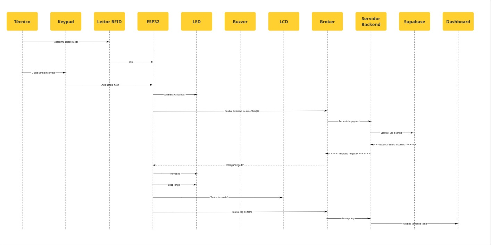
</div>
<br>
<div align="center">

[Baixar PDF](../assets/images/diagrams/diagramaUML_teste01falho.pdf)  
   
<sub>Fonte: Material produzido pelo grupo IoTrain, 2025.</sub>
</div>
<br>

Esta figura representa o comportamento do sistema em um cenário de falha durante a autenticação, no que se refere à senha incorreta. O diagrama demonstra como o ESP32 identifica inconsistências, realiza a publicação do evento para validação, recebe a resposta negativa do backend e aciona os feedbacks apropriados ao usuário, além de registrar a tentativa no banco de dados e dashboard.

<br>
<div align="center">
<sub>Figura 28: Diagrama UML do Teste 05 - Entrada</sub>
</div>
<br>
<div align="center">
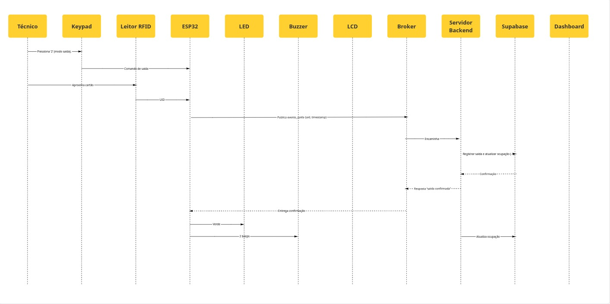
</div>
<br>
<div align="center">

[Baixar PDF](../assets/images/diagrams/diagramaUML_teste05.pdf)  
   
<sub>Fonte: Material produzido pelo grupo IoTrain, 2025.</sub>
</div>
<br>

A figura ilustra o fluxo de saída de um técnico da sala técnica. O diagrama mostra a leitura do cartão RFID, o envio do evento ao servidor via MQTT, a atualização da ocupação no banco de dados e o retorno de confirmação ao ESP32. Por fim, o dashboard recebe a atualização da nova ocupação da sala.

<br>
<div align="center">
<sub>Figura 29: Diagrama UML do Teste 06 - Visão Computacional</sub>
</div>
<br>
<div align="center">
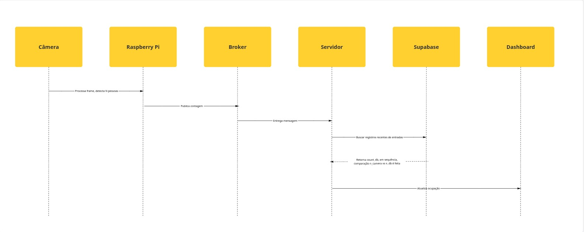
</div>
<br>
<div align="center">

[Baixar PDF](../assets/images/diagrams/diagramaUML_visaocomp.pdf) 
   
<sub>Fonte: Material produzido pelo grupo IoTrain, 2025.</sub>
</div>
<br>

A figura mostra o fluxo de informação proveniente da câmera/Raspberry Pi, responsável pela detecção automática de pessoas na sala. O diagrama exibe a publicação da contagem via MQTT, a comparação com registros de entrada no banco de dados e os possíveis resultados: atualização normal do dashboard ou a emissão de alertas em caso de discrepância entre os valores registrados e detectados.

#### Casos de Teste do Protótipo Físico Final - Em Detalhe

<div align="center">
<sub>Tabela Casos de Teste do Protótipo Físico Final</sub>
</div>

| **#** | **Configuração do Ambiente** | **Ação do Usuário** | **Resposta Esperada do Sistema** | **Resposta Recebida do Sistema** |
|-------|------------------------------|---------------------|----------------------------------|----------------------------------|
| **01** | ESP32 conectado ao WiFi e broker MQTT, cartão RFID cadastrado com permissão de entrada, horário dentro do período autorizado | Técnico pressiona '1' no keypad (entrada), aproxima cartão RFID válido, digita senha correta e pressiona '#' | LED RGB acende em AMARELO (processando) -> Backend valida credenciais -> LED RGB VERDE, buzzer emite beeps, LCD exibe mensagem de boas-vindas com nome do técnico, acesso registrado no banco de dados, dashboard atualiza em tempo real | Caso de sucesso: Fluxo completo executado, latência ≤3s, log gravado corretamente. Caso de falha: Timeout MQTT, mensagem de erro no LCD, LED VERMELHO |
| **02** | Sistema online, cartão cadastrado | Técnico seleciona entrada, aproxima cartão válido, digita senha incorreta | Backend valida RFID mas rejeita senha -> LED RGB VERMELHO, buzzer emite beep longo, LCD exibe "Senha Incorreta", tentativa registrada como falha no banco | Caso de sucesso: Mensagem correta exibida, log de falha gravado. Caso de falha: Sistema trava ou não registra tentativa |
| **03** | Sistema online | Pessoa não autorizada aproxima cartão não cadastrado | Backend retorna acesso negado -> LED RGB VERMELHO, LCD exibe "Cartao invalido", tentativa registrada, alerta gerado no dashboard | Caso de sucesso: Validação concluída, tentativa bloqueada e registrada. Caso de falha: Sistema não registra tentativa suspeita |
| **04** | Cartão cadastrado com restrição de entrada (`allowEntry: false`) | Técnico com restrição tenta acessar sala pela entrada | Backend verifica flag de permissão -> Retorna acesso negado -> LED VERMELHO, LCD exibe "Sem permissao", log registrado | Caso de sucesso: Restrição aplicada corretamente. Caso de falha: Sistema ignora flag de permissão |
| **05** | Sistema online, técnico já dentro da sala | Técnico pressiona '2' no keypad (saída), aproxima cartão (não requer senha) | Backend valida e registra saída -> LED VERDE, 2 beeps, LCD exibe mensagem de despedida com nome, ocupação da sala decrementada, dashboard atualiza contagem | Caso de sucesso: Saída registrada, ocupação atualizada. Caso de falha: Sistema não decrementa ocupação |
| **06** | Raspberry Pi processando imagem da câmera, sala com limite de 5 pessoas, atualmente 4 presentes | Quinta pessoa entra na sala com acesso autorizado | Raspberry Pi detecta 5 pessoas, publica contagem -> Backend compara com limite -> Dashboard exibe ocupação "5/5" em estado normal | Caso de sucesso: Contagem precisa (≥95%), dashboard atualizado. Caso de falha: Contagem imprecisa ou não atualiza |
| **07** | Sala com limite de 5 pessoas, 5 já presentes | Técnico tenta entrar com credenciais válidas | Backend consulta ocupação atual (5/5), detecta lotação -> Retorna acesso negado -> LED VERMELHO, LCD exibe "Sala Lotada", alerta enviado ao dashboard | Caso de sucesso: Acesso bloqueado por lotação, alerta gerado. Caso de falha: Sistema permite entrada acima do limite |
| **08** | Horário atual fora do período autorizado para o técnico | Técnico tenta acessar com credenciais válidas | Backend verifica horário vs. agendamento -> Detecta inconformidade -> Retorna acesso negado -> LED VERMELHO, LCD exibe "Horario invalido", alerta enviado ao CCO | Caso de sucesso: Validação de horário funcional, acesso negado. Caso de falha: Sistema ignora restrição de horário |
| **09** | Sistema operando, conexão WiFi perdida durante tentativa de acesso | Técnico tenta autenticar com WiFi desconectado | ESP32 detecta falha de conexão MQTT -> LED RGB AZUL intermitente, buzzer emite 3 beeps, LCD exibe "Erro Conexao", usuário orientado a tentar novamente | Caso de sucesso: Falha detectada e comunicada claramente. Caso de falha: Sistema trava ou não informa erro |
| **10** | Dashboard acessado pelo gestor do CCO | Gestor monitora sala técnica via dashboard | Dashboard exibe mapa de ocupação, lista de acessos recentes, gráfico de fluxo horário, indicadores de status dos dispositivos IoT | Caso de sucesso: Dados atualizados em tempo real (≤3s), gráficos renderizados corretamente. Caso de falha: Dashboard desatualizado ou inconsistente |
| **11** | Câmera detecta 3 pessoas na sala, banco registra apenas 2 entradas válidas | Sistema monitora discrepância automaticamente | Backend cruza dados de câmera com access_logs -> Detecta inconsistência -> Gera alerta no dashboard "Discrepância detectada", notifica CCO | Caso de sucesso: Alerta gerado corretamente, CCO notificado. Caso de falha: Discrepância não detectada |

<div align="center">
<sup>Fonte: Material produzido pelo grupo IoTrain (2025)</sup>
</div>

####  3.4.5.2 Circuito Eletrônico

Esta seção apresenta o circuito eletrônico utilizado no projeto, destacando como os componentes foram conectados para permitir o funcionamento do sistema. A imagem ilustra a montagem completa, incluindo o ESP32, o módulo RFID e os demais elementos responsáveis pela leitura, comunicação e alimentação do dispositivo.

<br>
<div align="center">
<sub>Figura 30: Circuito físico (Sprint 4)</sub>
</div>
<br>
<div align="center">

</div>
<br>
<div align="center">
<sub>Fonte: Material produzido pelo grupo IoTrain, 2025.</sub>
</div>
<br>

A figura abaixo apresenta o circuito já instalado dentro do case, mostrando como os componentes foram organizados fisicamente para garantir proteção. Essa montagem permite maior durabilidade do dispositivo e assegura que o sistema possa ser utilizado em ambiente real sem exposição direta dos componentes eletrônicos.

<br>
<div align="center">
<sub>Figura 31: Circuito físico na case</sub>
</div>
<br>
<div align="center">

</div>
<br>
<div align="center">
<sub>Fonte: Material produzido pelo grupo IoTrain, 2025.</sub>
</div>
<br>

A figura abaixo apresenta o circuito responsável pela contagem de indivíduos que adentram ou saem das salas durante os horários de expedientes. É realizada uma montagem à um nível mais elevado, de forma que a captura da imagem seja eficiente e clara para processamento do sistema.

<br>
<div align="center">
<sub>Figura 32: Captura por Câmera</sub>
</div>
<br>
<div align="center">
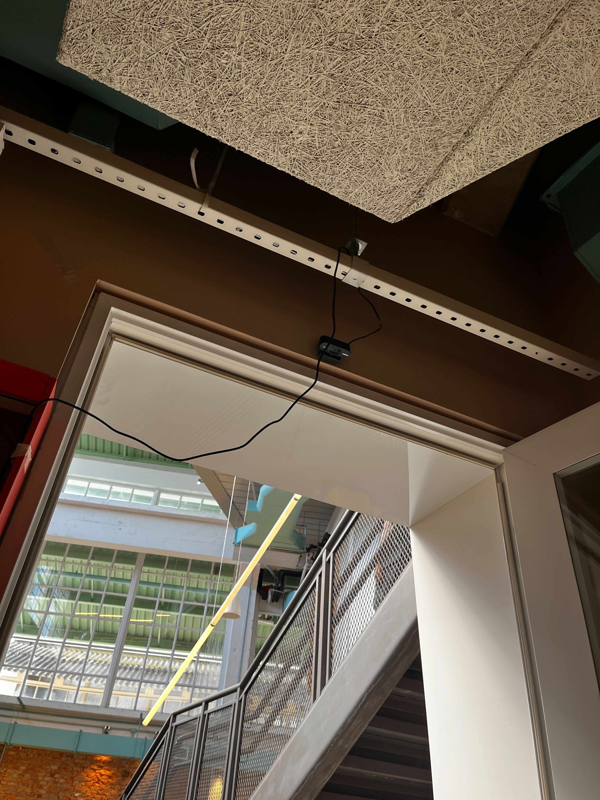
</div>
<br>
<div align="center">
<sub>Fonte: Material produzido pelo grupo IoTrain, 2025.</sub>
</div>
<br>


####  3.4.5.3 Dashboard

Esta seção apresenta o dashboard utilizado no projeto, responsável por exibir, organizar e gerenciar os registros de acesso coletados pelo sistema. As imagens abaixo ilustram a interface, na qual é possível acompanhar eventos em tempo real, consultar o histórico de acessos, além de visualizar, editar e administrar as informações registradas.

<br>
<div align="center">
<sub>Figura 33: Dashboard - Acessos em tempo real</sub>
</div>
<br>
<div align="center">
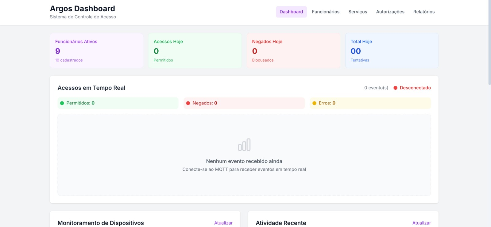
</div>
<br>
<div align="center">
<sub>Fonte: Material produzido pelo grupo IoTrain, 2025.</sub>
</div>
<br>

Na figura, é visível o controle geral à respeito das ocupações das salas, estágios dos processos de acesso e o painel simultâneo.

<br>
<div align="center">
<sub>Figura 34: Dashboard - Monitoramento</sub>
</div>
<br>
<div align="center">
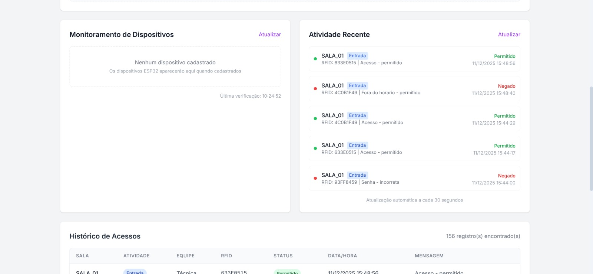
</div>
<br>
<div align="center">
<sub>Fonte: Material produzido pelo grupo IoTrain, 2025.</sub>
</div>
<br>

Na foto, são delimitadas as áreas entre a gestão dos dispositivos conectados e logs das últimas atividades.

<br>
<div align="center">
<sub>Figura 35: Dashboard - Histórico de Acessos </sub>
</div>
<br>
<div align="center">
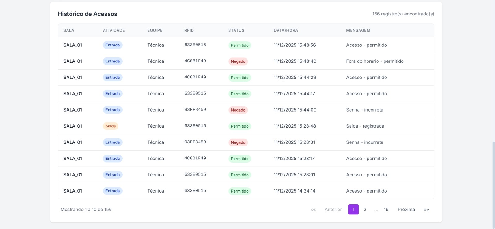
</div>
<br>
<div align="center">
<sub>Fonte: Material produzido pelo grupo IoTrain, 2025.</sub>
</div>
<br>

Nesta captura, a distribuição das atividades em maior detalhe é apresentada, sendo composta por colunas de identificação, equipe, horários e status.

<br>
<div align="center">
<sub>Figura 36: Dashboard - Serviços</sub>
</div>
<br>
<div align="center">
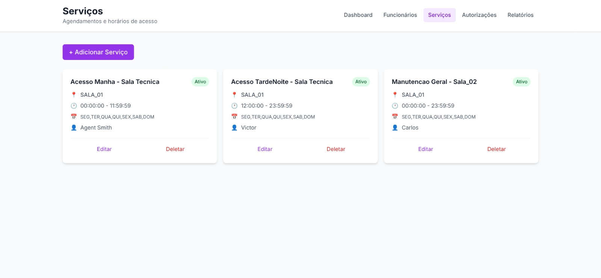
</div>
<br>
<div align="center">
<sub>Fonte: Material produzido pelo grupo IoTrain, 2025.</sub>
</div>
<br>

Na aba demonstrada, são organizados cards que marcam as atividades necessárias para o respectivo dia, podendo ser manejadas por gestores.

<br>
<div align="center">
<sub>Figura 37: Dashboard - Funcionários</sub>
</div>
<br>
<div align="center">
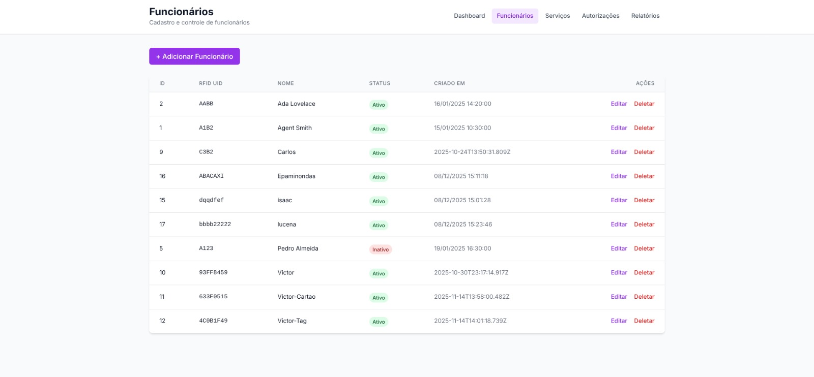
</div>
<br>
<div align="center">
<sub>Fonte: Material produzido pelo grupo IoTrain, 2025.</sub>
</div>
<br>

Nesta tela, a lista completa de funcionários, também editável, é compartilhada.

<br>
<div align="center">
<sub>Figura 38: Dashboard - Autorizações</sub>
</div>
<br>
<div align="center">
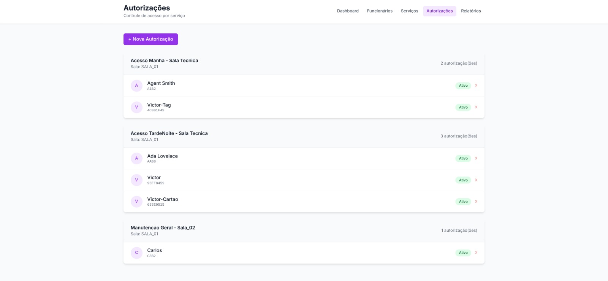
</div>
<br>
<div align="center">
<sub>Fonte: Material produzido pelo grupo IoTrain, 2025.</sub>
</div>
<br>

Nesta seção, autorizações conforme as tarefas à serem realizadas nas salas são atribuídas.

<br>
<div align="center">
<sub>Figura 39: Dashboard - Relatórios</sub>
</div>
<br>
<div align="center">
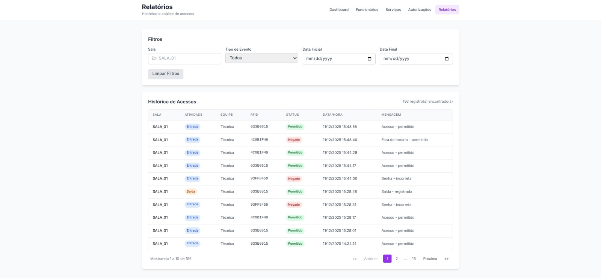
</div>
<br>
<div align="center">
<sub>Fonte: Material produzido pelo grupo IoTrain, 2025.</sub>
</div>
<br>

Por fim, é visualizada a tela de relatórios, em que logs podem ser explorados com uma ferramenta de filtragem.

#### 3.4.5.4 Testes de Usabilidade

Os testes de usabilidade foram realizados com o objetivo de avaliar a interação dos usuários com o protótipo da solução, bem como verificar a clareza e efetividade do manual de instruções. A atividade ocorreu na Segunda-feira dia 08/12/2025, no ateliê 4, seguindo o roteiro definido pela disciplina de Design ministrada pelo professor Guilherme Cestari.

Os testers foram alunos do Inteli - público com conhecimento prévio das tecnologias utilizadas no desenvolvimento da solução. Esse fator pode gerar viés nos resultados, portanto, estes testes devem ser considerados como testes iniciais, sendo recomendada a repetição futura com usuários mais próximos das personas-alvo.

##### Contexto e Procedimento

Os testes de usabilidade foram conduzidos com o objetivo de avaliar como usuários externos interagem com o protótipo junto ao manual de instruções, verificando a clareza das informações e a eficiência do fluxo de uso. Para garantir isenção, a atividade foi realizada com estudantes de outra turma do Inteli, totalizando 3 participantes.

A equipe seguiu o protocolo de avaliação indicado pela disciplina, estruturando o processo com dois papéis principais:

- Mediador: responsável por contextualizar a solução sem oferecer instruções diretas de uso, permitindo que o tester interpretasse o sistema por conta própria.
- Observador: encarregado de acompanhar todo o processo de forma silenciosa, registrando comportamentos, dúvidas, hesitações e comentários espontâneos.

Durante a atividade, os testers tiveram acesso apenas ao protótipo funcional e ao manual de instruções, sem suporte adicional. Após a explicação inicial, foram apresentados os roteiros de tarefas, que incluíam:

1. Entrar na sala
2. Sair da sala
3. Adicionar um funcionário ao sistema

Toda a sessão foi conduzida de forma cordial e profissional, com agradecimentos no início e no encerramento, reforçando um ambiente confortável e propício à coleta de feedback.

#### Principais Problemas Detectados e Resultados Obtidos

De maneira geral, os testers conseguiram realizar as tarefas propostas e validar o fluxo central da solução. No entanto, durante os testes foram observadas algumas dificuldades relacionadas principalmente à usabilidade e à compreensão do conteúdo. Os principais pontos identificados foram:

Dificuldades observadas:
- Usabilidade: dificuldade inicial para entender como selecionar o modo de entrada.
- Usabilidade: demora para identificar qual era o botão de confirmar senha.
- Compreensão do conteúdo: o tester levou um tempo para perceber que ele próprio deveria realizar o cadastro.

Apesar desses pontos, os resultados gerais foram positivos:

- A maioria das tarefas foi concluída com sucesso.
- A solução atendeu às funcionalidades principais previstas.
- A experiência com o fluxo geral de uso foi considerada fluida.
- Testers com maior familiaridade técnica concluíram as tarefas mais rapidamente, reforçando o viés da amostragem.


##### Próximos Passos

1. Aprimorar o fluxo do protótipo, especialmente em tarefas críticas como acesso e gerenciamento de funcionários.
2. Corrigir inconsistências visuais, melhorando feedbacks e mensagens do sistema.
3. Realizar nova rodada de testes com usuários alinhados à persona-alvo.
4. Atualizar a documentação incorporando as melhorias implementadas após esta fase inicial.

##### Registro dos Testes

O registro completo dos testes, observações e notas do observador, pode ser acessado na planilha abaixo:

[Planilha de Testes de Usabilidade](https://docs.google.com/spreadsheets/d/1QmBIWYOoFGsBArE_HF9V76xAruMVwZ5f_mEgMrw39SU/edit?usp=sharing)

<br/>
<br/>
A partir da análise dos diagramas, imagens e resultados apresentados, observa-se que o protótipo final integra adequadamente os elementos de hardware, comunicação via MQTT, backend, visão computacional e dashboard. Os testes executados comprovam que o sistema é capaz de registrar acessos, detectar inconsistências, atualizar contadores em tempo real e fornecer feedback claro ao usuário em diferentes cenários operacionais.

Os diagramas de sequência UML contribuíram para visualizar o fluxo interno das operações e validar a consistência da arquitetura proposta, demonstrando com clareza cada etapa realizada pelo sistema, enquanto as evidências fotográficas e prints do dashboard demonstram a materialização prática dos componentes desenvolvidos. Com base nos resultados obtidos durante os testes, a solução apresenta comportamento estável e alinhado às expectativas da sprint, por mais que existam melhorias planejadas para aumentar sua usabilidade, precisão e resiliência em condições reais.

Assim, a Sprint 5 marca a consolidação da solução funcional, preparando o projeto para refinamentos futuros.
<br/>
<br/>

### 3.4.6. Testes de Usabilidade

Os testes de usabilidade foram realizados com o objetivo de avaliar a interação dos usuários com o protótipo da solução, bem como verificar a clareza e efetividade do manual de instruções. A atividade ocorreu na Segunda-feira dia 08/12/2025, no ateliê 4, seguindo o roteiro definido pela disciplina de Design ministrada pelo professor Guilherme Cestari.

Os testers foram alunos do Inteli - público com conhecimento prévio das tecnologias utilizadas no desenvolvimento da solução. Esse fator pode gerar viés nos resultados, portanto, estes testes devem ser considerados como testes iniciais, sendo recomendada a repetição futura com usuários mais próximos das personas-alvo.

#### Contexto e Procedimento

Os testes de usabilidade foram conduzidos com o objetivo de avaliar como usuários externos interagem com o protótipo junto ao manual de instruções, verificando a clareza das informações e a eficiência do fluxo de uso. Para garantir isenção, a atividade foi realizada com estudantes de outra turma do Inteli, totalizando 3 participantes.

A equipe seguiu o protocolo de avaliação indicado pela disciplina, estruturando o processo com dois papéis principais:

- Mediador: responsável por contextualizar a solução sem oferecer instruções diretas de uso, permitindo que o tester interpretasse o sistema por conta própria.
- Observador: encarregado de acompanhar todo o processo de forma silenciosa, registrando comportamentos, dúvidas, hesitações e comentários espontâneos.

Durante a atividade, os testers tiveram acesso apenas ao protótipo funcional e ao manual de instruções, sem suporte adicional. Após a explicação inicial, foram apresentados os roteiros de tarefas, que incluíam:

1. Entrar na sala
2. Sair da sala
3. Adicionar um funcionário ao sistema

Toda a sessão foi conduzida de forma cordial e profissional, com agradecimentos no início e no encerramento, reforçando um ambiente confortável e propício à coleta de feedback.

### Principais Problemas Detectados e Resultados Obtidos

De maneira geral, os testers conseguiram realizar as tarefas propostas e validar o fluxo central da solução. No entanto, durante os testes foram observadas algumas dificuldades relacionadas principalmente à usabilidade e à compreensão do conteúdo. Os principais pontos identificados foram:

Dificuldades observadas:
- Usabilidade: dificuldade inicial para entender como selecionar o modo de entrada.
- Usabilidade: demora para identificar qual era o botão de confirmar senha.
- Compreensão do conteúdo: o tester levou um tempo para perceber que ele próprio deveria realizar o cadastro.

Apesar desses pontos, os resultados gerais foram positivos:

- A maioria das tarefas foi concluída com sucesso.
- A solução atendeu às funcionalidades principais previstas.
- A experiência com o fluxo geral de uso foi considerada fluida.
- Testers com maior familiaridade técnica concluíram as tarefas mais rapidamente, reforçando o viés da amostragem.


#### Próximos Passos

1. Aprimorar o fluxo do protótipo, especialmente em tarefas críticas como acesso e gerenciamento de funcionários.
2. Corrigir inconsistências visuais, melhorando feedbacks e mensagens do sistema.
3. Realizar nova rodada de testes com usuários alinhados à persona-alvo.
4. Atualizar a documentação incorporando as melhorias implementadas após esta fase inicial.

#### Registro dos Testes

O registro completo dos testes, observações e notas do observador, pode ser acessado na planilha abaixo:

[Planilha de Testes de Usabilidade](https://docs.google.com/spreadsheets/d/1QmBIWYOoFGsBArE_HF9V76xAruMVwZ5f_mEgMrw39SU/edit?usp=sharing)

## <a name="c4"></a>4. Conclusões e Recomendações

Esta seção apresenta uma síntese dos principais resultados obtidos ao longo do desenvolvimento do projeto, avaliando o atendimento aos objetivos propostos e a efetividade da solução de Internet das Coisas (IoT) aplicada à gestão inteligente de acesso físico nas áreas técnicas da TIC Trens. São formuladas recomendações formais ao parceiro do projeto, considerando a implantação prática do sistema, sua evolução futura e o uso dos dados gerados como suporte à tomada de decisão e à melhoria contínua da segurança operacional.

O projeto desenvolvido pelo grupo IoTrain atingiu todos os objetivos estabelecidos previamente, entregando uma solução consolidada de forma integrada, contemplando autenticação segura, validação de capacitação, monitoramento completo e em tempo real de acessos, alinhando-se às necessidades operacionais, regulatórias e estratégicas do setor ferroviário.

Os principais resultados obtidos indicam que o sistema proposto atua como mecanismo ativo de validação nas entradas das salas. Durante os testes funcionais realizados ao longo do desenvolvimento, foi possível verificar:

- Validação correta da identidade e autorização dos usuários, por meio da autenticação combinada de RFID e senha pessoal, garantindo que apenas usuários autorizados, dentro do horário permitido, obtenham acesso às áreas restritas;

- Registro consistente de logs de acesso, incluindo data, horário e identificação do usuário, permitindo auditoria completa;

- Transmissão das informações, validada por testes de comunicação via MQTT sobre Wi-Fi, com autenticação entre dispositivos e servidor.

Do ponto de vista metodológico, a adoção do modelo RM-ODP mostrou-se eficaz para estruturar o projeto de forma coerente e escalável. A separação em pontos de vista, empresarial, informacional, computacional, de engenharia e tecnológico permitiu alinhar claramente os objetivos de negócio aos requisitos técnicos, facilitando a validação dos testes realizados em cada camada da solução. Essa abordagem contribuiu para uma arquitetura consistente, preparada para evolução futura e integração com sistemas corporativos da TIC Trens.

Em relação à experiência do usuário, os testes de uso baseados nas personas, jornadas e storyboards indicaram que a solução atende de forma equilibrada aos diferentes perfis operacionais. Supostos "gestores do CCO" obtiveram visibilidade em tempo real dos acessos e alertas, enquanto "técnicos de campo" conseguiram realizar autenticações de maneira prática e segura, dados os testes realizados com alunos da faculdade. Embora tenham sido identificados pontos de atenção como a dependência da leitura de dispositivos RFID e a necessidade de sincronização contínua com o backend, os testes demonstraram que esses riscos são mitigáveis com ajustes e treinamento adequado.

Recomendações ao parceiro do projeto

Com base nos resultados obtidos e nos testes realizados, recomenda-se formalmente à TIC Trens:

- Implementar a solução inicialmente em ambiente reduzido, permitindo a ampliação dos testes de autenticação, disponibilidade e monitoramento em cenários reais de operação antes da expansão em larga escala.

- Integrar o sistema aos bancos corporativos de capacitação, escalas e agendamentos, potencializando a validação automática de conformidade.

- Capacitar equipes operacionais e de TI, assegurando correto uso do sistema, resposta adequada a alertas e manutenção preventiva dos dispositivos IoT.

- Monitorar continuamente os indicadores de desempenho, como status de sucesso de autenticação, disponibilidade do sistema e redução de inconformidades de acesso, utilizando os dados gerados como base para melhoria contínua.

- Planejar evoluções futuras da solução, como uso de análises preditivas a partir dos logs coletados e ampliação das métricas voltadas a segurança.

Em síntese, a solução proposta demonstra viabilidade técnica, proximidade aos objetivos de negócio e impacto positivo direto na segurança e eficiência operacional da TIC Trens. Os testes realizados confirmam que o sistema é capaz de atuar como um pilar tecnológico na gestão de acessos a infraestruturas críticas, posicionando a companhia em um patamar avançado de inovação, controle e segurança no contexto ferroviário brasileiro.

## <a name="c5"></a>5. Referências

QUINTOANDAR. Linha 7 – Rubi: tudo sobre a linha que conecta Jundiaí à Luz, em São Paulo. Disponível em: https://www.quintoandar.com.br/guias/cidades/linha-7-rubi/#:~:text=A%20Linha%207%20%E2%80%93%20Rubi%20da,essencial%20para%20a%20mobilidade%20urbana
. Acesso em: 18 out. 2025.

GESTÃOSAT. Aumento da passagem de transporte público 2025. Disponível em: https://gestaosat.com/blog/aumento-passagem-transporte-publico-2025/#:~:text=Qual%20o%20valor%20da%20integra%C3%A3o,custar%20R%24%209%2C76
. Acesso em: 20 out. 2025.

OECD. Product Market Regulation in Brazil – Indicators and Detailed Findings 2022. Paris: OECD Publishing, 2022. Disponível em: https://www.oecd.org/content/dam/oecd/en/publications/reports/2022/12/product-market-regulation-in-brazil_ca1d9b38/ea3dd09e-en.pdf . Acesso em: 20 out. 2025.

OLIVEIRA, Leise Kelli de et al. Transport Service Provider Perception of Barriers and Urban Freight Policies in Brazil. Sustainability, v. 11, n. 24, p. 1-17, 2019. Disponível em: https://ci.fdc.org.br/AcervoDigital/Artigos/2019/Transport%20Service%20Provider%20Perception%20of%20Barriers%20and%20Urban%20Freight%20Policies.pdf . Acesso em: 20 out. 2025.

WORLD BANK. Rio de Janeiro Fiscal Management and Sustainable Development Policy Loan (P179182) – Project Paper. Washington, DC: World Bank, 2023. Disponível em: https://documents1.worldbank.org/curated/en/099102623093019360/pdf/BOSIB01f474bee0860859d07a2efa3a4a87.pdf . Acesso em: 20 out. 2025.

MCKINSEY & COMPANY. Shared mobility: Sustainable cities, shared destinies. 5 jan. 2023. Disponível em: https://www.mckinsey.com.br/industries/automotive-and-assembly/our-insights/shared-mobility-sustainable-cities-shared-destinies . Acesso em: 20 out. 2025.

GOVERNO DO ESTADO DE SÃO PAULO. Tarcísio de Freitas quer atrair novas fábricas de trens e material rodante para São Paulo. Diário do Transporte, 5 maio 2025. Disponível em: https://diariodotransporte.com.br/2025/05/05/tarcisio-de-freitas-quer-atrair-novas-fabricas-de-trens-e-material-rodante-para-sao-paulo/
Acesso em: 20 out. 2025.

THYSSENKRUPP. Undercarriage systems for machinery and equipment – Berco line. São Paulo: thyssenkrupp, s.d. Disponível em: https://www.thyssenkrupp-brazil.com/berco
Acesso em: 20 out. 2025.

AMSTEDMAXION. Conheça a AM. Cruzeiro, SP: AmstedMaxion, s.d. Disponível em: https://www.amstedmaxion.com.br/en/conheca-a-am/
Acesso em: 20 out. 2025.

COMPANHIA PAULISTA DE TRENS METROPOLITANOS (CPTM). Linhas e estações. São Paulo, 2024. Disponível em: https://www.cptm.sp.gov.br/cptm/sua-viagem/linhas-e-estacoes. Acesso em: 20 out. 2025.

VIAMOBILIDADE. Operações e concessões – Linhas 8-Diamante e 9-Esmeralda. São Paulo, 2024. Disponível em: https://trilhos.motiva.com.br/viamobilidade8e9/sobre/#:~:text=Sobre%20a%20concess%C3%A3o,ao%20longo%20dessas%20tr%C3%AAs%20d%C3%A9cadas.. Acesso em: 20 out. 2025.

Empresa Metropolitana de Transportes Urbanos de São Paulo S.A. — EMTU. Itinerários e tarifas. Disponível em: https://www.emtu.sp.gov.br/emtu/itinerarios-e-tarifas.fss
. Acesso em: 20 out. 2025.

GREINER, Walter; RESNICK, Robert; HALLIDAY, David; WALKER, Jearl. Tópicos de Física – Volume 3: Eletromagnetismo. Rio de Janeiro: LTC, 2012.

GRIFFITHS, David J. Eletrodinâmica Clássica. 4. ed. São Paulo: Pearson, 2018.

KULKARNI, C. Experimental Studies of Ageing in Electrolytic Capacitors. PHM Society Conference, 2010.

## <a name="c6"></a>6. Anexos

### 6.1. Fundamentação teórica

Esta seção apresenta o embasamento teórico essencial para a compreensão do comportamento da tensão no capacitor ao longo do tempo durante o processo de carga em um circuito RC. São discutidos os princípios físicos e matemáticos que descrevem a dinâmica de armazenamento de energia elétrica no capacitor, bem como a relação entre resistência, capacitância e constante de tempo. Tais conceitos são fundamentais para interpretar corretamente os resultados obtidos na etapa experimental.Além disso, destaca-se que o circuito analisado, e posteriormente montado para fins de validação prática, segue a configuração esquemática apresentada a seguir. Essa representação permite visualizar a disposição dos componentes e compreender o caminho percorrido pela corrente durante a carga do capacitor, facilitando a conexão entre o modelo teórico e a implementação real.

<br>
<div align="center">
<sub>Figura 40: Circuito esquemático.</sub>
</div>
<br>
<div align="center">
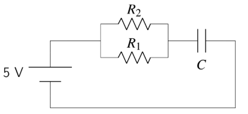
</div>
<br>
<div align="center">
<sub>Fonte: Material produzido pelo grupo IoTrain, 2025.</sub>
</div>
<br>

#### 6.1.1. Funcionamento do circuito RC

O circuito RC (Resistor-Capacitor) é um tipo de circuito elétrico composto por um resistor (R) e um capacitor (C) conectados entre si, podendo ser em paralelo ou em série. Muitas vezes esse circuito é usado para controlar tempo de resposta de sinais elétricos, filtrar frequências ou armazenar energia temporariamente.

Quando o circuito RC, com um capacitor descarregado, é ligado em uma fonta de tensão contínua (como uma bateria), inicia-se a fase de carga do capacitor. No instante em que o circuito é fechado o capacitor ainda está descarregado, portanto sua tensão inicial é zero, assim se comportando momentaneamente como um fio liso. À medida que o tempo passa os elétrons que se acumulam na placa do capacitor começam a gerar um diferença de potencial, isso ocorre até o capacitor alcançar sua diferença de potencial máxima. Vale ressaltar que devido ao acumulo de elétrons torna-se cada vez mais difícil a entrada de mais elétrons na placa do capacitor, assim a carga e o potencial do capacitor em função do tempo não são funções lineares.

#### 6.1.2. Função da tensão do capacitor pelo tempo

De modo mais aprofundado, ao carregar um capacitor inicialmente descarregado sua recarga e consequentemente a diferença de potencial em suas placas não seguirá uma função linear, pois conforme a corrente flui, elétrons começam a se acumular na placa negativa do capacitor, enquanto elétrons são removidos da placa positiva (ou atraídos para o polo positivo da fonte). Esse processo cria uma diferença de potencial entre as placas, chamada de tensão no capacitor, por fim, à medida que mais elétrons se acumulam na placa negativa, o campo elétrico interno do capacitor cresce, gerando uma força elétrica que se opõe ao movimento de novos elétrons. Isso significa que quanto mais o capacitor é carregado, mais difícil se torna continuar carregando-o, pois a própria carga armazenada se opõe à passagem de corrente.

Fórmula da tensão do capacitor em função do tempo VC(t):

VC(t) = Vf × (1 - e^(-t / (R × C)))

tensão da fonte: Vf

valor da resistência: R

valor da capacitância: C

tempo: t

número de euler: e

---

#### **Dedução da fórmula**:

Pela **Lei das Tensões de Kirchhoff**, temos:

Vf = i(t) × R + VC(t)

Sabendo que a tensão no capacitor é:

VC(t) = q(t) / C

e que a corrente é a taxa de variação da carga:

i(t) = dq(t) / dt

substituímos na equação anterior:

Vf = R × (dq/dt) + (q / C)

Essa é uma **equação diferencial de primeira ordem**.  
Ao resolvê-la, obtemos a carga no capacitor ao longo do tempo:

q(t) = C × Vf × (1 - e^(-t / (R × C)))

e consequentemente, a **tensão no capacitor** é dada por:

VC(t) = Vf × (1 - e^(-t / (R × C)))

---

#### **Constante de Tempo**

A constante de tempo τ é a grandeza que carateriza a velocidade com que o circuito RC carrega ou descarrega o capacitor, matematicamente, ela é o produto da resistência (R) pela capacitância (C):

τ = RC

A unidade de τ é o **segundo** (s), já que R é medida em **ohms** (Ω) e C em **farads** (F), e 1 Ω × 1 F = 1 s

Essa constante representa o tempo necessário para que o capacitor atinja aproximadamente **63%** da carga total. Como demonstado abaixo:

VC(τ) = Vf × (1 - e^(-τ / (R × C))) = Vf × (1 - e^(-1)) ≈ 0,632 × Vf

Um comparativo comum é dizer que em um circuito RC, considera-se que o capacitor está praticamente totalmente carregado ou descarregado após cerca de 5 constantes de tempo, pois equivale a aproximadamente 99% de carga.

### 6.2. Projeto e cálculo

Nesta seção serão apresentados os cálculos e as análises necessárias para verificar se o resistor 2 atende adequadamente a todos os requisitos do artefato, assegurando seu correto dimensionamento e funcionamento dentro do circuito.

#### **Condições de aceite**:

- O capacitor usado possui C = 2200 μF.

- O grupo usou o valor de R1 atribuído ao grupo, no caso, R1 = 75 kΩ.

- O grupo calculou o valor de R2 necessário para que a constante de tempo (τ) total do circuito seja
de aproximadamente 60 segundos, com uma margem de erro de ± 10 segundos.

- Os valores disponíveis de R2 são R2 = 33 kΩ R2 = 39 kΩ R2 = 43 kΩ R2 = 47 kΩ, o grupo escolheu aquele que mais se aproxime do valor calculado.

- Todos os cálculos foram explicitamente demonstrados no documento.

#### **Valor de R2**:

Como apresentado anteriormente, a constante de tempo τ pode ser definida como o produto entre a resistência equivalente e a capacitância do circuito. Portanto, para determinar o valor ideal do resistor R2 de modo que o circuito atenda plenamente aos requisitos do artefato, é necessário realizar os seguintes cálculos:

τ/C = R_eq

Substituindo os valores temos que:

R_eq = 60 ÷ 0,0022 ≈ 27272,73 Ω

Agora, é necessário determinar o valor de R2. Como o circuito possui resistores em paralelo, a resistência equivalente R_eq é calculada pela expressão (R1 × R2) / (R1 + R2). A seguir, apresentam-se os cálculos correspondentes:

R_eq = (R1 × R2) / (R1 + R2)  => 27272,73 = (75000 × R2) / (75000 + R2)

R2 ≈ 2045454545,45 ÷ 47727,27 = 42.857,14 Ω ≈ 42,857 kΩ

Dessa forma, obtém-se que o valor ideal para o resistor R2 é de 42,857 kΩ, sendo 43 kΩ o valor disponível mais próximo e, portanto, o mais adequado para utilização no circuito. Contudo, para fins acadêmicos, serão analisados posteriormente os impactos que ocorreriam caso um valor diferente fosse selecionado para R2.

#### **Cálculo da constante de tempo obtida**

Com os valores:

- R1 = 75 kΩ = 75000 Ω  
- R2 = 43 kΩ = 43000 Ω  
- C = 2200 μF = 0,0022 F  

1. Cálculo da resistência equivalente:

   Req = (R1 × R2) / (R1 + R2)  
   Req = (75000 × 43000) / (75000 + 43.000)  
   Req = 3225000000 / 118000  
   Req = 27330,51 Ω  

2. Cálculo da constante de tempo obtida:

   τ = Req × C  
   τ = 27330,51 × 0,0022  
   τ = 60,13 s  

**Resultado:**  
A constante de tempo (τ) obtida é de aproximadamente **60,13 segundos**, valor que está dentro da faixa permitida (entre 50 s e 70 s) e **muito próximo do valor ideal de 60 s**.

#### **Escolha de outros valores para R2**:

<br>
<div align="center">
<sup>Tabela 3 - Resultados para outros valores de R2</sup>

| R2 (kΩ) | Req (Ω) | τ (s) | Desvio (s) | Desvio (%) | Dentro do intervalo [50,70]? |
|:--:|:--:|:--:|:--:|:--:|:--:|
| 33 | 22916,67 | 50,42 | −9,58 | −15,97% | Sim |
| 39 | 25657,90 | 56,45 | −3,55 | −5,92% | Sim |
| 43 | 27330,51 | 60,13 | +0,13 | +0,21% | **Sim (melhor ajuste)** |
| 47 | 28893,44 | 63,57 | +3,57 | +5,94% | Sim |

<sub>Fonte: material desenvolvido pelos autores</sub>

<br>

</div>

#### Resultado final:

- **R1:** 75 kΩ  
- **R2 escolhido:** 43 kΩ  
- **R_eq calculado:** 27.330,51 Ω  
- **τ obtido:** 60,13 s  
- **Conclusão:** A constante de tempo para R2 escolhido está **dentro da faixa permitida** e **muito próxima do valor alvo de 60 s**.

### 6.3. Montagem do circuito RC:

O circuito físico segue a montagem do circuito esquemático da figura 18, ficando da seguinte forma:

<br>
<div align="center">
<sub>Figura 41: Circuito RC físico.</sub>
</div>
<br>
<div align="center">
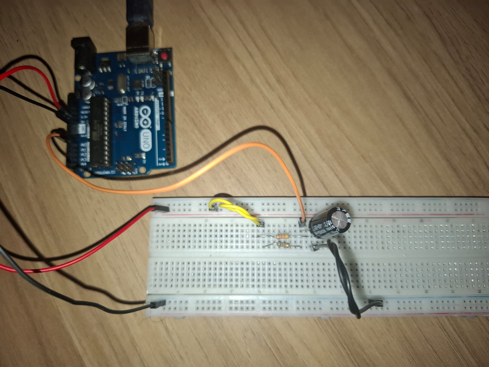
</div>
<br>
<div align="center">
<sub>Fonte: Material produzido pelo grupo IoTrain, 2025.</sub>
</div>
<br>

Os componentes usados foram 5 jumpers, 2 resistores, 1 capacitor e 1 arduino uno. Abaixo são especificados os resistores e o capacitor:

<br>
<div align="center">
<sub>Figura 42: Componentes no circuito RC.</sub>
</div>
<br>
<div align="center">
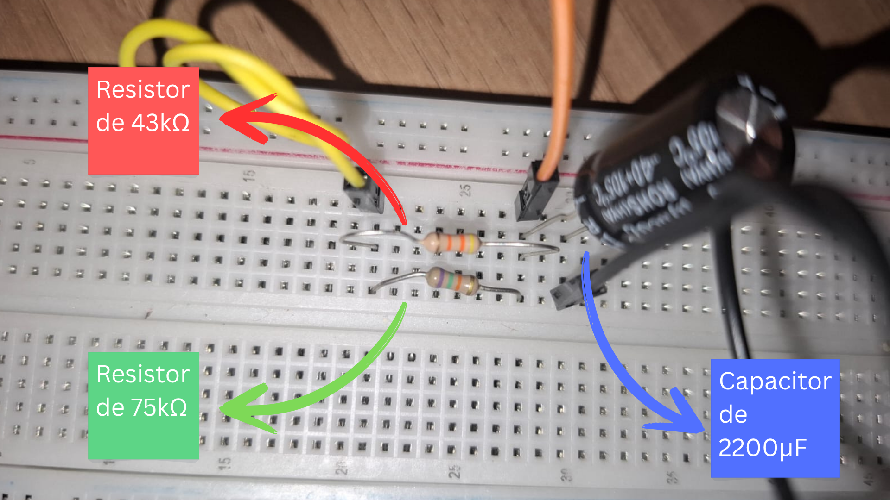
</div>
<br>
<div align="center">
<sub>Fonte: Material produzido pelo grupo IoTrain, 2025.</sub>
</div>
<br>

### 6.4. Coleta de dados experimentais:

Nesta seção, são apresentados os procedimentos adotados para a coleta de dados, bem como os valores obtidos experimentalmente. O objetivo desta etapa é analisar o comportamento da tensão no capacitor (VC) em função do tempo (t) durante o processo de carga no circuito RC.

#### 6.4.1. Código:

O código abaixo foi desenvolvido para automatizar a coleta de dados da tensão no capacitor (VC) em função do tempo (t) durante o processo de carga de um circuito RC.
O microcontrolador realiza leituras analógicas da tensão no pino conectado ao capacitor e envia os valores ao Serial Monitor no formato CSV (valores separados por vírgula), facilitando a posterior análise em planilhas ou softwares de plotagem.

A coleta foi dividida em três fases com espaçamentos de tempo distintos, conforme as recomendações experimentais:

- Fase 1: 0 a 60 s — 20 pontos igualmente espaçados (intervalo de 3 s)

- Fase 2: 60 a 180 s — 20 pontos igualmente espaçados (intervalo de 6 s)

- Fase 3: 180 a 300 s — 10 pontos igualmente espaçados (intervalo de 12 s)

Cada leitura converte o valor obtido pelo conversor analógico-digital (0 a 1023) para tensão real (0 a 5 V), armazenando o instante correspondente e o valor medido.

```cpp
const int pinCapacitor = A0; // Entrada analógica ligada ao capacitor
unsigned long tempoInicial;

void setup() {
  Serial.begin(9600);
  Serial.println("Coleta de dados do circuito RC");
  Serial.println("Tempo (s), Tensao no Capacitor (V)");
  tempoInicial = millis();
}

void loop() {
  unsigned long tempoAtual;
  float tempoSeg;
  int leitura;
  float tensao;

  // --- Fase 1: 0 a 60 s (20 pontos igualmente espaçados) ---
  for (int i = 0; i < 20; i++) {
    tempoAtual = millis() - tempoInicial;
    tempoSeg = tempoAtual / 1000.0;
    leitura = analogRead(pinCapacitor);
    tensao = leitura * (5.0 / 1023.0);
    Serial.print(tempoSeg, 2);
    Serial.print(",");
    Serial.println(tensao, 3);
    delay(3000); // 60 s / 20 = 3 s de intervalo
  }

  // --- Fase 2: 60 s a 180 s (20 pontos igualmente espaçados) ---
  for (int i = 0; i < 20; i++) {
    tempoAtual = millis() - tempoInicial;
    tempoSeg = tempoAtual / 1000.0;
    leitura = analogRead(pinCapacitor);
    tensao = leitura * (5.0 / 1023.0);
    Serial.print(tempoSeg, 2);
    Serial.print(",");
    Serial.println(tensao, 3);
    delay(6000); // (120 s / 20) = 6 s de intervalo
  }

  // --- Fase 3: 180 s a 300 s (10 pontos igualmente espaçados) ---
  for (int i = 0; i < 10; i++) {
    tempoAtual = millis() - tempoInicial;
    tempoSeg = tempoAtual / 1000.0;
    leitura = analogRead(pinCapacitor);
    tensao = leitura * (5.0 / 1023.0);
    Serial.print(tempoSeg, 2);
    Serial.print(",");
    Serial.println(tensao, 3);
    delay(12000); // (120 s / 10) = 12 s de intervalo
  }

  // Após coletar os 50 pontos, encerra o loop
  while (true) {
    // Fim da coleta — trava o programa
  }
}
```

- setup() — Executa apenas uma vez no início, iniciando a comunicação serial e registrando o tempo inicial da coleta.

- loop() — Realiza as medições de tensão em três fases com diferentes intervalos, enviando cada leitura (tempo e tensão) para o Serial Monitor.
Após 50 medições, o programa é encerrado automaticamente.

#### 6.4.2. Dados coletados

Os dados a seguir foram coletados durante o **experimento de carga do capacitor** em um circuito **RC (Resistor-Capacitor)**.  
O objetivo da medição foi registrar a **variação da tensão no capacitor (Vc)** ao longo do tempo, à medida que ele se carregava a partir de uma fonte de tensão constante.  
As medições foram realizadas em intervalos regulares de aproximadamente 3 segundos, utilizando um voltímetro digital conectado em paralelo ao capacitor.  
Esses dados permitirão ajustar o comportamento experimental à curva teórica da carga do capacitor dada por:  

VC(t) = Vf * (1 - e^(-t / (R * C)))

onde Vf é a tensão final, R a resistência e C a capacitância do circuito.

<br>
<div align="center">
<sup>Tabela 4 - Dados coletados do circuito RC físico</sup>

| Tempo (s) | Tensão no Capacitor (V) |
|:--------:|:------------------------:|
| 0.00     | 0.645 |
| 3.01     | 0.831 |
| 6.01     | 1.002 |
| 9.01     | 1.178 |
| 12.01    | 1.344 |
| 15.02    | 1.500 |
| 18.02    | 1.652 |
| 21.02    | 1.804 |
| 24.02    | 1.926 |
| 27.02    | 2.058 |
| 30.02    | 2.180 |
| 33.02    | 2.297 |
| 36.02    | 2.410 |
| 39.02    | 2.517 |
| 42.03    | 2.620 |
| 45.03    | 2.717 |
| 48.03    | 2.820 |
| 51.03    | 2.908 |
| 54.03    | 2.986 |
| 57.03    | 3.069 |
| 60.03    | 3.157 |
| 66.03    | 3.299 |
| 72.03    | 3.421 |
| 78.03    | 3.548 |
| 84.03    | 3.666 |
| 90.04    | 3.754 |
| 96.04    | 3.851 |
| 102.04   | 3.920 |
| 108.04   | 3.983 |
| 114.04   | 4.042 |
| 120.04   | 4.106 |
| 126.04   | 4.145 |
| 132.04   | 4.194 |
| 138.04   | 4.228 |
| 144.05   | 4.252 |
| 150.05   | 4.282 |
| 156.05   | 4.296 |
| 162.05   | 4.306 |
| 168.05   | 4.316 |
| 174.05   | 4.330 |
| 180.05   | 4.330 |
| 192.05   | 4.326 |
| 204.05   | 4.340 |
| 216.05   | 4.335 |
| 228.06   | 4.340 |
| 240.06   | 4.340 |
| 252.06   | 4.340 |
| 264.06   | 4.345 |
| 276.06   | 4.350 |
| 288.06   | 4.360 |

<sub>Fonte: material desenvolvido pelos autores</sub>

<br>

</div>

### 6.5. Gráficos:

Nesta seção serão apresentados os dados teóricos, bem como os gráficos teórico e experimental, com o objetivo de proporcionar maior clareza e facilitar a comparação entre os resultados obtidos.

#### 6.5.1. Dados teóricos:

A seguir, são apresentados os dados teóricos calculados com base no valor da constante de tempo τ (tau), previamente obtido na Seção 6.2. Nessa etapa anterior, foram definidos os requisitos do circuito, determinados os valores adequados de R2 e calculada a resistência equivalente necessária para que o sistema atingisse a constante de tempo desejada. Com esses parâmetros estabelecidos, os dados teóricos apresentados abaixo permitem verificar a coerência entre os valores projetados e o comportamento esperado do circuito RC.

<br>
<div align="center">
<sup>Tabela 5 - Dados teóricos do circuito RC</sup>

| Tempo (s) | V(t) (V) |
|----------:|---------:|
| 0   | 0.0000 |
| 3   | 0.2439 |
| 6   | 0.4758 |
| 9   | 0.6965 |
| 12  | 0.9063 |
| 15  | 1.1060 |
| 18  | 1.2959 |
| 21  | 1.4766 |
| 24  | 1.6484 |
| 27  | 1.8119 |
| 30  | 1.9673 |
| 33  | 2.1153 |
| 36  | 2.2559 |
| 39  | 2.3898 |
| 42  | 2.5171 |
| 45  | 2.6382 |
| 48  | 2.7534 |
| 51  | 2.8631 |
| 54  | 2.9677 |
| 57  | 3.0676 |
| 60  | 3.1620 |
| 66  | 3.3678 |
| 72  | 3.5416 |
| 78  | 3.6908 |
| 84  | 3.8201 |
| 90  | 3.9349 |
| 96  | 4.0381 |
| 102 | 4.1323 |
| 108 | 4.2193 |
| 114 | 4.3007 |
| 120 | 4.3779 |
| 126 | 4.4519 |
| 132 | 4.5236 |
| 138 | 4.5936 |
| 144 | 4.6627 |
| 150 | 4.7316 |
| 156 | 4.8008 |
| 162 | 4.8706 |
| 168 | 4.9416 |
| 174 | 4.9737 |
| 180 | 4.9811 |
| 192 | 4.9888 |
| 204 | 4.9936 |
| 216 | 4.9964 |
| 228 | 4.9980 |
| 240 | 4.9989 |
| 252 | 4.9994 |
| 264 | 4.9997 |
| 276 | 4.9998 |
| 288 | 4.9999 |

<sub>Fonte: material desenvolvido pelos autores</sub>

<br>

</div>

#### 6.5.2. Gráfico teórico:

O gráfico apresentado nesta seção representa a curva teórica de carregamento do capacitor ao longo do tempo, construída a partir da expressão matemática da tensão V(t) utilizando a constante de tempo obtida (60,13 s). Ele serve como referência ideal para comparação com os valores medidos experimentalmente, permitindo avaliar a coerência entre o comportamento real do circuito e o previsto pelo modelo RC.

<br>
<div align="center">
<sub>Figura 43: Gráfico teórico.</sub>
</div>
<br>
<div align="center">
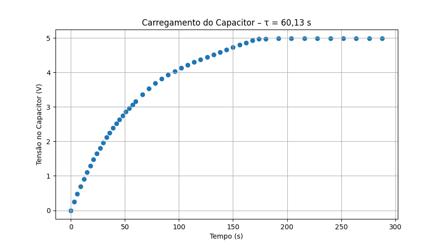
</div>
<br>
<div align="center">
<sub>Fonte: Material produzido pelo grupo IoTrain, 2025.</sub>
</div>
<br>

#### 6.5.3. Gráfico experimental:

O gráfico a seguir apresenta os valores de tensão medidos experimentalmente ao longo do tempo durante o processo de carregamento do capacitor. Esses dados foram obtidos diretamente no circuito montado e permitem comparar o comportamento real do sistema com o modelo teórico previamente calculado. A análise desse gráfico é essencial para verificar se o comportamento observado experimentalmente segue a tendência esperada para um circuito RC com constante de tempo próxima de 60,13 segundos.

<br>
<div align="center">
<sub>Figura 44: Gráfico experimental.</sub>
</div>
<br>
<div align="center">
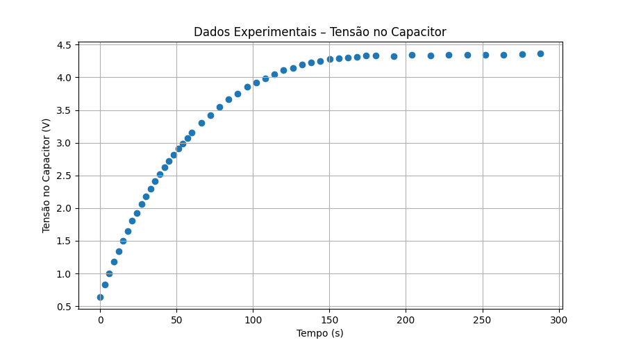
</div>
<br>
<div align="center">
<sub>Fonte: Material produzido pelo grupo IoTrain, 2025.</sub>
</div>
<br>

#### 6.5.4. Código dos gráficos:

O código a seguir foi utilizado para gerar os gráficos referentes ao comportamento teórico e experimental da tensão no capacitor ao longo do tempo. Ambos os gráficos foram produzidos em Python utilizando a biblioteca matplotlib, permitindo visualizar a evolução temporal do processo de carregamento do capacitor.

O primeiro bloco apresenta o gráfico teórico, calculado com base nos valores obtidos da equação de carga de um circuito RC com constante de tempo τ = 60,13 s.
O segundo bloco apresenta o gráfico experimental, construído a partir dos valores medidos durante o experimento.

```python
import matplotlib.pyplot as plt

# Dados da tabela (tau = 60.13 s)
tempos = [
    0, 3, 6, 9, 12, 15, 18, 21, 24, 27, 30, 33, 36, 39, 42, 45, 48, 51, 54, 57,
    60, 66, 72, 78, 84, 90, 96, 102, 108, 114, 120, 126, 132, 138, 144, 150,
    156, 162, 168, 174, 180, 192, 204, 216, 228, 240, 252, 264, 276, 288
]

tensoes = [
    0.0000, 0.2439, 0.4758, 0.6965, 0.9063, 1.1060, 1.2959, 1.4766, 1.6484, 1.8119,
    1.9673, 2.1153, 2.2559, 2.3898, 2.5171, 2.6382, 2.7534, 2.8631, 2.9677, 3.0676,
    3.1620, 3.3678, 3.5416, 3.6908, 3.8201, 3.9349, 4.0381, 4.1323, 4.2193, 4.3007,
    4.3779, 4.4519, 4.5236, 4.5936, 4.6627, 4.7316, 4.8008, 4.8706, 4.9416, 4.9737,
    4.9811, 4.9888, 4.9936, 4.9964, 4.9980, 4.9989, 4.9994, 4.9997, 4.9998, 4.9999
]

# Plot
plt.figure(figsize=(9, 5))
plt.scatter(tempos, tensoes)
plt.title("Carregamento do Capacitor – τ = 60,13 s")
plt.xlabel("Tempo (s)")
plt.ylabel("Tensão no Capacitor (V)")
plt.grid(True)

plt.show()


# Dados experimentais obtidos
tempos_exp = [
    0.00, 3.01, 6.01, 9.01, 12.01, 15.02, 18.02, 21.02, 24.02, 27.02,
    30.02, 33.02, 36.02, 39.02, 42.03, 45.03, 48.03, 51.03, 54.03, 57.03,
    60.03, 66.03, 72.03, 78.03, 84.03, 90.04, 96.04, 102.04, 108.04, 114.04,
    120.04, 126.04, 132.04, 138.04, 144.05, 150.05, 156.05, 162.05, 168.05,
    174.05, 180.05, 192.05, 204.05, 216.05, 228.06, 240.06, 252.06,
    264.06, 276.06, 288.06
]

tensoes_exp = [
    0.645, 0.831, 1.002, 1.178, 1.344, 1.500, 1.652, 1.804, 1.926, 2.058,
    2.180, 2.297, 2.410, 2.517, 2.620, 2.717, 2.820, 2.908, 2.986, 3.069,
    3.157, 3.299, 3.421, 3.548, 3.666, 3.754, 3.851, 3.920, 3.983, 4.042,
    4.106, 4.145, 4.194, 4.228, 4.252, 4.282, 4.296, 4.306, 4.316, 4.330,
    4.330, 4.326, 4.340, 4.335, 4.340, 4.340, 4.340, 4.345, 4.350, 4.360
]

# Plot
plt.figure(figsize=(9, 5))
plt.scatter(tempos_exp, tensoes_exp)
plt.title("Dados Experimentais – Tensão no Capacitor")
plt.xlabel("Tempo (s)")
plt.ylabel("Tensão no Capacitor (V)")
plt.grid(True)

plt.show()
```

### 6.6. Interpretações e Conclusões:

Nesta seção final são interpretados os resultados obtidos a partir da comparação entre as medições experimentais do circuito RC físico e os dados teóricos previamente calculados utilizando o valor de τ = 60,13 s.

#### 6.6.1. Compatibilidade entre o gráfico experimental e o teórico

Ao comparar os dois gráficos, o experimental e o teórico, observa-se que ambas as curvas apresentam o mesmo comportamento característico de carga de um capacitor: crescimento exponencial rápido nos primeiros instantes seguido de uma aproximação lenta à tensão final. Os valores experimentais começam ligeiramente mais altos do que o previsto teoricamente (por exemplo, 0,645 V no instante t = 0 s), o que indica a presença de uma pequena tensão inicial residual no capacitor ou um offset de leitura no sistema de medição. Ainda assim, a forma geral da curva experimental acompanha de perto a curva teórica, especialmente entre 10 s e 120 s, região onde o capacitor mais rapidamente acumula carga. Nos instantes finais (acima de 180 s), as tensões experimentais ficam ligeiramente abaixo da tensão final ideal (5,0 V), estabilizando-se perto de 4,33–4,36 V. Essa diferença pode ser explicada pela tolerância dos resistores, perdas internas e limitações do ADC do Arduino. Mesmo assim, a curva experimental mantém a tendência teórica, mostrando que o modelo RC foi adequadamente seguido. Portanto, os resultados indicam que o comportamento experimental é amplamente compatível com o modelo teórico, apresentando diferenças pequenas e justificáveis.

#### 6.6.2. Estimativa da constante de tempo experimental

Para estimar a constante de tempo experimental, utilizamos o critério de que:

VC​(τ)≈0,632⋅Vf​

Como a tensão da fonte é aproximadamente Vf ≈ 5 V, o valor correspondente a 63,2% é:

0,632×5=3,16 V

Observando os dados na tabela experimental:

- Em 57,03 s, Vc = 3,069 V

- Em 60,03 s, Vc = 3,157 V

- Em 66,03 s, Vc = 3,299 V

O valor de 3,16 V está exatamente em torno de 60 s, coincidindo com o valor teórico de τ = 60,13 s.

Assim, podemos estimar:

τ(experimental)​≈60 s

#### **Conclusão**:

A constante de tempo experimental bate praticamente igual com a constante de tempo teórica calculada. A diferença entre os valores é suficientemente pequena para ser atribuída a erros experimentais normais.

#### 6.6.3. Fontes potenciais de erro

Algumas discrepâncias observadas entre os dados experimentais e teóricos podem ser atribuídas aos seguintes fatores:

1. Tolerância dos componentes eletrônicos

- Resistores comuns possuem tolerância de ±5%, podendo alterar a resistência equivalente.

- O capacitor eletrolítico possui tolerância elevada (tipicamente entre ±10% e ±20%), sendo a maior fonte de variação real na constante de tempo.

2. Precisão limitada do ADC (Conversor Analógico-Digital) do Arduino

- O Arduino Uno utiliza ADC de 10 bits, o que resulta em resolução de aproximadamente 4,9 mV por passo.

- Ruídos elétricos ou flutuações internas podem introduzir pequenas variações nas leituras.

3. Tensão da fonte ligeiramente diferente de 5,00 V

- A porta 5V do Arduino normalmente fornece algo entre 4,8 a 5,1 V dependendo da carga e alimentação.

- Uma alteração de apenas 0,1 V já modifica a interpretação do ponto correspondente ao valor de 63,2%.

4. Tensão inicial do capacitor não completamente zerada

- Mesmo após descarregar manualmente, capacitores eletrolíticos podem manter pequena carga residual.

- Isso explica tensões iniciais como 0,645 V logo no tempo t = 0 s.

5. Resistência interna do capacitor

- O capacitor possui ESR (Equivalent Series Resistance), que altera discretamente a curva de carregamento real.

6. Atraso entre medição e tempo registrado

- O tempo medido via millis() está sujeito à latência da execução do código e leitura do ADC.

- O uso de delays pode introduzir desvios acumulados de alguns milissegundos, porém sem grande impacto geral.

#### 6.6.4. Conclusão final

Os resultados experimentais obtidos pelo circuito RC físico se mostraram consistentes com o comportamento teórico esperado, apresentando curva de carga com tendência exponencial e aproximando-se adequadamente do valor final da tensão da fonte. A constante de tempo experimental estimada foi de aproximadamente 60 s, coincidindo com o valor teórico calculado (τ = 60,13 s) com R1 = 75 kΩ, R2 = 43 kΩ e C = 2200 μF. As pequenas discrepâncias observadas ao longo do experimento são justificáveis por efeitos físicos e limitações dos instrumentos de medição, não comprometendo a validade dos resultados.

Em suma, o experimento confirma a teoria do circuito RC, demonstrando que o modelo matemático utilizado descreve corretamente o comportamento da tensão no capacitor ao longo do tempo.
